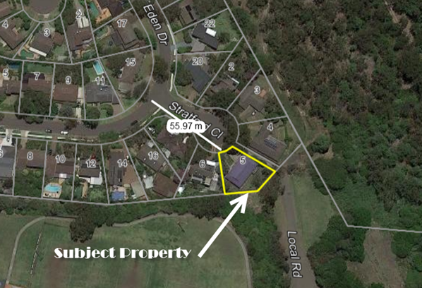

## Back balcony

As per the page on the living conditions of the house, [the house is not safe](/marcseparation/living_conditions/#the-house-is-totally-not-safe). This is the railing of the top balcony at the back of the house, kids can fall down through this, land on the ground and could seriously injure themselves of whats worse, kill themselves. 

<iframe width="420" height="315"
    src="https://www.youtube.com/embed/Pb2Wtx18Zj8?playlist=Pb2Wtx18Zj8&loop=1&start=81&end=89&Version=3&autoplay=1&mute=1&showinfo=1&rel=0">
</iframe>

### The railing is still not fixed

On January 16, 2022, I was back at the house and noticed that not the railing is still not fixed and has gotten worse, it's the entire length of the railing, the wire has totally ome out. 

<iframe width="420" height="315"
    src="https://www.youtube.com/embed/rW6g---2QLw?playlist=rW6g---2QLw&loop=1&start=81&end=89&Version=3&autoplay=1&mute=1&showinfo=1&rel=0">
</iframe>

## Alex is [Laissez-faire](https://www.encyclopedia.com/children/applied-and-social-sciences-magazines/laissez-faire-parents) / hands-off parenting

As per [this section](/marcseparation/alex_parenting/#alexs-parenting-style). Alex is following the same parenting style as her own mother. We can see how this turned out for Alex's sister Julia, she killed herself.

Julia had a real drinking problem and was a chain smoker amongst having bipolar disorder, not being able to hold down a job and as Bec said, she's a "*bad egg*". 

Leaving the home at 14, and no father in her life (as he was interstate at the time, then died soon after), the mother was exercising a [Laissez-faire](https://www.encyclopedia.com/children/applied-and-social-sciences-magazines/laissez-faire-parents) *behind the scenes* parenting style as Julia lived in share accommodation with Alex and Alex's gay friend Kristan. Julia lacked the support, guidance and discipline needed to develop into a decent woman to have somewhat of a chance of a normal life. 

This is a classic text book case that directly reflects the reports from what the experts say that kids turn out best with shared custody between both Mother and Father.

The highlights from the expert studies:

- children with a shared parenting arrangement have better physical, mental, social and academic outcomes compared to children in a primary parenting arrangement
- children with shared parenting had better outcomes for physical health, psychological well-being, moods and emotions, self-perception, autonomy, parental relations, material outcomes, peer relations, school satisfaction and social acceptance
- children in a shared parenting arrangement had better outcomes on all measured variables for well-being, most notably for their family relationships, physical health, adolescent behaviour and mental health

This information came from other pages on this exact same site. For more details, see:
- [Top 10 list of the benefits of 50/50 custody](/marcseparation/5050_custody/)
- [Platform for European Fathers (PEF)](/marcseparation/platform_for_european_fathers/)
- [Scientific research for shared parenting](/marcseparation/my_initial_comments/#scientific-research-for-shared-parenting)
- [Nielsen’s Research: Divorce & Shared Parenting](/marcseparation/appendix_nielsens_research/)

## The matrimonial home is constantly left unlocked

As I have documented very clearly on this site, [the house is constantly left unlocked](/marcseparation/alex_mental_health/#the-house-is-constantly-left-unlocked) The house backs onto bush, as you can see from this aerial view of the property:

Not once, not twice, but many times the house is being left unlocked by Alex before she and I separated, and even now 2 years after separation. She constantly leaves the house unlocked. It's still happening as you can see [here](/marcseparation/alex_mental_health/#the-house-is-constantly-left-unlocked) with my most recent video taken in January 2022. 

Years ago when I was living in the house, the Tennis club at the back of the property got broken into, this will be on record with the Police. At night time it's pitch black at the back of the property and anyone can linger in the area and gain access to the home. This is why when I was living there I had security cameras installed to help with our security, this relates to the other absurd episode about the [Breast Feeding Spy Allegation](/marcseparation/breast_feeding_spy_allegation/), now you can understand the reasons why I installed the security cameras. 

However, post separation, I removed the security cameras as Alex didn't want them there, she thought that I see things she didn't want me to see. 

In relation to the house being unlocked all the time, you can here my son who is concerned about his safety:

<audio src="../audio/Alex_not_locking_the_house_Charlie_not_comfortable.mp3" type="audio/mpeg" controls>
  I'm sorry. You're browser doesn't support HTML5 <code>audio</code>.
</audio>

