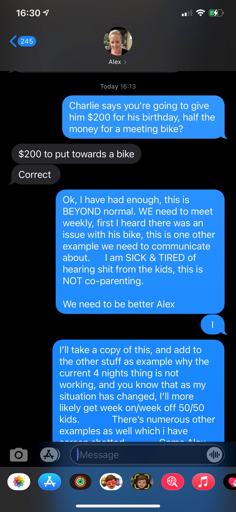
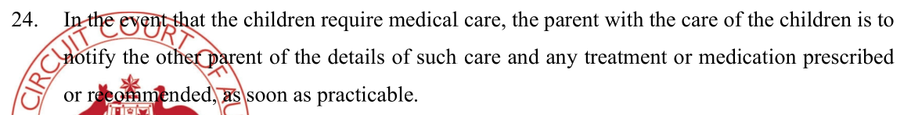

The current co-parenting is not working. Alex is under pressure and is not coping, adopting the [hands-off parenting approach](/marcseparation/alex_parenting/#alex-is-never-around) that her own mother took. The 28.6% of the time that I have the kids, there's been on-going health issues with Chloe. 

- Chloe constantly has a sore tummy, for the past 2 years, something is causing it and Alex has done nothing to look into it properly other than band-aid fixes
- Chloe has had a niggling cough for 4+ months, never went away. Alex hasn't done anything about it, I bought cough medicine which did seem to help somewhat, but she needs to be taken to ENT specialist to look into it further
- Chloe constantly has issues with her mouth, trouble swallowing certain foods and Alex does nothing about fixing it. 

Even in the report, Alex mentions it to the report writer:

Note, that is says **possibly from anxiety**? It's **possibly**, Alex **doesn't know**. As Alex hasn't done anything about it, could be time or money or both. Regardless, the kids on-going health issues is secondary to Alex's primary reliance on the financials - holding onto the kids as much as she can, quantity over quality, just so she gets maximum money from child support. Alex is very much hand-off with the kids [as documented here](/marcseparation/alex_parenting/#alex-is-never-around), she really needs to spend more quality time with the kids and take them to specialists to really get to the bottom of the on-going health issues, but she simply doesn't have the bandwidth or money to do it, rather, she's quite happy to waste whatever time/money she has on legal issues.

I call it this this **temporary phase of life**, a **holding pattern** so to speak, the time between separation (Nov 2019) and a final hearing/settlement. This has been going on for over two years now. Seems to me that in this **holding pattern**, Alex is clutching on for dear life with the [minimal money that she has](/marcseparation/child_support/#alex-wages) and spending a tone of money in legal costs, meanwhile she's [heavily dependant on me for child support](/marcseparation/child_support/#child-support-alex-is-receiving-from-me) to live day-to-day and the kids are neglected with on-going health issues that need to be properly looked at, any money she does have is not being properly spent on the kids, it's being spent in legal bills. 

As I pointed out, the [living conditions of the matrimonial home](/marcseparation/living_conditions/), its's disgusting, the house is way too big for her to manage by herself, the amount of mortgage that Alex is paying, Alex is in well over her head and why? Because she's holding, clutching at straws and holding onto this **holding pattern**, a fake reality while it lasts, but it's not sustainable and as I have documented both [here](/marcseparation/living_conditions/) and [here](https://marckean.github.io/marcseparation/living_comparisons/), things are starting to fall apart for Alex. 

Alex is not coping.
## General events

### March 4, 2021 Communicating via the kids

- Charlie tells me Mums plan, expecting me to pay $200 for his birthday, towards a new bike
- After I question Charlie about the issue with his current bike, he doesn’t need a new bike, he just needs his current bike adjusted, the handle bars can go up.

### March 9, 2021 No respect, & comms via the kids

- I go to the house to drop off kids sports uniforms
- Alex greets me at the door with a foul look on her face, abuses me, tells me - I forgot the kids sneakers and doesn’t even say thank you
- She doesn’t even say thank you
- Charlie calls me later on Wednesday night and asks me about his shoes, I tell him to speak to Mummy to sort it out and then all of a sudden he hangs up on me which is totally out of character for him
- Straight after, Alex calls me and abuses me, what did I do, Charlie is in tears and I just hung up on her
- I find out later on Thursday from Charlie that Alex was with him at the time when he called and it was Alex that hung up on me

## Not informing me about kids medical appointments

### From the interim court order:

| February 1, 2021 | March 12, 2021 |
| ----------- | ----------- |
|  | Doesn’t tell me in advance about the Charlie’s optometrist visit  |

| November 18, 2020 | March 23, 2021 |
| ----------- | ----------- |
|  | I emailed this to the dentist and knew of the kids dentist appointment on said date, but Alex never tells me about this appointment.  |

| October 2021 |
| ----------- |
| I found out through Dr Ruth Selig, that my daughter Chloe Kean had a psychologist appointment, and I knew nothing about it. I still know nothing about it, but I do know that she had this appointment.  |

## Not informing me about other things

### From the interim court order:

| Not informing me about kids being out of school |
| ----------- |
| Julia Spence (Alex’s sister) had her funeral out of town (in Bowral) Tuesday April 20, 2021 and failed to let me know as per section 20 of the parenting order (below). 
 Alex took the kids out of school for two days.  |

## Different behaviours from the kids upon delivery

Just like this comment from Alex's friend Bec:

I get exactly the same when I take delivery of the kids, but more shocking. I have noticed several times, within 24/48 hours of getting the kids back, I would ask Charlie to do something, and his response, instantly, would be "*No*". This is totally the out of character of Charlie when he's around me. Normally when I ask the kids (Charlie & Chloe) to do something, they do it straight away with no fuss at all. I'm assuming they then do the opposite when they are returned to their mother and are very well behaved kids for a short time. 

It pretty much says it here:

Again, Alex's friend Bec even said it herself, "*Alex could be stricter*", **totally**. 

Even before Alex and I were separated, the kids were totally out of control around Alex, not doing what they were told and just treating Alex like a joke. I had to constantly step into to sort things out and get the kids to respect Alex. I was always telling them to respect Alex, but they never did. The kids respected me, but Alex was never able to get it. 

I would say to Alex how I did things being a big believer of **consistency** and **follow though**, and as much as Alex **admired** and **relied** on my back-up for parenting, she'd hate me giving her any tips or advice which would ultimately help her long term. 

It was weird, Alex loved it how I was there to always step in for support, but as soon as I said anything about assisting her to parent, she straight away thought I was attacking and criticising her and this developed into an argument - always. Alex was not interested in developing her parenting skills at all, not from me or anyone else for that matter. 