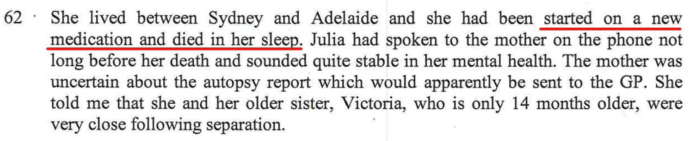

Whilst in the session with Dr Ruth Selig, there were several things that I mentioned that were missed in the report.

## Teaching the kids life skills

- I mentioned that one of the things I was most proud of was that I taught the kids table manners whilst I was still living in the house. My father who was a CEO at large companies throughout his life, **wined and dined** with his other business people and it was imperative that he spoke correctly and acted correctly as he was representing his company. People judge others by the way they speak and act which includes things like table manners. Even today, the kids tell me that now they are proud that even tell other peers (their friends) the correct table manners.

## Julia dying

- Ruth told me that *I’ll be putting in the report that Julia Spence committed suicide*. But she didn't. 

## Alex's mental state

Everything I listed [here](/marcseparation/alex_mental_health/), I asked **Ruth Selig** to find out what was happening in Alex's head, her mental state. There's clear evidence of mental issues in the family, but **Ruth Selig** skipped this totally and swept this under the rug. **Ruth Selig** did say to me that "*she has powers from the court*" to find out information, so this is when I asked **Ruth Selig** to find out about Alex's mental state of mind. Something is seriously happening with Alex. 

In the last few months before separation, when going to bed, Alex never said goodnight to me

Asked me if I had another partner, this wasn’t mentioned anywhere
## Kids table manners

I am very instrumental in teaching the kids good moral and values. I used the example of my father who worked in high profile jobs all his life as CEO of large companies where he had to represent the company with other business people, he understood correct manners. I also mentioned that having good manners is a good reflection on the kids themselves, also the parents and that other people take notice of this. People notice these things, good manners of kids and create good warm opinions of the kids as a result. I said that before separation one of the things I did which I was very proud of, from an early age I taught the kids proper table manners. To this day, the kids still exhibit good table manners and even teach some of their own peers the correct way to use a knife & fork for example.

## Chloe dropped face first onto a tiled floor

As per [this other section](/marcseparation/alex_mental_health/#chloe-dropped-face-first-onto-a-tiled-floor), this too was missed. When our daughter was a little baby and still in nappies. Alex was changing her nappy in the laundry, Alex put Chloe on the bench face up. Alex turns her back for a second, then Chloe roles off the bench and goes splat onto the tiled floor face down. Chloe would have fallen about 1+ meters.

## Parental Controls on devices

I mentioned this in the session to Ruth, and this was missed totally, as I understand that it would have gone over her head, too complicated to put in a report. As per [my previous comments](/marcseparation/#the-family-report---why-were-here), **Ruth Selig** opted to manually write things down with pen and paper while I spoke, interpreted in her own way.

Both of my kids **Charlie** and **Chloe** have devices. They both have a Windows 11 computer each at my place, and they also have a Nokia X20 Android phone. As we know, that **the internet is a bad place**, it's imperative that parental controls are setup both on the device and on the internet gateway level as well.

- For the internet gateway level, I know that at both homes the kids are protected. I set this up at both homes.
- I also know that their Android phones are also setup with parental controls, classed as **kids** in the Google world.
- As for services like **Netflix**, **Disney+**, **Amazon Prime**, **Binge** etc, I have setup security individually for these services for the kids, the kids have their own profiles setup as **kids**, with adult content password protected.

The kids are protected from high risk and inappropriate websites on both their computers and phones and streaming content services.

However this doesn't stop the kids:

- Getting into Alex's phone - which I know they can
  - Both kids can get into Alex's phone, they both know Alex's PIN to get into the phone. Alex has never taken this seriously. Kids can then have free rein to look at all Alex's apps signed in as her, watch adult content, read sensitive text messages/emails etc, especially about the court case with their parents. The Kids have always been able to get into Alex's phone, it's always been the case, previously and now. 
- Being given devices from other people to use
### iPad from Bec

Alex's friend Bec (Rebecca) gave