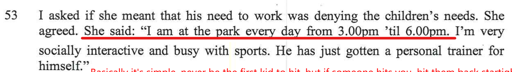

### Contradiction 1

Alex was brought up with the belief that she thinks fathers play a very important role for kids

Below Alex is saying three nights a fortnight

### Contradiction 2

Alex says that she goes to the park each afternoon from 3pm.

Chloe says the opposite. 

It's true that when the kids are with their Mum, they are left alone to play with their friends and/or be looked after by Aunty's or friends as Alex needs to work. It's also true that Charlie goes to the park by himself. 

This is Chloe discussing it with me...

<audio src="../audio/Alex_works_from_home_after_3pm.mp3" type="audio/mpeg" controls>
  I'm sorry. You're browser doesn't support HTML5 <code>audio</code>.
</audio>

### Contradiction 3

Alex working on Saturday mornings.

Chloe says the opposite. 

It's true that when the kids are with their Mum, they are left alone to play with their friends and/or be looked after by Aunty's or friends as Alex needs to work. It's also true that Charlie goes to the park by himself. 

### Contradiction 4

Alex working on Saturday mornings.

- **Alex said** "*He is owning his parenting and the children now have their own voices*"

- **Alex said** "*Chloe goes extremely quiet but now she is more out of her shell*"

- **Alex said** "*The children find it hard to stand up for themselves and feel intimidated by him*"

- **Bec said** "*The less time with him the better, especially for Chloe. SHe fined is difficult to be vulnerable with Marc*"

- **Bec said** "*Chloe Struggles*"

In 49 **Alex said** "*The children find it hard to stand up for themselves and feel intimidated by him*", then in 51 **Alex said** "*He is owning his parenting and the children now have their own voices*" this is totally conflicting. 

If we weigh it all up, there's a totally different focus on Chloe here between Alex and Bec with conflicting information. Chloe and I have no issues together, when we're together. We get on perfectly fine, we laugh and chat, we naturally connect, she understands me and I understand her. Like me, [Chloe has Asperger's](/marcseparation/chloe/) and I simply **get** Chloe more than neurotypical people such as Alex, or Bec. 