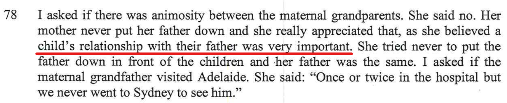
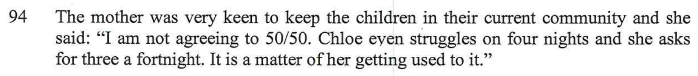
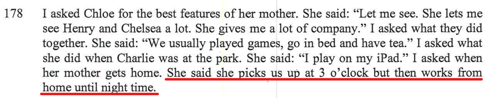
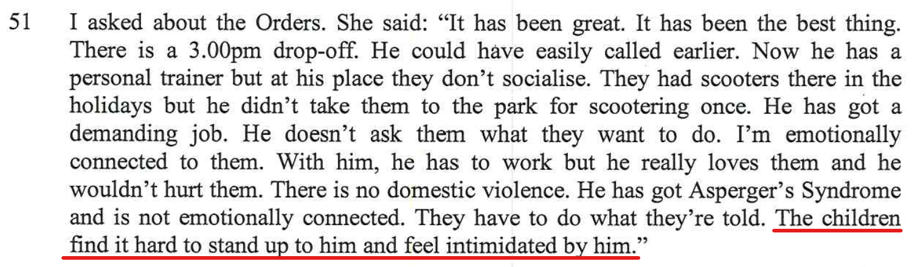
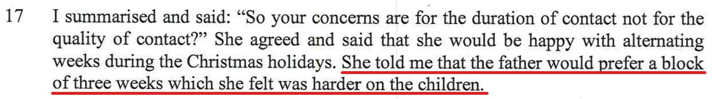

Below are a list of contradictions that I found in the report, conflicting information. 
### Fathers play a very important role for kids

Alex was brought up with the belief that she thinks fathers play a very important role for kids

Below Alex is saying three nights a fortnight

### Alex says that she goes to the park each afternoon from 3pm.

Chloe says the opposite. 

It's true that when the kids are with their Mum, they are left alone to play with their friends and/or be looked after by Aunty's or friends as Alex needs to work. It's also true that Charlie goes to the park by himself. 

This is Chloe discussing it with me...

<audio src="../audio/Alex_works_from_home_after_3pm.mp3" type="audio/mpeg" controls>
  I'm sorry. You're browser doesn't support HTML5 <code>audio</code>.
</audio>

### Alex working on Saturday mornings.

- As it states here, Alex works from home five days a week **including Saturday mornings**.

- Then here (a little later in the report), it clearly states that both **Victoria** and **Rebecca** looks after the kids on Saturday mornings.

- This one confirms that every week, Alex is **not** working from home on Saturday mornings
- This conflicts with number 12

- This is one is totally incorrect as **Rebecca** has no family relation at all with Andrew Kyngdon.
- This one conflicts with 23 where says that both **Victoria** & **Rebecca** looks after the kids on Saturday mornings, whereas here it clearly states that Rebecca looks after the kids **every Saturday**

- This one states that Bec looked after the kids **most** weekends. 
- This one conflicts with 86, does Rebecca look after the kids **most** weekends, or **every** weekend? Which one is it? 

This is a lot of conflicting information with this one.

### Kids and their voices

- **Alex said** "*He is owning his parenting and the children now have their own voices*"

- **Alex said** "*Chloe goes extremely quiet but now she is more out of her shell*"

- **Alex said** "*The children find it hard to stand up for themselves and feel intimidated by him*" (Talking about me).

- **Bec said** "*The less time with him the better, especially for Chloe. SHe fined is difficult to be vulnerable with Marc*"

- **Bec said** "*Chloe Struggles*"

In 49 **Alex said** "*The children find it hard to stand up for themselves and feel intimidated by him*", then in 51 **Alex said** "*He is owning his parenting and the children now have their own voices*" this is totally conflicting information.

If we weigh it all up, there's a totally different focus on Chloe here between Alex and Bec with conflicting information. Chloe and I have no issues together, when we're together. We get on perfectly fine, we laugh and chat, we naturally connect, she understands me and I understand her. Like me, [Chloe has Asperger's](/marcseparation/chloe/) and I simply **get** Chloe more than neurotypical people such as Alex, or Bec. 

Kids don't struggle around me, see this section on [Dad is fun](/marcseparation/dad_fun/) and [Dad is a good Dad](/marcseparation/dad_is_a_good_dad/), there's heaps of content, the kids are having so much fun and are more than happy when they're with me. 

Another example I posted [here](/marcseparation/dad_is_a_good_dad/#big-boing-birtinya-qld), this is when we went to Queensland to visit the paternal grandparents. I didn't want to go on the trampolines with the kids as I thought I was too old, but it was my daughter **Chloe** that twisted my arm to do this. She wouldn't have twisted my arm so much if the above statements were true - Chloe doesn't not struggle with me and the kids are not intimidated at all. 

### My time with the kids

- At number 91, Alex says that I am fixated with 50/50 time with the kids (week on / week off)

- At number 17, Alex says that I want a long block of 3 weeks

This is conflicting information. But to set the record straight, I have been consistent all along and always advocated for week on / week off (50/50) across the whole year, this is both across school days and school holidays.

### Chloe and I

- As noticed & noted by the report writer (the so called expert), Chloe had no issues standing up for herself and expressing her thoughts in front of me in the session.

- Alex is saying the opposite, that both kids would be more intimidated with 50/50. Alex goes onto say that both kids are restricted from being themselves.

This comment from Alex's friend Bec. This contradicts what the report writer witnessed in the session. 