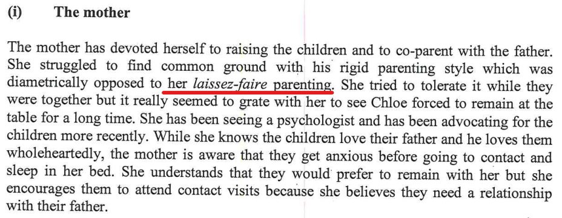

As per [what I mentioned on the home page](/marcseparation/#the-family-report---why-were-here), there's no denying, the bulk of this report is against me and makes me look like a real monster of a Dad - I'm not a monster of a Dad and this site proves that I am not a monster. There's certain aspects that been ignored (purposely or mistakenly), things taken out of context, spoken words not perceived clearly from what was mentioned in the room with a clear skewed view based on influence from particular neurotypical people interviewed. 

At the start of the session with **Ruth Selig**, I asked her how things would run in the session, as I saw her sitting there with a pen and paper. I asked if she would be recording the session (verbally) and she said "*no*", she's happy to manually write everything down pen/paper, a look on her face as if to say that this is normal, she does this every day and this is how she rolls. It's her interpretation of what I say in real time. Looking back, I should have asked if I could record the audio of the session for accuracy, as it was 95% me that did the talking. It's very common for people with Asperger's, everyone tells me that they can't read me, people read me the wrong way, people tell me that they can't read me at all and that things I say are miss-interpreted and I am always perceived differently to other people. 

Then we had two neurotypical people in the sessions (Alex & Bec), **Ruth Selig** would have been able to more easily interpret these people and read these people with more accuracy - it's no wonder this report is totally out of whack. 

Report writers need to remain neutral and leave all emotions out completely with these things - not the case here. There's a ton of things incorrect and this site is here to bring it all out in the open by using photos, audio and videos - media in these formats doesn't lie.

## Bribe

The other thing that sort of makes sense to be but would be very had to prove. Alex has the support of her friend Bec and Bec's Mum & Dad. Bec comes from a very wealthy family and I wouldn't be surprised that they offered a cash payment (untraceable) to Ruth **Ruth Selig** to skew this report in the direction where they wanted it to go. It makes sense why **Ruth Selig** changed tact after my session with her.

## Turning a blind eye towards Alex's sister committing suicide

We just need to look at the evidence in front of us - Alex's sister [Julia](/marcseparation/julia_spence_mental_health/) moved out of the Mum's home when she was only 14 years old. Now look how **Julia** turned out, she's DEAD! 

This is pretty serious!

- The expert even confirms Alex's parenting style in the report being [Laissez-faire](/marcseparation/alex_parenting/#alexs-parenting-style), but suspiciously ignores the topic altogether, additionally chooses to completely ignore the connection between Alex's parenting style, Alex's mother (Maree's) parenting style and Julia committing suicide. Rather, the report writer was quick to make a connection between my parents and my parenting style:

- Numerous places throughout the report, the report writer has real issues with the way that I parent, and a connection to my own parents parenting style, the report is littered with this, but no where is there a connection to Alex's parenting style copied from her mother, then Julia committing suicide is there?

The report writer has been influenced from somewhere. This is a direct cover up, a totally one-sided view - whereas the report writer needs to remain neutral. It's clear the report writer didn't seem to like me in the session, but regardless of her own opinions of me in the session, she needs to overlook this, look at the bigger picture here. Either that, the report writer has another hidden agenda to try to cover up the mental illness that runs in Alex's family, also the Laissez-faire parenting style of Alex's mum that led to Julia's death. If we keep going with Alex copying the way her mother parented, and the kids continue spending the majority of the time with Alex, then my kids are at serious risk.  

## Children are objects

The report writer is saying that I presume the children are objects as per:

The report writer was totally incorrect with accusing me of treating the ***children as bargaining chips*** as I have explained [here](/marcseparation/experts_opinions/#kids-objects-bargaining-chips) - the report writer misinterpreted what I said in the session. 

If we flip this and change the focus to Alex and also on the subject of treating the ***children as bargaining chips***, as per what I have written [here about Alex using the children for financial gain](/marcseparation/child_support/#evidence-of-using-the-children-for-financial-gain), I have provided enough information to prove that with Alex it's **money primary** and **children secondary**. Alex is clearly treating the ***children as bargaining chips***.

The report writer has been influenced here substantially and has totally missed this. 