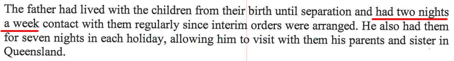
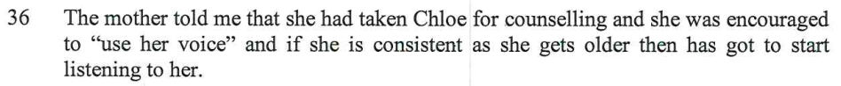

There are many errors in this report. Like I was saying [here](/marcseparation/#the-family-report---why-were-here), someone's interpretation using a pen/paper to note things down is prone for errors, humans are not perfect, they make mistakes. 

You need to seriously question the credibility of this report writer. For a report that costs $18K, you wouldn't expect any mistakes, especially like these. 

As the audio of the sessions wasn't recorded either digitally or analog, there's no way to prove the accuracy of anything in the report and based on the [contradictions](/marcseparation/report_contradictions/) and the mistakes which I have listed here, this entire report is questionable.

## Simple mistakes

- This is one is totally incorrect as **Rebecca** has no family relation at all with Andrew Kyngdon.

- At the time of the report, I am only 45 years of old and I don't live in Chatswood, I live in Asquith. 

- I don't live in Chatswood, I am renting in Asquith.

### Alex's sister Julia

Alex only had one mentally screwed up younger sister that committed suicide. This was **Julia**, not **Julie**.

- The report writer refers to Julia with the correct spelling here.

- This is my Mum's comment (the paternal grandmother)

About 85% of the references to Julia, Julia's name is spelt correctly, but then the remaining 15% (both mine and my mothers comments) references to Julia, the report writer spells Julia's name wrong as - **Julie**. Is this intentional? 

It makes sense that I did ask the report writer how Julia died and more information about the [family's mental health](/marcseparation/alex_mental_health/), and Ruth ignored this. 

Ruth also looked me in the eye and told me that [she would be putting in the report that Julia committed suicide](/marcseparation/julia_spence_mental_health/#what-the-report-writer-told-me-in-person) - but this wasn't mentioned in the report at all. 

The report writer is clearly trying to sugar coat this mental health aspect. 

### Chloe's age

- This is incorrect, the Assessment was done October 14/15, 2021. Chloe's DOB is March 7, 2013. Chloe was eight and seven months old at the time of assessment, not eight and two months old. 

### My current time with the kids

- This is incorrect, my current time with the kids is 4 nights a fortnight, "*one big block*" (as the judge called it when he made the order back in 2020)

- The report writer is saying here that I currently have the kids for **two days a fortnight**.
- Again here, the report writer has no clue at all of the time I currently have with the kids. As per the interim orders, I have the kids for **four nights a fortnight**, not **two days a fortnight**.

### Marriage

To set set the record straight, Alex and I were never married. We were engaged, but never married, so we were defacto only. I did mention this to the report writer in the session, also my Mum is very clear on this as well, however the report writer has incorrectly said it multiple times, incorrectly referring to Alex and I as **married**. 

- This is the section from the report writer herself

- This is from the session with Alex, Alex even knew that we were't married, however the report writer still uses this incorrect statement. 

- This is from the session with my Mum (the paternal grandmother). My Mum wouldn't have mentioned that we were married at all. 

This is pure laziness from the report writer. She makes these mistakes, she can't even go to the trouble of using correct terminology, how can you then accurately believe the rest of the report. 

### Alex's work

- Alex doesn't work in Cremorne, she never has, she works at the **Century 21** office in Asquith.

### Doesn't make sense

- Simply doesn't make sense, grammar is wrong.

### Mum coming to Sydney

- Mum didn't come to Sydney in November for a week as per what the report writer said, she came in December for 4 nights.

    Here's Mum's Virgin itinerary to prove this fact: 

    

## Other mistakes

### Holiday time with the kids

- This is false, inaccurate, I have been consistent all the time and always wanted week on / week off (50/50) with the kids, this includes the holidays.

### Stick next to bed

- This stick was like a long wooden dowel (cylindrical rod) and was beside the bed for self defence only. As [I have already documented here](/marcseparation/alex_mental_health/#the-house-is-constantly-left-unlocked), Alex constantly leaves the house unlocked, and still does today. Times when I went to bed first before Alex, there was no guarantee the house would be locked before she went to bed and I needed to be ready to defend myself and my family in case of an intruder in the home. Same thing in my car, I have a long metal cylindrical pole in my car beside the car seat ready in case of road rage to defend myself. Always be prepared. My father used to do the same, always be ready just in case.

### Financial abuse

- Never ever was there any type of financial abuse. We can check the history with the Commonwealth Bank. While Alex and I were together before separation (Nov 2019) we had joint credit Mastercards. Both cards attached to the same account. Both Alex had one, and I had one. Every month, there's history of me paying it off each month with my salary. 

    On top of this, Alex has her own Commonwealth Bank account to where her wages $500/week was paid into, but mostly she had free rein and just used her credit card most of the time.

### Kids WiFi

This is bullshit, I never said this, the report writer has gotten this twisted around. I stop the kids WiFi (sometimes) when either breakfast, lunch or dinner is ready. I hit the stop button, then within 10 seconds, kids happily run out and say "*Yes Dad*"? 

We then eat at the dining room table, then I unblock the WiFi once we've finished eating. 

As you can see here, my son Charlie said it himself, I turn off the WiFi (Internet) at mealtime, for when the kids need to come out to eat and sit at the table. 

It's not if the kids annoy each other. 
