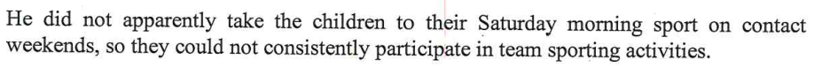

In the report from page 39 onwards is where the so called expert has listed all her recommendations. This is not an exhaustive list of the report writer's recommendations, as the others I have captured throughout this site on other pages. 

## Page 39

### Saturday morning sport

- As per [the Dad, Kids & Sport page](/marcseparation/dad_kids_sport/), I explain that due to Covid, there's been pretty much no sport in the past two years. 

### Standards of cleanliness, chores

- My own standards of cleanliness is normal compared to where Alex live, if you see the [living comparisons page](/marcseparation/living_comparisons/) my place Vs ALex's place, pictures & videos don't lie. 
- Plus, the kids know how to rinse and stack their own dishes in the dish washer after eating, they know how to hang up their washing on the line, then know how to make their beds, they know how to clean their own bathroom, they know how to clean their rooms - because I taught them how to do this, they don't get taught this stuff at their Mum's.
- The *eating everything on the plate* is covered on the [kids eating page](/marcseparation/kids_eating/).

### Uno rules

- Seriously? Kids need to develop and practice good habits, they can't go on through life always doing the wrong thing, then they'll get themselves into a difficult situation at some point. It wasn't finicky at all, it more so being fair - kids were fine with it. 

## Page 40

### Fun to serious, tense in the room

For starters, I have covered this off [here](/marcseparation/my_initial_comments/#interactions-with-kids-in-front-of-the-report-writer), it wasn't the best environment at all, especially going second after the kids had already just spent an hour with their Mum in the same room, **the kids didn't even get a break**! This is why the report writer would think the atmosphere was tense, I am very sensitive to humidity and the room was extremely stuffy and hot plus we didn't have a table that we could use - the entire environment was not comfortable at all. This explains why the kids looked as through they were insecure and avoidant.

As evidence to show that I am super sensitive to humidity & places being stuffy, below is the $9.2K invoice from when I was still living in the matrimonial home and before separation. I organised to get the biggest and best air-conditioner put in to the home, a ducted 3 phase 18KW Fujitsu Air-Conditioner, and I left it running 24/7 through the entire year set to **AUTO**. 

### My view of the world, mother's housekeeping is lax, lazy

- This report writer saying that my view of the world is different to that of neurodevelopmentally average individuals in relation to the mother's housekeeping? The report writer hasn't even seen the matrimonial home, as shown [here](/marcseparation/living_conditions/) and [here](/marcseparation/living_comparisons/), the mother's housekeeping is beyond any form of acceptable standard. Just like her own mother, as per the pages I have provided links for on this site, Alex is totally lax & lazy when it comes to housekeeping, and no matter if you're a neurodevelopmentally average individual or with Asperger's, it's clear to see. 
- As for saying that I have failed to make my time a rich one for the kids, this is not fair at all. Considering I haven't really had the chance to prove myself as a Dad with only 28.6% of the time spent with the kids, I haven't had the bandwidth nor time to really develop a rich experience for the kids. I get the kids, [they thaw out](/marcseparation/co_parenting/#different-behaviours-from-the-kids-upon-delivery), adjust with me, then you blink an eye and then they're back with their Mum again. More time with the kids would make a **huge** difference. 

### Children muck up and whinge and irritate each other to get my attention

- This is crap, the kids do not muck up and whinge and irritate each other, more so that they annoy each other and this is not to get my attention at all. Kids are online happily playing with their friends, playing Roblox or Minecraft and I literally have to physically pull them out of the room, just so we can leave the home, to go shopping, to a park, walk, ice-cream etc etc. If I let them, the kids would be in their room all day every day on their computers. It's the new virtual Covid world, all their friends are online with computers, iPads, phones etc and all connected with audio and video.
  
  You have to remember that the kids don't have computers at their Mum's place, so when they come to my place with their computers, then flock to & quietly disappear to their room and jump online with all their friends. They use **Discord** or the **Messenger Kids** app on their phones to talk to their friends. 

  As the report writer put it, *when they muck up*, it's not a cue that then need to go outside, rather than *mucking up*, there's commotion because one is annoying the other e.g. Charlie talking too loud or humming and it's annoying Chloe - that's it. 

  If I let them, they'd be on their computers happily playing all day. But I do limit their time from the computers and we do go for a drive to places to get out, stretch out legs or hang out at a park. 

  Even my son Charlie says it here, the internet is his social life:

  

### Kids with Dad

- This report writer says that there's been some **anticipatory anxiety** prior and a transition period for some hours afterwards. It's all Alex and purely a fallacy and misconception as Alex gets the kids all hyped up and worried about coming, as an example she sprays Chloe's teddies with her perfume every time. [Chloe still sleep in Alex's bed every night](/marcseparation/living_comparisons/#chloes-room), even today in an attempt to tell the kids that the smell will remind them of her. This is what dogs do with their scent of their mother, not humans. The kids bring their teddies and they literally stick as they're covered in Alex's perfume. It's all a false sense of security which Alex has put onto the kids. 
- As for my view and demands, this is a totally distorted view of what really happens, see [Dad is Fun](/marcseparation/dad_fun/), [Dad is a good Dad at home](/marcseparation/dad_is_a_good_dad_at_home/) and [Dad is a good Dad outside](/marcseparation/dad_is_a_good_dad_outside/) for real examples, my kids are **not alienated** from me at all - look at the videos and photos, look at the kids faces & their interactions, they are at home and 100% comfortable with me. 

Some of the several fun times the kids have while at my place - they are **totally relaxed**, I love them to bits. 

## Page 41

### My temper, shouting at kids

- This is absurd. For starters I never raise my voice with the kids, never loose my temper or shout at them. You can ask the kids. This may have been my behaviour towards Alex and likewise Alex also shouted back at me in return. 
- As for me practising punctilious adherence to rules? The report writer is really hanging onto this tiny point-in-time (one hour, on Friday, 15 October 2021), the report writer has really focused on this one **rule** episode from her obscured observation of me and the kids on that day in which I have already commented [above](/marcseparation/experts_opinions/#fun-to-serious-tense-in-the-room) and further [here](/marcseparation/my_initial_comments/#interactions-with-kids-in-front-of-the-report-writer), it was far from a suitable environment with unforeseen challenges to deal with i.e. the environment that the report writer had us in and the kids not having a break etc - not a situation to be fairly judged on and to take as gospel - it wasn't a natural environment for the kids and I and as such can't be judged fairly based on that.
- So no, the kids won't turn out like pariahs, they won't turn out like social outcasts at all. 
- As for the **lack of flexibility with the mother**, she is impossible to deal with, as until settlement, it's all war for her. As you can see by my numerous pages on this site and as you can see from the various comments in this report from both Bec & Alex, the mother hates me, her friends hate me, I have already proven the fact that Alex is playing "*the game*" and my evidence I have [provided here](/marcseparation/child_support/) where Alex even says it herself, **the primary motivation is money** (child support), **the kids are secondary** to her and I have outlined Alex's lax / hands-off parenting style [here](/marcseparation/alex_parenting/).
- As for punishing my kids, define punishing... Is this corporal punishment and involves infliction of physical pain upon the kids? Well as you can read in the report, I don't smack my kids and haven't done so for a very very long time, it's even acknowledged by Alex herself in the report. No matter how my parents raised me, I decided to never use corporal punishment. So, it's not corporal punishment. I don't have to anything like this. I am a big believer of **consistency** and **follow through** and I have punctilious adherence to this parenting style. This simple parenting style simply works. They know me, they know rules of what's right and what's wrong. Should they ever do something wrong, they get in trouble for it, to learn that it's not right they can continue to be good kids. 

### Eating everything on plate

- It says here about it's a mistake getting the kids to eat everything on their plate. [As I have already mentioned](/marcseparation/kids_eating/) on this site, its a mistake not understanding my kids, when was the last time they ate, how much they ate last time, gauging how much they can easily eat without force feeding them. It's about knowing my own kids which I do. THen I serve them proportions relevant to their size and the quantity of food that they can comfortably eat.
- In the US and many other Western countries, [we’re taught that it’s rude to leave food on your plate](https://matadornetwork.com/read/7-food-etiquette-rules-around-world/) because it somehow indicates you didn’t enjoy your meal.
- I too was taught this as a kid, but again, like me, my parents made sure they portioned controlled the amount of food on my plate so that finishing everything on my plate was easily achievable. 

### Punishment

## Page 44/45

- This is not fair to say this, because I haven't had the same length of time with the kids,than that of what Alex has had with the kids. As I have only had the kids for 28.6% of the time, I haven't had the luxury of meeting the kids friends parents, organising sleepovers, or play dates. Should I have the kids longer, that is totally the plan, and has always been the thought in the back of my mind for me to meet the parents of the kids friends, also I would love it to be able to have a working relationship with the kids cousins parents (Alex's sister & brother in law) Andrew and Victoria, so the kids can continue their own relationship with their Sydney cousins - Henry and Chelsea. I don't hate Alex and that side fo the family, and am quite prepared to make this work.

    I have already got a list of the kids **primary friends** parents and their phone numbers in my phone:

    | My Kid | Their friend | Friend's parent |
    | ------ | ------ | ------ |
    | Charlie | Oscar  | San (Dad) |
    | Charlie | Theo & Noah  | Jackie (Mum), Brad (Dad) |
    | Chloe | Letha  | Hannah (Mum) |
    | Chloe | Layla  | Deb (Mum) |
    | Charlie | Nicholas  | Betty (Mum), Benny (Dad) |
    | Charlie | Eden | Rachael (Mum), Masa (Dad) |

As you can see, I am all over it. With only 28.6% of the time that I have the kids, it's challenging.

During school holidays, the kids already hang out with their friends in which I organise through this contact list above. 

However during non-school holiday time, the time I have with the kids is greatly reduced so its different obviously as we are time poor with only the one weekend and I generally spend the time and play with them instead. During non-school holiday weekends, I try and maximise my time with the kids as I only see the kids for the lesser time. 

Should I get more time with the kids, week on / week off, then even during non-school holidays I'd adopt the same as school holidays and there would totally be more friend time with the kids.

