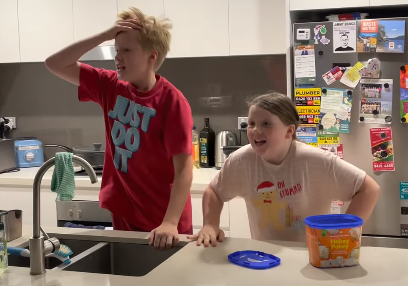
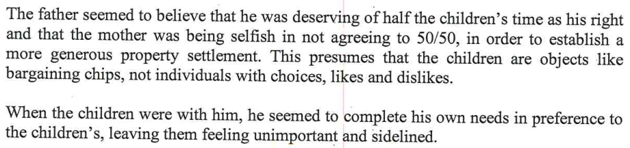

In the report from page 39 onwards is where the so called expert has listed all her recommendations. This is not an exhaustive list of the report writer's recommendations, as the others I have captured throughout this site on other pages. 

## Page 39

### Saturday morning sport

- As per [the Dad, Kids & Sport page](/marcseparation/dad_kids_sport/), I explain that due to Covid, there's been pretty much no sport in the past two years. 

### Standards of cleanliness, chores

- My own standards of cleanliness is normal compared to where Alex live, if you see the [living comparisons page](/marcseparation/living_comparisons/) my place Vs ALex's place, pictures & videos don't lie. 
- Plus, the kids know how to rinse and stack their own dishes in the dish washer after eating, they know how to hang up their washing on the line, then know how to make their beds, they know how to clean their own bathroom, they know how to clean their rooms - because I taught them how to do this, they don't get taught this stuff at their Mum's.
- The *eating everything on the plate* is covered on the [kids eating page](/marcseparation/kids_eating/).

### Uno rules

- Seriously? Kids need to develop and practice good habits, they can't go on through life always doing the wrong thing, then they'll get themselves into a difficult situation at some point. It wasn't finicky at all, it more so being fair - kids were fine with it. 

## Page 40

### Fun to serious, tense in the room

For starters, I have covered this off [here](/marcseparation/my_initial_comments/#interactions-with-kids-in-front-of-the-report-writer), it wasn't the best environment at all, especially going second after the kids had already just spent an hour with their Mum in the same room, **the kids didn't even get a break**! This is why the report writer would think the atmosphere was tense, I am very sensitive to humidity and the room was extremely stuffy and hot plus we didn't have a table that we could use - the entire environment was not comfortable at all. This explains why the kids looked as through they were insecure and avoidant.

As evidence to show that I am super sensitive to humidity & places being stuffy, below is the $9.2K invoice from when I was still living in the matrimonial home, before separation. I organised to get the biggest and best air-conditioner I could find to be installed into the home. It was a ducted 3 phase 18KW Fujitsu Air-Conditioner, and I left it running 24/7 through the entire year set to **AUTO**. I even had to use a level one electrician and convert the electricity meter on the side of the house from one phase to three phase. 

### My view of the world, mother's housekeeping is lax, lazy

- This report writer saying that my view of the world is different to that of neurodevelopmentally average individuals in relation to the mother's housekeeping? The report writer hasn't even seen the matrimonial home, as shown [here](/marcseparation/living_conditions/) and [here](/marcseparation/living_comparisons/), the mother's housekeeping is beyond any form of acceptable standard. Just like her own mother, as per the pages I have provided links for on this site, Alex is totally lax & lazy when it comes to housekeeping, and no matter if you're a neurodevelopmentally average individual or with Asperger's, it's clear to see. 
- As for saying that I have failed to make my time a rich one for the kids, this is not fair at all. Considering I haven't really had the chance to prove myself as a Dad with only 28.6% of the time spent with the kids, I haven't had the bandwidth nor time to really develop a rich experience for the kids. I get the kids, [they thaw out](/marcseparation/co_parenting/#different-behaviours-from-the-kids-upon-delivery), adjust with me, then you blink an eye and then they're back with their Mum again. More time with the kids would make a **huge** difference. 

### Children muck up and whinge and irritate each other to get my attention

- This is crap, the kids do not muck up and whinge and irritate each other, more so that they annoy each other and this is not to get my attention at all. Kids are online happily playing with their friends, playing Roblox or Minecraft and I literally have to physically pull them out of the room, just so we can leave the home, to go shopping, to a park, walk, ice-cream etc etc. If I let them, the kids would be in their room all day every day on their computers. It's the new virtual Covid world, all their friends are online with computers, iPads, phones etc and all connected with audio and video.
  
  You have to remember that the kids don't have computers at their Mum's place, so when they come to my place with their computers, within seconds they quietly take off and disappear to their room and jump online with all their friends. They use **Discord** or the **Messenger Kids** app on their phones to talk to their friends. 

  As the report writer put it, *when they muck up*, it's not a cue that then need to go outside, rather than *mucking up*, there's commotion because one is annoying the other e.g. Charlie talking too loud or humming and it's annoying Chloe - that's it. 

  If I let them, they'd be on their computers happily playing all day. But I do limit their time from the computers and we do go for a drive to places to get out, stretch out legs or hang out at a park. 

  Even my son Charlie says it here, the internet is his social life:

  

### Kids with Dad

- This report writer says that there's been some **anticipatory anxiety** prior to coming to my place and a transition period for some hours afterwards. It's all in Alex's head, she's instigating it, this is a misconception as Alex makes such a big deal out of it and it gets the kids all hyped up and worried about coming for no justified reason at all. [Chloe still sleeps in Alex's bed every night](/marcseparation/living_comparisons/#chloes-room), Alex is still babying the kids, keeping them as close as she can, of course this contrast making it much harder for the kids to be handed over. Another example, Alex sprays Chloe's teddies with her perfume every time, even today sill sprays the teddies in an attempt to remind the kids of her scent. It's ludicrous, this is what dogs do with their scent of their mother - not humans. The kids bring their teddies and they literally stink so bad, as they're saturated in Alex's perfume. It's all a false sense of security which Alex has applied to the kids. 
- As for my view and demands, this is a totally distorted view of what really happens, see [Dad is Fun](/marcseparation/dad_fun/), [Dad is a good Dad at home](/marcseparation/dad_is_a_good_dad_at_home/) and [Dad is a good Dad outside](/marcseparation/dad_is_a_good_dad_outside/) for real examples, my kids are **not alienated** from me at all - look at the videos and photos, look at the kids faces & their interactions, they are at home and 100% relaxed and comfortable with me. 

Some of the several fun times the kids have while at my place - they are **totally relaxed**, I love them to bits. 

## Page 41

### My temper, shouting at kids

- This is absurd. For starters I never raise my voice with the kids, never loose my temper or shout at them. You can ask the kids. This may have been my behaviour towards Alex prior to separation and likewise Alex also shouted back at me in return when we regularly argued. 
- As for me practising punctilious adherence to rules? The report writer really is so desperate to pin me down on something, she really is grasping on to this tiny point-in-time (one hour, on Friday, 15 October 2021), the report writer has done a great job in **double clicking** onto this one **rule** episode. What's more, what she did observe of the rule episode is an obscured observation of me and the kids on that day in which I have already commented [above](/marcseparation/experts_opinions/#fun-to-serious-tense-in-the-room) and further [here](/marcseparation/my_initial_comments/#interactions-with-kids-in-front-of-the-report-writer), it was far from a suitable environment with unforeseen challenges to deal with i.e. the environment of the room that the report writer had us in, and the kids how they didn't have a break etc - not a perfect situation to be fairly judged on and to take as gospel - it totally wasn't a natural environment for the kids and I and as such can't be judged fairly based on that.
- So no, the kids won't turn out like pariahs, they won't turn out like social outcasts at all. 
- As for the **lack of flexibility with the mother**, she is impossible to deal with, as until settlement, it's all war against me for her. As you can see by my numerous pages on this site and as you can see from the various comments in this report itself from both Bec & Alex, the mother hates me, her friends hate me, they are doing everything they can just to "***win***". I have already proven the fact that Alex is playing "***the game***" and my evidence that I have [provided here](/marcseparation/child_support/) where Alex even says it herself, **the primary motivation is money** (child support), **the kids are secondary** to her and I have outlined Alex's [Laissez-faire](https://www.encyclopedia.com/children/applied-and-social-sciences-magazines/laissez-faire-parents) / hands-off parenting style [here](/marcseparation/alex_parenting/#alexs-parenting-style).
- As for punishing my kids, define **punishing**... Is this corporal punishment that involves infliction of physical pain upon the kids? Well as you can read in the report, I don't smack my kids and haven't done so for a very very very long time, it's even acknowledged by Alex herself in the report. No matter how my parents raised me is beside the point, I'm a smart man and I decided a long time ago to never use corporal punishment. So, it's not corporal punishment. I don't even need to anything like this anyway. I am a big believer of **consistency** and **follow through** and I have punctilious adherence to this parenting style with my kids. This parenting style is simple, and it simply works. The kids know me, know me well, they know the boundaries of what's right and what's wrong. Should they ever do something wrong, they get in trouble for it so they know it's wrong, they learn that it's not right, then they can continue on to be the good kids that they are. Kids are kids, they are not born knowing what's right or wrong, they need to learn this, that's why parents exist. 

### Eating everything on plate

- It says here about it's a mistake getting the kids to eat everything on their plate. [As I have already mentioned](/marcseparation/kids_eating/) on this site, its actually a mistake not understanding my kids. As an example, when was the last time they ate, how much they ate last time, gauging how much they can easily eat without force feeding them. It's all about knowing my own kids, knowing them well, which I do. Then I serve them proportions relevant to their size and the quantity of food that they can comfortably eat.
- In the US and many other Western countries, [we’re taught that it’s rude to leave food on your plate](https://matadornetwork.com/read/7-food-etiquette-rules-around-world/) because it somehow indicates you didn’t enjoy your meal.
- I too was taught this as a kid, but again, like me, my parents made sure they portioned controlled the amount of food on my plate so that finishing everything on my plate was easily achievable. Note: Today, and throughout our lives, neither my sister or I have/had an eating disorder, this statement from the report writer is false - myth busted. 

### Punishment

- As for punishing my kids, define **punishing**... Is this corporal punishment that involves infliction of physical pain upon the kids? Well as you can read in the report, I don't smack my kids and haven't done so for a very very very long time, it's even acknowledged by Alex herself in the report. No matter how my parents raised me is beside the point, I'm a smart man and I decided a long time ago to never use corporal punishment. So, it's not corporal punishment. I don't even need to anything like this anyway. I am a big believer of **consistency** and **follow through** and I have punctilious adherence to this parenting style with my kids. This parenting style is simple, and it simply works. The kids know me, know me well, they know the boundaries of what's right and what's wrong. Should they ever do something wrong, they get in trouble for it so they know it's wrong, they learn that it's not right, then they can continue on to be the good kids that they are. Kids are kids, they are not born knowing what's right or wrong, they need to learn this, that's why parents exist. 

### Asperger's syndrome

- If you read online, the report writer is not an expert in people with Asperger's syndrome. Regardless, see [Dad is Fun](/marcseparation/dad_fun/), [Dad is a good Dad at home](/marcseparation/dad_is_a_good_dad_at_home/) and [Dad is a good Dad outside](/marcseparation/dad_is_a_good_dad_outside/) - videos and photos tell a thousand words and my kids are more than comfortable, they are secure with me and more than assured.

### Kids & running

- NOT CORRECT - The report writer totally screwed this. She thinks that I take my daughter on a seven kilometre run? This is bullshit, I never have as I know my daughter, the's not into running at all, so I don't **expect** that from her at all. Charlie is slightly different and is more sporty than Chloe. Sometimes Charlie will come with me on a run, but this is only sometimes and when Charlie tells me that he wants to come. These times that Charlie comes with me, he doesn't last the distance and I slow down, wait for him and he generally sits out half way through and he's not forced at all.  **Ask the kids**, they'll confirm, Chloe has never run with me ever, Charlie has sometimes but never lasted the distance and I never pressured him.
- As for the kids waiting in the car, sure they do. However, it's 6am in the morning, the car is locked, sun roof wide open for the heat to escape (heat rises), there's water bottles in the car, I have my 5G WiFi internet turned on, the kids are not in any **emotional distress** and are so happy waiting on their a android phones & headphones either playing games, talking to their friends online or watching Netflix etc. Plus the in the space of my 50 minute run, I am running past the car 4 times in this 50 minutes, the kids are safe and happy. After my run and when I drive home, I put the music on in the car and normally it's Chloe that whinges and tells me to turn off the music as she's **still** fixated on her phone. 

### Kids interpersonal relationships

- The report writer is not qualified to make this comment. What happened in my childhood was in my childhood and left in my childhood. I am now an adult. The old saying "***What ever doesn't kill you makes you stronger***" I have a different outlook on life now that I am an adult and much different to that when I was a child. 

## Page 42

### Kids homework importance

- I dismiss this, no way the report writer can say this with any substance of evidence. As during school days, I only have the kids 4 nights a fortnight and two fo these days are the weekend. I can't be judged on this fairly based on the current time I have with the kids. 
- Of course I see that kids homework is important - totally unrelated to when I was a kid, like I said before, that was my childhood, I'm now an adult. 

### Relating to my kids

- Total nonsense, I disagree. As you can see from this site, these pages in particular [Dad is Fun](/marcseparation/dad_fun/), [Dad is a good Dad at home](/marcseparation/dad_is_a_good_dad_at_home/) and [Dad is a good Dad outside](/marcseparation/dad_is_a_good_dad_outside/) - my kids and I have a perfect bond in which the report writer doesn't understand, nor has enough information to accurately comment on. 

### Kids, objects, bargaining chips

- The report writer has taken what I said in the session totally out of context. I didn't mention any connection between the kids of 50/50 care to that of financial settlement. 
- I said that the mother, Alex was [using the children for financial gain](/marcseparation/child_support/), which is another subject the report writer totally ignored and didn't look into, as this report is totally skewed in Alex's favour.
- As for the kids feeling unimportant and sidelined, the pages on this site negate this, e.g. [Dad is Fun](/marcseparation/dad_fun/), [Dad is a good Dad at home](/marcseparation/dad_is_a_good_dad_at_home/) and [Dad is a good Dad outside](/marcseparation/dad_is_a_good_dad_outside/)

## Page 44

### Kids more time with their mother

- This is totally incorrect, it's purely because I have had less time with the kids and not the opportunity to create a real father/kid bond with them. This is not by choice either, my current time with the kids is 4 nights a fortnight and this was a judges decision early in 2020 with an interim court order, who at the time had 50 cases to get through on the day, he had a headache and was short of temper and said that he was just going to make an order, that was it - I've been stuck with this order - as much as I hated it - for the past 2 years. 

 Now that I am working from home every day (since the start of the pandemic), plus can work whatever hours I like, I can more than accommodate the kids. 

## Page 44/45

- This is not fair to say this, because I haven't had the same length of time with the kids compared to what Alex has had with the kids. As I have only had the kids for 28.6% of the time, I haven't had the same luxury of meeting the kids friends parents, organising sleepovers, or play dates. Should I have the kids longer, it's always been the plan, to meet the parents of the kids friends. I'd also love to be able to have a working relationship with the kids cousins parents (Alex's sister (Victoria) & brother in law (Andrew)), so the kids can continue their own relationship with their Sydney cousins - Henry and Chelsea. I don't hate Alex and her side of the family, and am quite prepared to make this work for the benefit of my kids.

    I have already got a list of the kids **primary friends** parents and their phone numbers in my phone:

    | My Kid | Their friend | Friend's parent |
    | ------ | ------ | ------ |
    | Charlie | Oscar  | San (Dad) |
    | Charlie | Theo & Noah  | Jackie (Mum), Brad (Dad) |
    | Chloe | Letha  | Hannah (Mum) |
    | Chloe | Layla  | Deb (Mum) |
    | Charlie | Nicholas  | Betty (Mum), Benny (Dad) |
    | Charlie | Eden | Rachael (Mum), Masa (Dad) |

As you can see, I am all over it. With only 28.6% of the time that I have the kids, I already have a head start, but it's challenging.

During school holidays, as I have the kids for a much longer period of time, the kids already hang out with their friends in which I organise through this contact list above. 

However during non-school holiday time, the time I have with the kids is greatly reduced so its obviously different as we are time poor with only the one weekend (four nights) a fortnight and I generally tend to maximise this time that I have with the kids, as I get much less time. 

Should I get more time with the kids, week on / week off as an example, then even during non-school holidays I'd adopt the same as school holidays practice and there would totally be more friend time with the kids.

