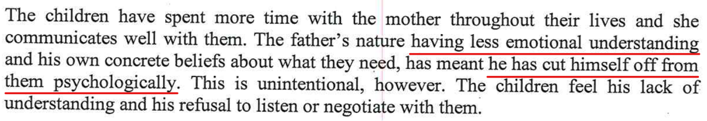
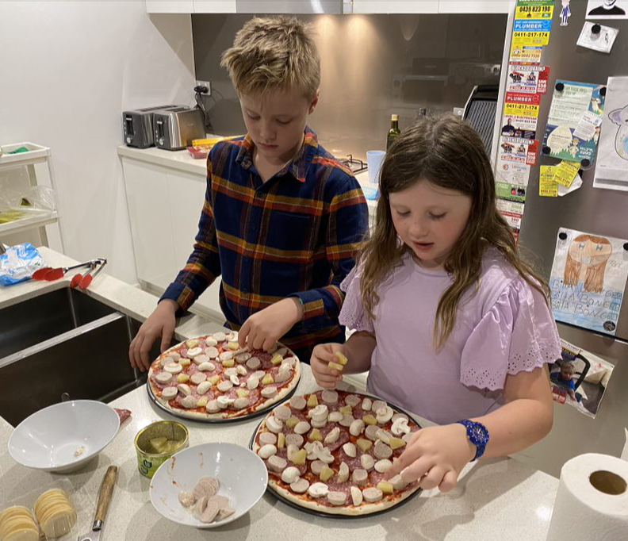

[//]: # (margin:top right bottom left)

<iframe width="420" height="315"
    src="https://www.youtube.com/embed/H4vi8ATgJgw?playlist=H4vi8ATgJgw&loop=1&Version=3&autoplay=1&mute=1&showinfo=1&rel=0">
</iframe>

## Statements from the report

The report contained the following:

- *He already has failed to make his time a rich one for the children with child centered experiences*

- *Rather than picking up the que that they needed to go outside and do physical activity together*

- *The Fathers difficulty in understanding the age-appropriate needs of his children*

- *The inflexibility which is due to his neurodevelopmental disorder is a major deficit to his ability to relate to all people and in particular his own children*

- *The father's nature of having less emotional understanding and his own concrete beliefs about what they need, has meant he has cut himself off from them psychologically*

## My rebuttal

### Fun things I have done with my kids

Since separation, the kids and Dad have done many fun things together.

- I am a fun and the kids love being with me & their extended paternal family
- Photos all of which since separation (since Nov 2019)
- Kids are more than happy and at peace with themselves

|  |  |
| ----------- | ----------- |
|  |  |
|  |  |
|  |  |
|  |  |
|  |  |
|  |  |
|  |  |
|  |  |
|  |  |
|  |  |
|  |  |
|  |  |
|  |  |
|  |  |
|  |  |
|  |  |
|  |  |
|    Paternal cousins, Nathan & Connor |  |
|  |  |
|  |  |
|  |  |
|  |  |
|  |  |
|  |  |

### BIG4 Ingenia holiday park

Other fun things I do with the kids, I made a fun tourist video with the kids when we stayed recently at the BIG4 Ingenia Holiday park in Soldiers Point NSW, near Port Stephens, just north east of Newcastle. Kids had a whole bunch of fun making it. See the video here:

<iframe width="420" height="315"
    src="https://www.youtube.com/embed/vvz1-OsgYB8?playlist=vvz1-OsgYB8&loop=1&Version=3&autoplay=1&mute=1&showinfo=1&rel=0">
</iframe>

### Encouraging kids to hit other kids

#### The report

### My rebuttal

The real story here. I am a big believer of self-defence, it's ok to defend yourself as long as it wasn't you that started it. I was always told as a kid to stand up for myself. I did a pretty crap job at it, but I was a big believer in it. Teachers won't be around everywhere to protect you, so I wanted my kids to learn this early in life, start early and develop good habits themselves rather than rely on **teachers** for example that won't be around all their life. I told the kids many times that if anyone hit them at school, hit them back straight away within a millisecond and say "*no*" in a big voice. I also told them very clearly to **never be the first one to hit** and **only** if someone hits them, then hit them back instantly. The thought process here is that the kids bullying doing the hitting in the first place will learn very quickly not to target kids that stand up for themselves, and then the bullier will move onto to the next kid. It's like the old saying with security in homes, the thieve breaking into homes, if your house is fully secure and locked up, they'll move on and target the weakest house. Same with a bullier, they'll tend to target the weakest and easiest kid.
