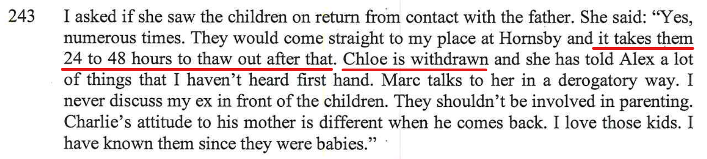

[//]: # (margin:top right bottom left)

## Statements from the report

The report contained the following:

- This is crap, the kids love being with me. The below videos, you can see, th kids are more than happy spending time with me. 

- This is a comment frm Bec when talking to the the report writer... This didn't happen, I remember this night very clearly as I saw Bec's boobs, it's etched in the back of my mind forever. Yes, I remember walking into the kitchen of the hotel room that we had near the Vivid light show, and there was Bec sitting on the ground in the kitchen with my son Charlie, Bec was totally topless with her boobs hanging out. I quickly walked back out again. But got me wondering afterwards, why is Bec totally topless and my son Charlie was right there at the same time? Why didn't Bec get changed in the bathroom? This is totally inappropriate!

    Plus, the hotel that we were in was right at the Vivid light show, so we didn't drive to it, we simply walked to it as we were right on circular quay in the middle of Sydney.

- Utter bullshit, as per this site, I have published pages with a lot of content to quash this - [I am fun](/marcseparation/dad_fun/), [Dad is a good Dad at home](/marcseparation/dad_is_a_good_dad_at_home/), [Dad is a good Dad outside](/marcseparation/dad_is_a_good_dad_outside/) and [I take the kids to the park](/marcseparation/kids_park/).

- There's reasons behind this attention to detail, as per all the issues that I had with Alex and her mental health, [all the issues that I had with her](/marcseparation/alex_mental_health/) when living with her, I couldn't understand why she did the things that she did, it didn't make sense to me, constantly asking questions to her and always getting a different response to what the answer should have been. The below shows that this doesn't continue with my kids, and that my kids are very much in tune with me, likewise I'm very much in tune with my kids. My daughter [Chloe for example](/marcseparation/chloe/), I totally understand her, as like me she has Asperger's, she like a real mini me and we simply connect. As mentioned [here](/alex_parenting/#alex-is-never-around), Alex never plays with Chloe.

## My rebuttal

### I am not a bad Dad

Photos and videos speak for themselves, they are trust worthy and they don't lie. These video's below are my proof of me being a good Dad **inside the home**. For proof of me being a good Dad **outside the home**, please visit the other page, [Dad is fun outside the home](/marcseparation/dad_is_a_good_dad_outside/).

## The below are some videos of the kids and I having heaps of fun inside the home

Kids to excited at my place...

<iframe width="420" height="315"
    src="https://www.youtube.com/embed/HBVIzwhJitw?playlist=HBVIzwhJitw&loop=1&Version=3&autoplay=1&mute=1&showinfo=1&rel=0">
</iframe>

Of course the kids are faking this, but they're having so much fun together!

<iframe width="420" height="315"
    src="https://www.youtube.com/embed/Zqry3yZ9eJg?playlist=Zqry3yZ9eJg&loop=1&Version=3&autoplay=1&mute=1&showinfo=1&rel=0">
</iframe>

### Rubik’s Cube Challenge

Rubik’s Cube Challenge - I messed it up and Charlie Kean solved it! Hats off to Charlie, the little genius!

What else is there to do in lockdown, other than make the most of the time to yourself. 

See what you can do when you focus and apply yourself, you can do anything…

<iframe width="420" height="315"
    src="https://www.youtube.com/embed/4BIsmeyN9wI?playlist=4BIsmeyN9wI&loop=1&Version=3&autoplay=1&mute=1&showinfo=1&rel=0">
</iframe>

### Charlie & Chloe helped to build their brand new loft bed from IKEA

Great activity for the kids to really get involved in something that we can all contribute to as a family, learn some new skills and really enjoy the finished result. 

<iframe width="420" height="315"
    src="https://www.youtube.com/embed/qWYC70au4ts?playlist=qWYC70au4ts&loop=1&Version=3&autoplay=1&mute=1&showinfo=1&rel=0">
</iframe>
 
<iframe width="420" height="315"
    src="https://www.youtube.com/embed/I_OHOYEqIY0?playlist=I_OHOYEqIY0&loop=1&Version=3&autoplay=1&mute=1&showinfo=1&rel=0">
</iframe>

### Gingerbread house

A fun activity and challenge as a family, to build a gingerbread house. We all too part in this group activity, was fun and kept us all occupied for quite some time. 

<iframe width="420" height="315"
    src="https://www.youtube.com/embed/6jcYpYPdIfQ?playlist=6jcYpYPdIfQ&loop=1&Version=3&autoplay=1&mute=1&showinfo=1&rel=0">
</iframe>
 
<iframe width="420" height="315"
    src="https://www.youtube.com/embed/bplzhkNkYdA?playlist=bplzhkNkYdA&loop=1&Version=3&autoplay=1&mute=1&showinfo=1&rel=0">
</iframe>

### Random dancing

I love music, so do my kids. At times when the music is on (especially the kids favourite music), the kids have a bit of fun and dance, I love it as they are happy and provides me with some priceless entertainment. 

<iframe width="420" height="315"
    src="https://www.youtube.com/embed/VnAHx1-3CJo?playlist=VnAHx1-3CJo&loop=1&Version=3&autoplay=1&mute=1&showinfo=1&rel=0">
</iframe>

### Playing/signing on my legs

Another example, you can see the kids are more than comfortable and relaxed with me. Totally not alienated from me at all. They love me and I love them. 

<iframe width="420" height="315"
    src="https://www.youtube.com/embed/Lgved-Kvb2A?playlist=Lgved-Kvb2A&loop=1&Version=3&autoplay=1&mute=1&showinfo=1&rel=0">
</iframe>

## Epilogue

My kids are absolutely awesome! My kids are the BEST things in my life.

For proof of me being a good Dad **outside the home**, please visit the other page, [Dad is fun outside the home](/marcseparation/dad_is_a_good_dad_outside/).