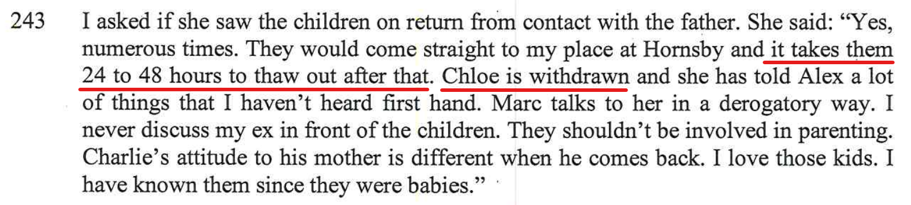
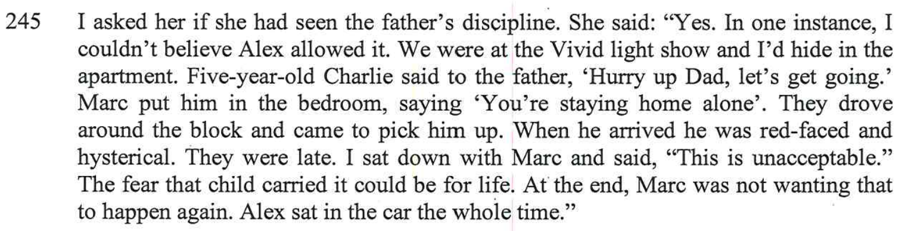
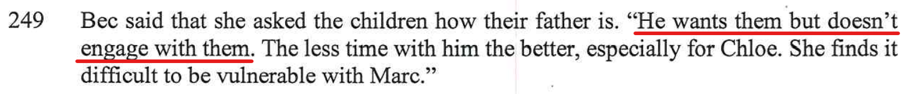
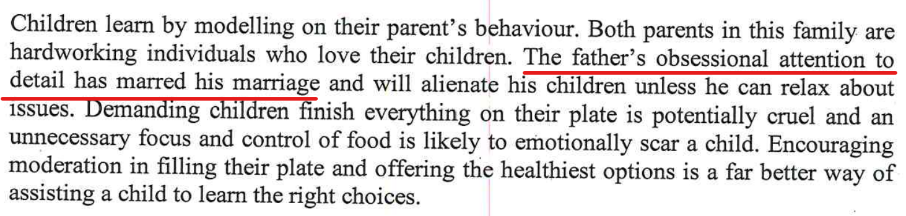

[//]: # (margin:top right bottom left)

## Statements from the report

The report contained the following:

- This is crap, the kids love being with me. The below videos, you can see, th kids are more than happy spending time with me. 

- This is a comment frm Bec when talking to the the report writer... This didn't happen, I remember this night very clearly as I saw Bec's boobs, it's etched in the back of my mind forever. Yes, I remember walking into the kitchen of the hotel room that we had near the Vivid light show, and there was Bec sitting on the ground in the kitchen with my son Charlie, Bec was totally topless with her boobs hanging out. I quickly walked back out again. But got me wondering afterwards, why is Bec totally topless and my son Charlie was right there at the same time? Why didn't Bec get changed in the bathroom? This is totally inappropriate!

    Plus, the hotel that we were in was right at the Vivid light show, so we didn't drive to it, we simply walked to it as we were right on circular quay in the middle of Sydney.

- Utter bullshit, as per this site, I have published pages with a lot of content to quash this - [I am fun](/marcseparation/dad_fun/), [Dad is a good Dad at home](/marcseparation/dad_is_a_good_dad_at_home/), [Dad is a good Dad outside](/marcseparation/dad_is_a_good_dad_outside/) and [I take the kids to the park](/marcseparation/kids_park/).

- There's reasons behind this attention to detail, as per all the issues that I had with Alex and her mental health, [all the issues that I had with her](/marcseparation/alex_mental_health/) when living with her, I couldn't understand why she did the things that she did, it didn't make sense to me, constantly asking questions to her and always getting a different response to what the answer should have been. The below shows that this doesn't continue with my kids, and that my kids are very much in tune with me, likewise I'm very much in tune with my kids. My daughter [Chloe for example](/marcseparation/chloe/), I totally understand her, as like me she has Asperger's, she like a real mini me and we simply connect. As mentioned [here](/alex_parenting/#alex-is-never-around), Alex never plays with Chloe.

## My rebuttal

### I am not a bad Dad

Photos and videos speak for themselves, they are trust worthy and they don't lie. These video's below are my proof of me being a good Dad **outside the home**. For proof of me being a good Dad **inside the home**, please visit the other page, [Dad is fun inside the home](/marcseparation/dad_is_a_good_dad_at_home/).

## The below are some videos of the kids and I having heaps of fun outside the home

### Australia Zoo

December 2021, the paternal grandfather, myself and the kids went to Australia Zoo for the day. 

<iframe width="420" height="315"
    src="https://www.youtube.com/embed/O8NhnRvIjVM?playlist=O8NhnRvIjVM&loop=1&Version=3&autoplay=1&mute=1&showinfo=1&rel=0">
</iframe>

### Big Boing, Birtinya, QLD

December 2021, the kids and I went to Big Boing for the day. Chloe literally twisted my arm, she so desperately wanted me to jump & climb with them. If it wasn't for my [personal training sessions](/marcseparation/dad_kids_sport/#my-rebuttal), I would have struggled. 

<iframe width="420" height="315"
    src="https://www.youtube.com/embed/R1dAO4jOdlk?playlist=R1dAO4jOdlk&loop=1&Version=3&autoplay=1&mute=1&showinfo=1&rel=0">
</iframe>

### Clip & Climb | Gosford, NSW, Jan 2021

Kids and I experienced this awesome place, we all had so much fun. 

<iframe width="420" height="315"
    src="https://www.youtube.com/embed/_58f7he47qc?playlist=_58f7he47qc&loop=1&Version=3&autoplay=1&mute=1&showinfo=1&rel=0">
</iframe>

### The Entrance NSW, The fair, October 2021

An example of some of the things we do when I have the kids, we go for a drive and get out away from the home, away from our computers and this weekend in October was one of those times and there just happened to be a fair happening at The Entrance on the Central Coast. So I couldn't say no to buying them tickets for the kids to go and have a whole heap of fun. 

<iframe width="420" height="315"
    src="https://www.youtube.com/embed/fpo9foj23rM?playlist=fpo9foj23rM&loop=1&Version=3&autoplay=1&mute=1&showinfo=1&rel=0">
</iframe>

### Charlie showing off his muscles

Some ad-hoc fun at the shops, Charlie wanted to demonstrate his muscles. I thought it was pretty fun and the kids also loved it. Simple things are often the best. You can see the kids are more than comfortable and relaxed with me. Totally not alienated from me at all. 

<iframe width="420" height="315"
    src="https://www.youtube.com/embed/ZVgyjLI4MuY?playlist=ZVgyjLI4MuY&loop=1&Version=3&autoplay=1&mute=1&showinfo=1&rel=0">
</iframe>

### Yes Day

Similar to the [movie of the same name](https://www.youtube.com/watch?v=Y-3Vr8Ut8d0). I gave the kids points for doing jobs at my place. Chloe managed to get enough points to have her very own **yes day** - she was the boss for this very one day. So it was off to the shops, as this is what she wanted to do.

<iframe width="420" height="315"
    src="https://www.youtube.com/embed/weHhTMzBIls?playlist=weHhTMzBIls&loop=1&Version=3&autoplay=1&mute=1&showinfo=1&rel=0">
</iframe>
 
<iframe width="420" height="315"
    src="https://www.youtube.com/embed/wZXi-_c4o4E?playlist=wZXi-_c4o4E&loop=1&Version=3&autoplay=1&mute=1&showinfo=1&rel=0">
</iframe>

### Halloween 2020 / 2021

Spent 2020 Halloween with the kids:

<iframe width="420" height="315"
    src="https://www.youtube.com/embed/7QFUTMtBnoY?playlist=7QFUTMtBnoY&loop=1&Version=3&autoplay=1&mute=1&showinfo=1&rel=0">
</iframe>
 
<iframe width="420" height="315"
    src="https://www.youtube.com/embed/V97XWdcX4Dc?playlist=V97XWdcX4Dc&loop=1&Version=3&autoplay=1&mute=1&showinfo=1&rel=0">
</iframe>

Spent 2021 Halloween with the kids:

<iframe width="420" height="315"
    src="https://www.youtube.com/embed/KqFBTrD8H7w?playlist=KqFBTrD8H7w&loop=1&Version=3&autoplay=1&mute=1&showinfo=1&rel=0">
</iframe>

## Blast from the past

Before Alex and I separated, the paternal grandparents (my Mum & Dad) came to visit in 2019 to help with laying of new grass. It was a massive job and hard work, but this is one example of some fun we had with the kids. 

<iframe width="420" height="315"
    src="https://www.youtube.com/embed/plLRz1Bu-yg?playlist=plLRz1Bu-yg&loop=1&Version=3&autoplay=1&mute=1&showinfo=1&rel=0">
</iframe>

## Epilogue

Kids are great! Kids are the BEST things in my life.

For proof of me being a good Dad **inside the home**, please visit the other page, [Dad is fun inside the home](/marcseparation/dad_is_a_good_dad_at_home/).
