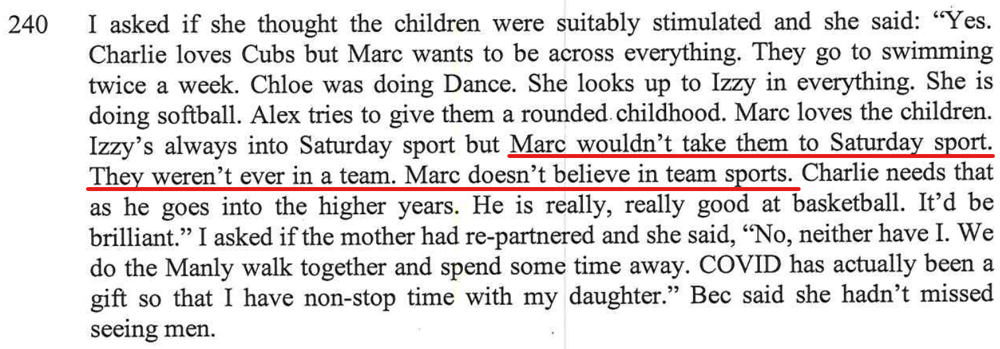
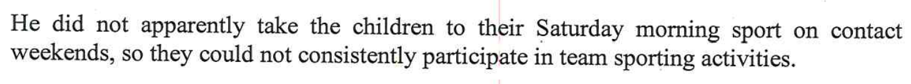
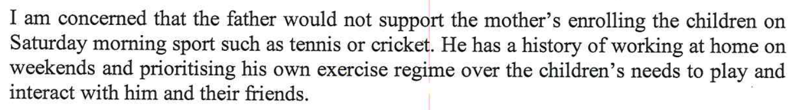
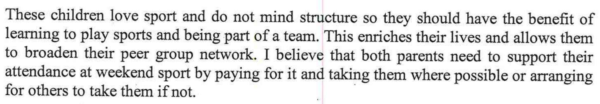
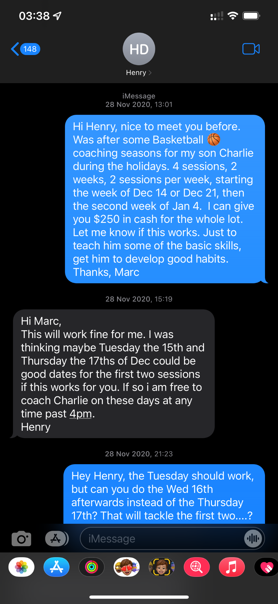
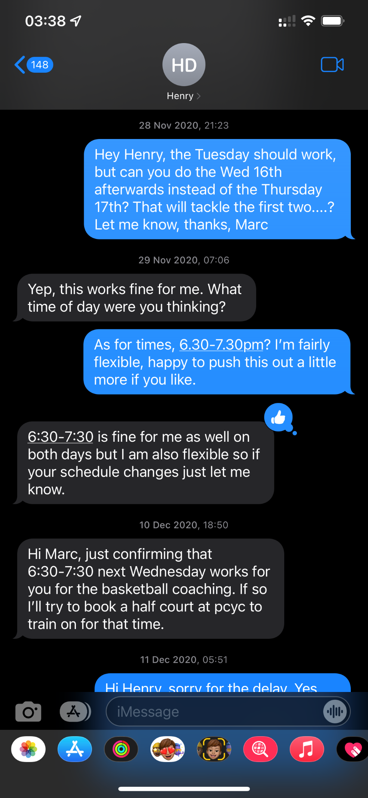
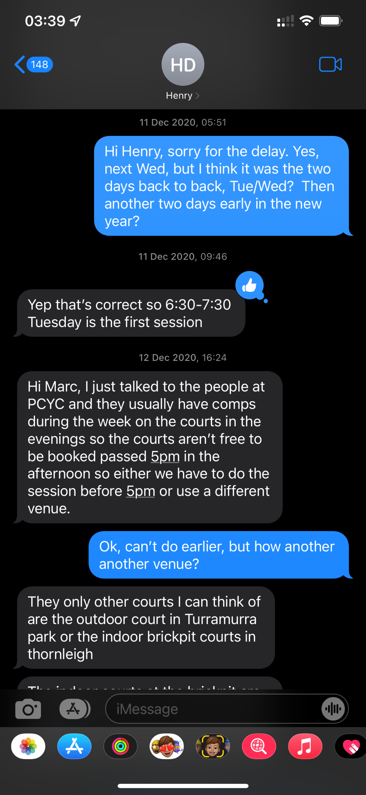

[//]: # (margin:top right bottom left)
## Statements from the report

- Bec said *Marc wouldn't take them to Saturday sport. They weren't ever in a team. Marc doesn't believe in team sports.*

- Expert's opinion - this is incorrect criticism, see below.

- Expert's opinion - the below makes this statement of concern irrelevant

- Below is evidence that I do pay and organise the kids to do sport and physical activities

## My rebuttal

I myself personally am not a big sporting person, I don't have an athletic bone in my body, this is similar to my daughter Chloe as she takes after me with this gene. I am not a natural at sports and need a lot of work/training, more than others. Hence why I have a personal trainer who I have been seeing 3 times a week for the past 2 years, it's all about staying on top of it, maintenance. It hasn't been easy, however the results after this 2 years speak for themselves: 
- I was flat out doing 1 lap running around an oval. Now I can run 8kms non-stop. 
- I couldn't even do 3 push-ups, now I can do 60 push-ups in one go
- I was at 32% body fat in the beginning, I'm now down to 17% body fat

Below is my personal trainer, I'm talking to **Phil Baird** from **Philthy Phitness**:

<iframe width="420" height="315"
    src="https://www.youtube.com/embed/WWx4NHazYj8?playlist=WWx4NHazYj8&loop=1&Version=3&autoplay=1&mute=1&showinfo=1&rel=0">
</iframe>

It's all about commitment, perseverance and dedication. I now see physical fitness as a fundamental part of life and will never go back to my previous life of no exercise. Doing physical exercise is perfect for physical and mental wellbeing and see it as super important for everyone, not just myself. 

This is also true for my kids and I encourage my kids to play whatever sport that they decide to.

When I have the kids every second Thursday, the kids come with me to my personal training session on Thursdays. Below is a recent video where my son is getting some stretches from my PT Phil:

<iframe width="420" height="315"
    src="https://www.youtube.com/embed/ioT5nCbTRbQ?playlist=ioT5nCbTRbQ&loop=1&Version=3&autoplay=1&mute=1&showinfo=1&rel=0">
</iframe>

Previous to my separation, just over two years ago I wasn't getting any physical exercise at all and had a different mindset to physical fitness. Now I look at physical fitness totally different - my results over the last 2 years are real results and speak for themselves. This is fact, not someone's non-factual opinion in a report.

The statement in the report *He did not apparently take the children to their Saturday morning sport on contact weekends, so they could not consistently participate in team sporting activities* - this is not a fair criticism. The reason for this is that Alex and my separation has been in sync with Covid. We separated pretty much right at the start of Covid and due to this, we've been in lockdown for the bulk of the past two years with sport seasons cancelled over and over. There's been **no** Saturday morning sport on contact weekends. In saying this, the little sport that the kids did manage to play was at all at school on Fridays, where Charlie would play cricket on Fridays and Chloe would play T-Ball on Fridays. 

### Charlie Basketball coaching

In the report it did a great job advertising the fact that I'm crap at encouraging kids to play sport. Over 2 years ago maybe, definitely not now. What wasn't mentioned in the report was that in the past two years since separation, and as a result of no Saturday morning sport, I took it upon myself and arranged & paid for Charlie to have one-on-one Basketball coaching. Alex knew about this great initiative of mine, but decided not to menton this in the report.

Since separation, on a weekend that I had the kids, I took Charlie to the Waitara PCYC to play Basketball, but I noticed that he didn't have the exact skills, he looked a little amateur in his style. I knew that it would be great if someone can work with Charlie one-on-one and teach him some invaluable skills so that he could use these new skills to really help him progress in his quest to be great at Basketball. 

<iframe width="420" height="315"
    src="https://www.youtube.com/embed/6lxE7asWP5o?playlist=6lxE7asWP5o&loop=1&Version=3&autoplay=1&mute=1&showinfo=1&rel=0">
</iframe>

As evidence, the below are the text's of me organising the coaching with **Henry Day** (the coach).

### Team Sports

I work at Microsoft, Microsoft is totally a team sport. We all work together, support each other and achieve results. 

### Other physical activity while in lockdown

**Beat the lift** was in the early days of Covid lockdown and after my separation. An ingenious idea of mine, a way of getting exercise whilst in complete lockdown in an apartment block. The kids and I would literally race up the fire stairs, burn a few calories at the same time to try and beat the lift. It was all in aid of having a bit of fun while in apartment lockdown  and getting exercise at the same time. 

<iframe width="420" height="315"
    src="https://www.youtube.com/embed/KD0vs6mdVp0?playlist=KD0vs6mdVp0&loop=1&Version=3&autoplay=1&mute=1&showinfo=1&rel=0">
</iframe>