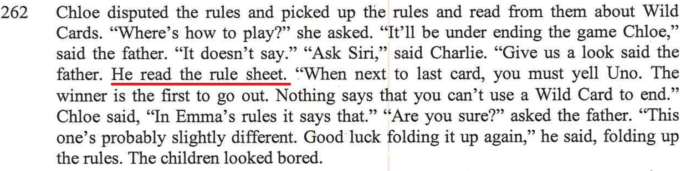
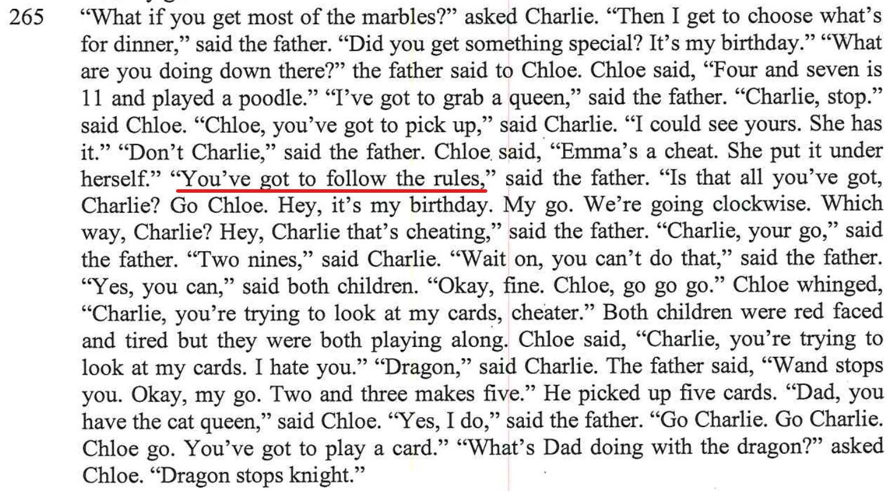
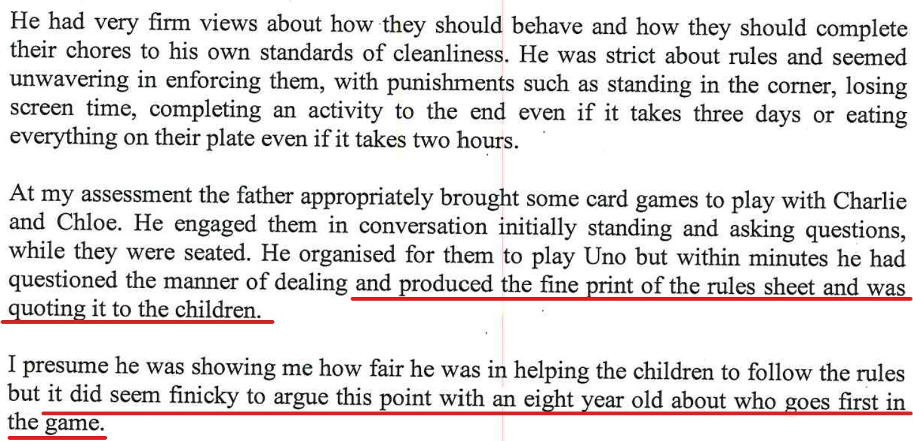
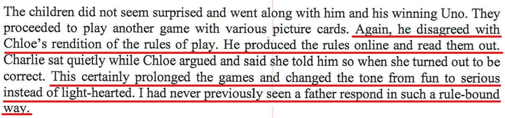

[//]: # (margin:top right bottom left)

## Statements from the report

The report contained the following:

- I checked and confirmed the rules for Uno

- Advising my kids that they need to follow rules

- I produced rules for my kids

- The report writer is having a go at me for getting rules out in a game
- 
## My rebuttal

### Rules in games

The report writer having a go at me for reading the rules for games, this is totally absurd. The report writer said, "*This certainly prolonged the games and changed the tone from fun to serious instead of light-hearted. I had never seen a father respond in such a rule-bound way*.". This video here is taken of my own Dad (Poppy to my kids) and he is reading rules for a game called **Bobs**. I then go onto ask Charlie is he is happy with the game, to which he replies, *yes*:

<iframe width="420" height="315"
    src="https://www.youtube.com/embed/SxiYoejo6qs?playlist=SxiYoejo6qs&loop=1&Version=3&autoplay=1&mute=1&showinfo=1&rel=0">
</iframe>

It's ok for others to read rules. My brother in law (my sisters husband) always refers to rules when playing games so there's no arguments, fights or disagreements. It's not OK for me? [Bearing in mind the conditions of the room when I interacted with the kids](/my_initial_comments/#interactions-with-kids-in-front-of-the-report-writer), it wasn't the best environment for playing card games at all.  

Reading rules is not a constant thing, it's only needed generally once when someone is unsure of the game and it makes sure that it sets good habits for kids then on, so they don't grow up playing games the wrong way with the risk that they end up in an argument, fight or disagreement with their peers when playing games. 

On the subject of games (e.g. Bobs), having fun and the kids getting really involved in the game. Here's a video of both **Charlie** & **Chloe**, they are both right into the game of **Bobs**. I ask them how to play, and as their Poppy read the **rules** to them, they were **happy** to explain how to play the game while they themselves played the game itself:

<iframe width="420" height="315"
    src="https://www.youtube.com/embed/lknoiBWW9xA?playlist=lknoiBWW9xA&loop=1&Version=3&autoplay=1&mute=1&showinfo=1&rel=0">
</iframe>

