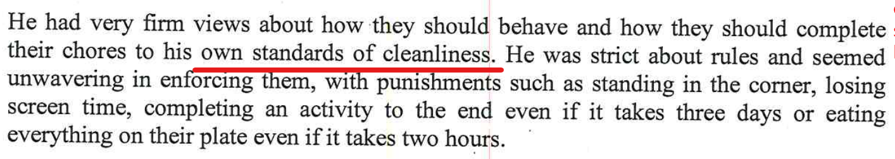
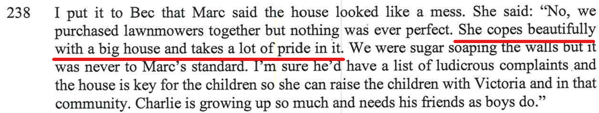

## Statements from the report

- "He had very firm views about how they should behave and how they should complete their chores to his own standards of cleanliness."

- "She copes beautifully with a big house and takes a lot of pride in it."

## My rebuttal

Remember for me as the father, that as per [what I mentioned in my initial comments](/marcseparation/my_initial_comments/#unfairly-judged-based-on-current-time-with-the-kids), my current living arrangement is only **temporary**, back at the start of separation I had no choice but reluctantly move out of the home in Jan 2020 and then rent an apartment **temporarily** (now going on 2 years) until this separation is totally completed. All my money is tied up in the matrimonial home.

However, this will give you a good idea that as Alex has remain in the matrimonial home, again only **temporary**, she is not coping to maintain the home, it's way too big for her to manage.

The below video is a walk through of the home, it's a total dump and reminds me of walking through her own late mothers house when she was alive.

Alex has lost total control over the maintenance of the home.

<iframe width="420" height="315"
    src="https://www.youtube.com/embed/gDr0XIgdk7A?playlist=gDr0XIgdk7A&loop=1&Version=3&autoplay=1&mute=1&showinfo=1&rel=0">
</iframe>

### The house is totally not safe

This is railing of the top balcony at the back of the house, kids can fall down through this, land on the ground and could seriously injure themselves of whats worse, kill themselves. 

<iframe width="420" height="315"
    src="https://www.youtube.com/embed/Pb2Wtx18Zj8?playlist=Pb2Wtx18Zj8&loop=1&start=81&end=89&Version=3&autoplay=1&mute=1&showinfo=1&rel=0">
</iframe>

#### The railing is still not fixed

On January 16, 2022, I was back at the house and noticed that not the railing is still not fixed and has gotten worse, it's the entire length of the railing, the wire has totally ome out. 

<iframe width="420" height="315"
    src="https://www.youtube.com/embed/rW6g---2QLw?playlist=rW6g---2QLw&loop=1&start=81&end=89&Version=3&autoplay=1&mute=1&showinfo=1&rel=0">
</iframe>

The current living conditions for the home are contrary to that of the report. 

- Just like Alex’s mother, there’s crap left all over the place
- The house is filthy and disgusting 

These videos are real walk through videos of the state of the home since separation. It's a dump, the the living conditions are far from optimal in anyone's standards.

<iframe width="420" height="315"
    src="https://www.youtube.com/embed/hixvOH7lxVo?playlist=hixvOH7lxVo&loop=1&Version=3&autoplay=1&mute=1&showinfo=1&rel=0">
</iframe>

This video below, you will notice that about half way through that there's a completely loose cable on the back balcony which is totally dangerous, as kids can fall straight through about 5+ meters to the ground. 

<iframe width="420" height="315"
    src="https://www.youtube.com/embed/1oJeG2IlXPQ?playlist=1oJeG2IlXPQ&loop=1&Version=3&autoplay=1&mute=1&showinfo=1&rel=0">
</iframe>

### Current state of the house

As you can see that fairly substantial maintenance has been undertaken. You see from the rest of the footage that the house is still looking like a dump and a total pigsty. 

<iframe width="420" height="315"
    src="https://www.youtube.com/embed/ylQRMTdOcjc?playlist=ylQRMTdOcjc&loop=1&Version=3&autoplay=1&mute=1&showinfo=1&rel=0">
</iframe>

Alex and I are both **tenants in common** for the matrimonial home. It says from [here](https://www.aussielegal.com.au/nsw-property-law-co-ownership-tenants-in-common-joint-tenants) That if one co-owner spends money in carrying out necessary repairs and maintaining the property, or pays for the construction of improvements on the property, without the consent of the other co-owner(s), that co-owner cannot force the others to contribute for the expenses paid for by that co-owner.
