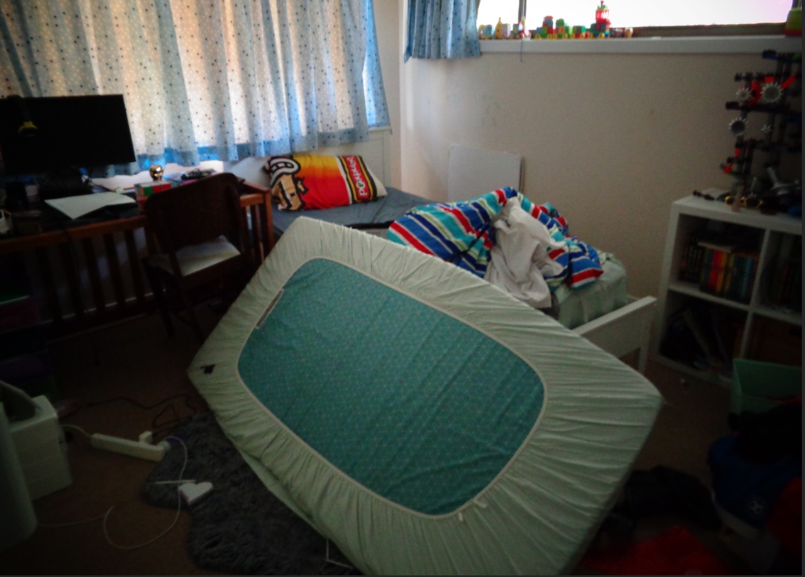
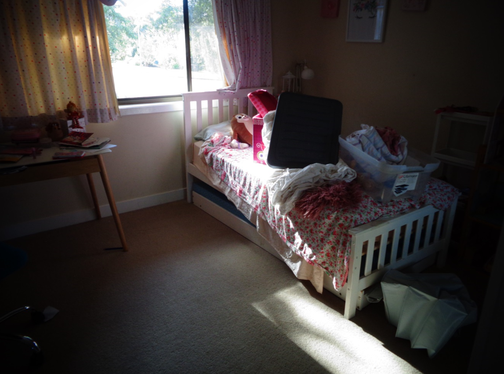
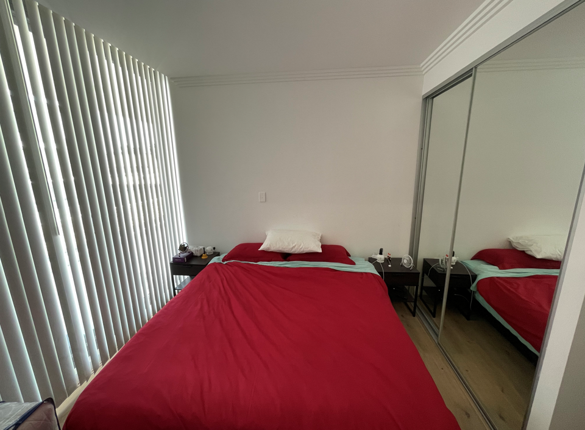
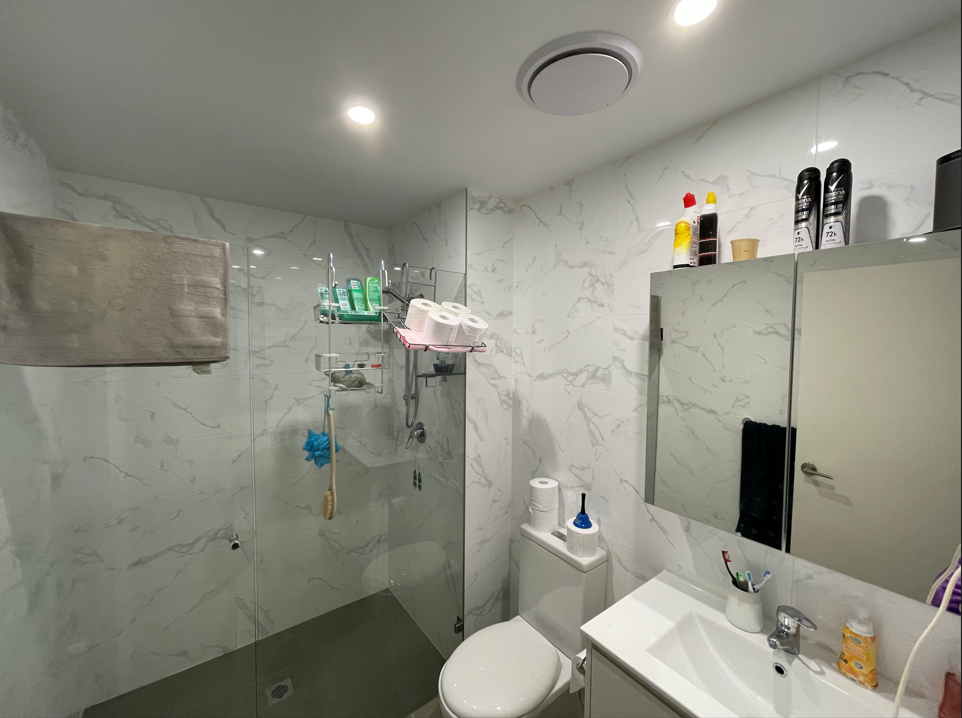
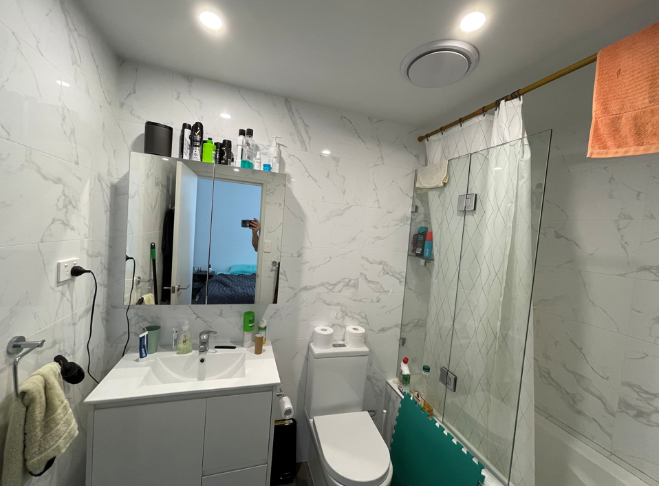
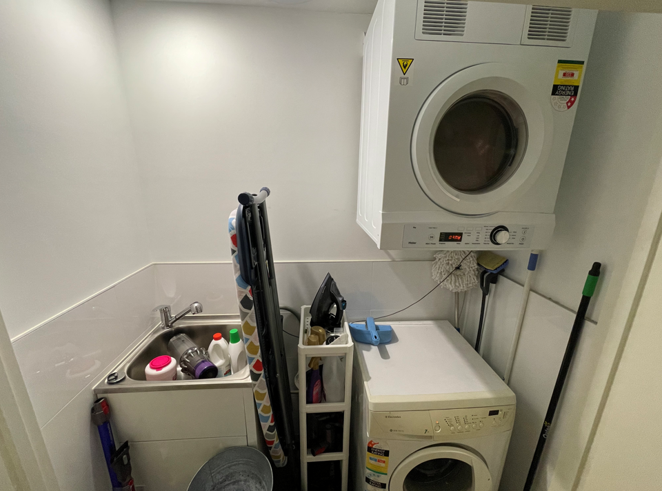
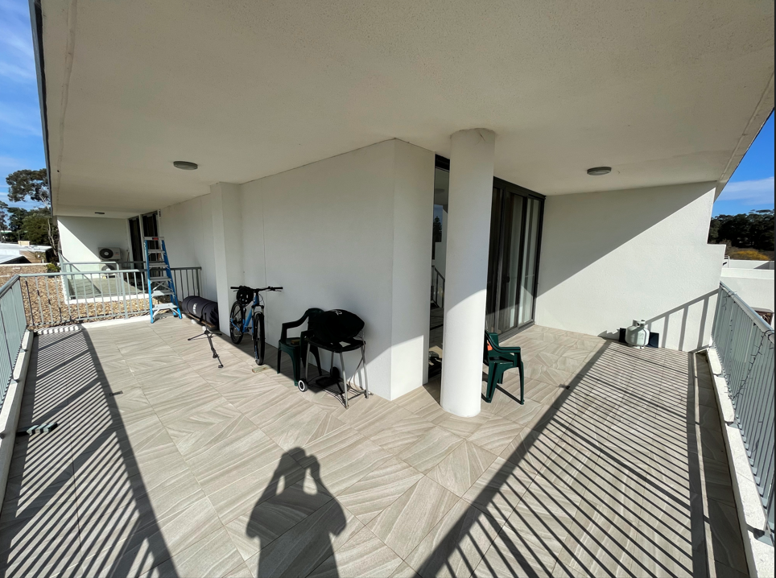

## Statements from the report

- "He had very firm views about how they should behave and how they should complete their chores to his own standards of cleanliness."

- "She copes beautifully with a big house and takes a lot of pride in it."

## My rebuttal

Remember for me as the father, that as per [what I mentioned in my initial comments](/marcseparation/my_initial_comments/#unfairly-judged-based-on-current-time-with-the-kids), my current living arrangement is only **temporary**, back at the start of separation I had no choice but reluctantly move out of the home in Jan 2020 and then rent an apartment **temporarily** (now going on 2 years) until this separation is totally completed. All my money is tied up in the matrimonial home.

However, this will give you a good idea that as Alex has remain in the matrimonial home, again only **temporary**, she is not coping to maintain the home, it's way too big for her to manage. 

### Kid's bedroom

#### Mother's place

##### Charlie's room

###### Chloe's room

It's to be noted that Chloe sleeps in Mummy's bed every single night from what Chloe & Charlie tell me, also considering the state of Chloe's room, it's currently a construction site, Chloe doesn't have a bedroom at the moment. 

 

<iframe width="420" height="315"
    src="https://www.youtube.com/embed/UoELU1q8RO4?playlist=UoELU1q8RO4&loop=1&Version=3&autoplay=1&mute=1&showinfo=1&rel=0">
</iframe>

---------------------------------------------------------------
---------------------------------------------------------------

### Kitchen

#### Mother's place

<iframe width="420" height="315"
    src="https://www.youtube.com/embed/cQZkKjgGH4A?playlist=cQZkKjgGH4A&loop=1&Version=3&autoplay=1&mute=1&showinfo=1&rel=0">
</iframe>

#### Father's place

<iframe width="420" height="315"
    src="https://www.youtube.com/embed/qPIIONhejpU?playlist=qPIIONhejpU&loop=1&Version=3&autoplay=1&mute=1&showinfo=1&rel=0">
</iframe>

---------------------------------------------------------------
---------------------------------------------------------------

### Master Bedroom

#### Mother's place

<iframe width="420" height="315"
    src="https://www.youtube.com/embed/9h2GkBO6-Dg?playlist=9h2GkBO6-Dg&loop=1&Version=3&autoplay=1&mute=1&showinfo=1&rel=0">
</iframe>

#### Fathers's place

---------------------------------------------------------------
---------------------------------------------------------------

### Main bathroom

#### Mother's place

<iframe width="420" height="315"
    src="https://www.youtube.com/embed/LsX5zrnutXY?playlist=LsX5zrnutXY&loop=1&Version=3&autoplay=1&mute=1&showinfo=1&rel=0">
</iframe>

#### Father's place

---------------------------------------------------------------
---------------------------------------------------------------

### Ensuite

#### Mother's place

<iframe width="420" height="315"
    src="https://www.youtube.com/embed/MlCafbIy4gw?playlist=MlCafbIy4gw&loop=1&Version=3&autoplay=1&mute=1&showinfo=1&rel=0">
</iframe>

#### Father's place

---------------------------------------------------------------
---------------------------------------------------------------

### Main Toilet

#### Mother's place

<iframe width="420" height="315"
    src="https://www.youtube.com/embed/wztAQZuxJ0o?playlist=wztAQZuxJ0o&loop=1&Version=3&autoplay=1&mute=1&showinfo=1&rel=0">
</iframe>

The father's place doesn't have a separate main toilet, it's part of the main bathroom.

---------------------------------------------------------------
---------------------------------------------------------------

### Lounge

#### Mother's place

<iframe width="420" height="315"
    src="https://www.youtube.com/embed/GKBIrnPEKMo?playlist=GKBIrnPEKMo&loop=1&Version=3&autoplay=1&mute=1&showinfo=1&rel=0">
</iframe>

The father's place doesn't have a separate lounge, it's shown further above as part of the kitchen

---------------------------------------------------------------
---------------------------------------------------------------

### Laundry

#### Mother's place

<iframe width="420" height="315"
    src="https://www.youtube.com/embed/sMs-OCUwgAE?playlist=sMs-OCUwgAE&loop=1&Version=3&autoplay=1&mute=1&showinfo=1&rel=0">
</iframe>

#### Father's place

---------------------------------------------------------------
---------------------------------------------------------------

### Going Upstairs

#### Mother's place

<iframe width="420" height="315"
    src="https://www.youtube.com/embed/gC_GgPVdlbk?playlist=gC_GgPVdlbk&loop=1&Version=3&autoplay=1&mute=1&showinfo=1&rel=0">
</iframe>

---------------------------------------------------------------
---------------------------------------------------------------

### Downstairs spare room

#### Mother's place

<iframe width="420" height="315"
    src="https://www.youtube.com/embed/orExK3hnZrQ?playlist=orExK3hnZrQ&loop=1&start=31&end=41&Version=3&autoplay=1&mute=1&showinfo=1&rel=0">
</iframe>

### General living

#### Mother's place

The below is a video when I went to the house at one stage since separation, I took my mower & wippa snippa and I mowed the lawn and did the edges. I did a comparison video on the before and after, you will see a massive difference: 

<iframe width="420" height="315"
    src="https://www.youtube.com/embed/B61ABb9LGg0?playlist=B61ABb9LGg0&loop=1&Version=3&autoplay=1&mute=1&showinfo=1&rel=0">
</iframe>

This video was from before Alex and I separated. I take pride on keeping places clean to a good standard. As it was my job to mostly keep the outside of the home clean e.g. the lawn, I extended this and even looked after my next door neighbours lawn while they were away. The following video will show you the before, mid-point and after view of the lawn after I did the edges and mowed the lawn for him (John): 

<iframe width="420" height="315"
    src="https://www.youtube.com/embed/fEc_OpXdne8?playlist=fEc_OpXdne8&loop=1&Version=3&autoplay=1&mute=1&showinfo=1&rel=0">
</iframe>

#### Father's place

My **temporary** place at the moment, this is the outside wrap around balcony. 

