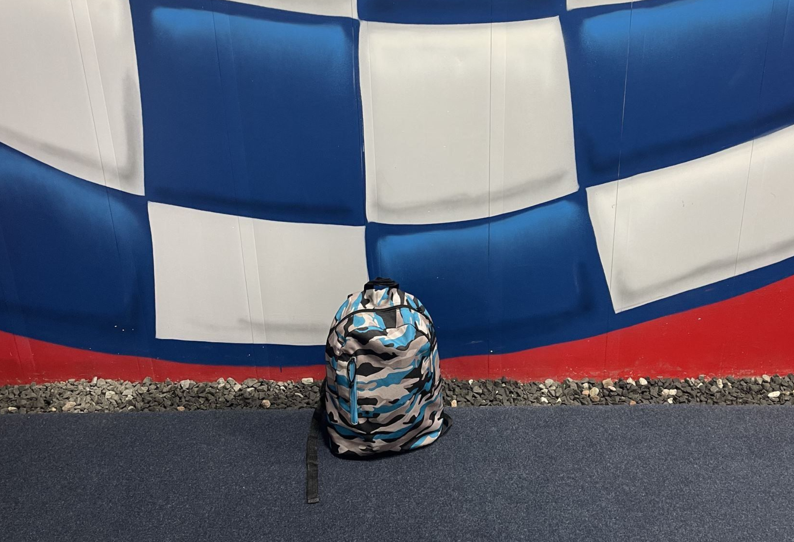

## Statements from the report

- *Two statements from Alex* - Alex's sister Victoria or Bec looking after the kids on Saturdays

- Not by choice, but Alex has no choice but to be heavily reliant on her sister Victoria to help look after the kids, as she has no parents (they are dead). But we all know how mentally insane Victoria is don't we? 
- Vic [calls me a dickhead in front of the kids](/marcseparation/vic_calling_me_a_dickhead/), then even without Alex knowing, she calls the Police and tells them that I am suicidal. The next day, even Alex had to call the Police and tell them to cancel the event. 
- Also this absurd accusation Victoria is making about [me spying on her breast feeding](/marcseparation/breast_feeding_spy_allegation/), where I have included evidence of where Alex herself at the time defended me. Basically Victoria and her husband Andrew are completely insane with the allegations. 
- Plus all the other issues with Victoria as listed [here](/marcseparation/alex_sister_victoria/).

Now with all this information about Alex's sister Victoria, you really think it's a good idea that she looks after my kids? Of course not. 

The below statement from Bec:

Rebecca (Bec) also is not exactly the best role model for any kids as I have mentioned [here](/marcseparation/alex_friend_bec/).

- Being topless in front me my son Charlie, not once, but several times
- Bec is a long term smoker, smokes around my kids and leaves cigarettes around them
- Bec doesn't believe in parental controls for online streaming platforms such as Netflix, Disney+, Prime, Binge etc

Having Bec look after my kids, not the best choice. 

## Charlie looked after by Victoria

There was a school holiday event called "**Free G Parkour**" on at the local PCYC in Waitara. On Wednesday January 19, Alex's sister Victoria took the kids, Charlie (my son) and his cousin Henry (Victoria's son). 

However again due to the [Laissez-faire](/marcseparation/alex_parenting/#alexs-parenting-style) / permissive parenting style which I have documented, this parenting style runs rife throughout the Spence family with both Alex & Victoria. Just like her mother, Victoria parents the same way. 

As a result, I had a phone call from Mikaila at the PCYC Monday January 24 (5 days later), Charlie's backpack had been left there, and I picked it up. In it, it had Charlie's lunch box, water bottle and a camera. Neither ALex or Victoria even noticed that it had been missing. 

