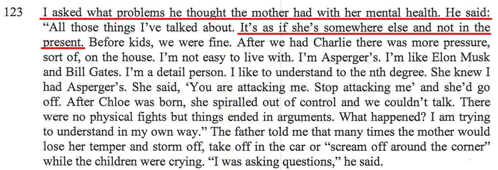
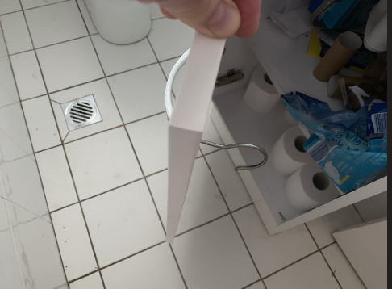

## Background

Alex is not coping and/or has mental issues or a mix of both. We know that there has definitely been a history of mental health in both Alex's father and sister, with both experiencing Bipolar disorder. There was a number of idiotic things that Alex did while we were living together and as for the cause, part of it I put it down to that she's not happy in our relationship, she wasn't coping (one reason why we separated) as she wasn't happy at all.

However since separation and even with me removed from the picture, in theory Alex should be much happier now and in turn, cope better. However, this is not the case and Alex is still doing idiotic things, making stupid mistakes and mishaps over and over again. Further below are examples of these stupid and idiotic things which she did both **before** and **after** we separated. 

As mentioned in the report, I told the report writer that it's as if Alex is running on autopilot and lot living in the present moment.

Alex has mental issues - the below is a summary of real events, which have been documented at the time of the events happening

- Alex runs on auto-pilot, her brain is not engaged on things that she's doing
- Alex runs on subconscious and is not conscious most of the time 

Doing extensive research online, knowing Alex from **before** and **after** we separated, it seems that she may be suffering from [depersonalisation disorder](https://www.netdoctor.co.uk/ask-the-expert/depression-faqs/a512/i-constantly-feel-like-im-on-autopilot/) its as though she's disconnected from both her body and the world around. These feelings of detachment are the mind’s way of coping in situations of extreme stress. And stress is exactly what Alex was going through before our separation, and now it may seem that this hasn't changed. depersonalisation disorder is meant to be only temporary, however, when these feelings keep occurring or never completely go away and interfere with ones ability to function, it can also be considered as **depersonalization-derealization** disorder. This disorder is more common in people who've had **traumatic experiences**.

### Alex has experienced traumatic experiences

- Her mother died of Motor neurone disease (MND)
- Alex experienced a tremendous amount of stress in the last 4 years of our relationship before we split

## What we know of the current situation:

- Alex is a single Mum in a large home, much bigger than she needs with her and two kids, [the matimonial home is run down](/marcseparation/living_conditions/)
- [In the report](/marcseparation/report_contradictions/#contradiction-2), Alex says that she goes to the park each afternoon from 3pm, but my daughter Chloe says the opposite
- It's true that when the kids are with their Mum, [they are left alone](/marcseparation/alex_parenting/#alex-is-never-around) to play with their friends and/or be looked after by Aunty's or friends as Alex needs to work. It's also true that Charlie goes to the park by himself. 
- Alex's parents separated when she was six years of age. Alex's Julia was two years of age at the time. Alex practically spent her entire life growing up in a broken family. In contrast, my Mum & Dad are still together today and have been for approx 50~ years.

## The house is constantly left unlocked

Before separation in Nov 2019, Alex used to always leave the matrimonial home unlocked. I would come home from work, no one was home and constantly I would find a door unlocked. Can just walk straight in. Even now it's still happening, a conversation with my son Charlie & Chloe confirm this is still the case. Alex is so mentally affected, that even my own son **Charlie** has to step up and remind Alex to lock the house. 

<audio src="../audio/Alex_not_locking_the_house.mp3" type="audio/mpeg" controls>
  I'm sorry. You're browser doesn't support HTML5 <code>audio</code>.
</audio>

### Matrimonial home totally unlocked January 16, 2022

I was due to drop the kids back on this day. So, I went back to the house, Alex wasn't there, the kids don't have keys, however they walked straight into the house. The front security screen door and main door was completely **unlocked**, and the back sliding door was also **unlocked**.

The below video is documentation of the event (you can hear Charlie saying "*the door's unlocked and she's not even here?*"):

<iframe width="420" height="315"
    src="https://www.youtube.com/embed/oS304zLLMuk?playlist=oS304zLLMuk&loop=1&Version=3&autoplay=1&mute=1&showinfo=1&rel=0">
</iframe>

## Alex transferred money to my account

In December 2021, Alex transferred not one amount of money, but two amounts of money to an old bank account in her name that has been part of my portfolio of bank accounts since separation. It was an old joint account that Alex stopped using 2 years ago and hasn't used it since. All my bank accounts are with **Commonwealth Bank**, and all Alex's bank accounts are with **Westpac**. 

### $1,000.00

### $1,350.00

These transfers were about an hour apart, I know this as two notifications came through on my **Apple Watch** for each transfer as soon as the transfer took place. The **$1,000.00** transfer amount came through while I was at Westfields Hornsby on this day, then the **$1,350.00** transfer amount came about an hour later when I just got home from Westfields Hornsby.

She didn't do this just once as a mistake, she literally did this twice an hour apart. Who makes a stupid mistake, not once, but twice in the space of an hour? 

This extra proof that Alex is totally not coping, living well beyond her means, up to her eye balls and she's suffering from [depersonalisation disorder](/marcseparation/alex_mental_health/) - as though she’s disconnected from both her body and the world around.

## Alex's crap carpark

On December 16, 2020 look how far out from the gutter that she parked on an already narrow street in the middle of school pickup:

## Chloe dropped face first onto a tiled floor

When our daughter was a little baby and still in nappies. Alex was changing her nappy in the laundry, Alex put Chloe on the bench face up. Alex turns her back for a second, then Chloe roles off the bench and goes splat onto the tiled floor face down. Chloe would have fallen about 1+ meters.

## Parking ticked left in machine

August 2, 2019 - At Nelson Bay, Alex bought parking ticket from a street parking vending machine across the road from where the car was parked, she then came back to the car and said "**Let's go kids, all done**" but she left the ticket in the machine and didn't put it in the car.

## Puppy poos in the lounge room

2019 - Alex puts the puppy in the lounge room crate on a Saturday night before going to bed, but she doesn’t close the crate door properly, it doesn’t latch. As a result, the puppy gets out and does a poo in the lounge room and does a wee in the hallway.

## The house just about burns down

January 14, 2020 - The kitchen stove was left on from breakfast, I walked into the kitchen at 2.15pm and found it had been left on, the stove was hot and drawing a ton of electricity, I was paying the electricity bill, and the house could have caught fire.

## The grass that was for sale

### My statement from the report

I ask Alex "Do we have the money for the grass?"    She says, "Yes"
I ask where is it, she says "In the office"
I ask where abouts is it in the office, she says "it'll be dropped off to the office"

It was a constant thing with Alex, she would always be saying stuff which is in-correct, I ask a question, see doesn't give me the correct answer.

## Private Health Insurance

Half way through November I asked Alex to cancel the health cover (under her name) cover for her and the kids. Alex paid this using money out of the joint account $1.9K (after separation) she took our money to pay for her health cover, this included cover for both Alex and the kids (I’m not paying for Alex's cover), I asked this same night if she had reversed the health cover and she said YES! She said the money would be back in my account in a couple of days. Just now (2 weeks later) the money is still not back in the account, however the money has been transferred to a completely separate account in her name - which I don't have access to. 

## Sealant in the kitchen

### My statement from the report

### More detail

Before Alex and I separated, I noticed water leaking through the kitchen bench through the joins of the granite bench top. So I removed the old sealant, cleaned it, then laid new sealant. After this I also put bright blue tape either side of the wet sealant like a road works warning, that would be easily noticed from the cornet of the eye, so that one would stay well clear of the sealant while it dries. This happened at about 4pm one afternoon. Just after I laid the sealant, I showed Alex how much of a great job it was, a perfect line of sealant, told her not to touch it as it needed to dry, and she acknowledged it.

Later that same day at about 6.30pm (2.5 hours later) after dinner, I noticed the sealant line had been broken in 3 different sections – Alex was washing the dishes at the time right next to the sealant and I was on the other side of the bench and could easily see the sealant broken.

The kids were not around and I was in the office the whole 2.5 hour window between me laying the sealant and when I noticed it had been broken. Alex however was in the kitchen getting dinner ready.

When I noticed the damage, I brought it up with Alex and she denied anything to do with it. At the time of me bringing it up while Alex was doing the dishes, Alex had a tea towel in her hand and actually wiped over the sealant right then and there thinking I was talking about a spec of dust on the line of sealant and she thought she could wipe off the spec of dust.
 
What happened??? 

- Either **A**: Alex have wiped across the sealant and didn’t say anything due to the fear of being yelled at or me getting angry
- or **B**: Alex wiped over it and forgotten she had done it or not aware of wiping over it. If this is the case, this is a mental issue and seriously concerning. Assume it’s option A, then I wouldn’t care as much, fine, she owns up that she fucked up, she made a mistake, everyone makes mistakes, I would be fine if you did this (I can move on with this). But instead she is adamant she didn’t wipe over it - hence the reason I was seriously angry just after. I’m both angry and concerned because if it was option B, mental illness runs in her family, she had all along thought I would physically hit her and she has always thought I attack her (which is total bullshit, I have never hit her), if she has genuinely forgotten she has wiped over it - which we have had similar issues in the past of random shit happening beyond comprehension and her not remembering having any recollection or owning up to it e.g.
  - forgetting to lock the house regularly
  - the dish drainer ended up in the bin and you didn’t know how and no recollection

…. she might need to get tested for her mental wellbeing. 

Either or, we need to sort this ASAP, if this doesn’t get sorted it and if I move out and Alex does have a mental problem, her looking after our kids by herself is not healthy. 

As evidence, the below are the photos I took, the photos of the sealant being broken, the blue tape there as a warning sign to keep away while it dries.

|  |  |
| ----------- | ----------- |
|  |  |
|  |  |

## Tree loppers

After Alex and I separated, and would be about 20 months afterwards. On 03/10/2021, tree loppers came to chop down next-door neighbours' trees alongside fence line pf the matrimonial home on the neighbour's side of the fence.

This happened on a Sunday, I wasn’t aware. I did ask the neighbour (who I have a decent relationship with) to let me now, however he assumed he would let Alex know and she would let me know.

I had the kids that weekend, I came to the house with the kids or another reason on that same day and while I was there I happened to notice the tree loppers that were there at the time. The side fence was wide open, Alex was not home and the dog was there. The dog **Ginger** is a cross between a Beagle & King Charles Cavalier and they like to wander off. Being a scent hound dog, the Beagle has been bred for centuries to follow his nose, this instinct is extremely strong. Most often, [a Beagle will run away to follow a scent](http://www.beaglepro.com/beagle-running-escaping).

The tree loppers didn’t know anything about the dog in the house – and it was super lucky that I managed to be there on that same day to inform the tree loppers about he dog and to keep the fence shut. 

The next door neighbour **Rolly** send me a screenshot of his correspondence with Alex, As you can see below there was a week's notice.

Alex chose to ignore it. 

## Chloe dropped face first onto a tiled floor

When our daughter was a little baby and still in nappies. Alex was changing her nappy in the laundry, Alex put Chloe on the bench face up. Alex turns her back for a second, then Chloe roles off the bench and goes splat onto the tiled floor face down. Chloe would have fallen about 1+ meters.

## Ginger the dog on the back balcony

### My statement from the report

### More detail

Mum and Dad were here at the time.

I needed to mow the lawn, so I had the back gate open in the back yard, I put Ginger the dog on the balcony with the balcony gate closed so she was contained. I did this so that I could mow the lawn. 

I informed Alex not to let Ginger off the balcony as I was mowing the lawn with the back gate open. As Ginger is a cross between a Beagle & King Charles Cavalier, she liked to wander off quite a lot. Being a scent hound dog, the Beagle has been bred for centuries to follow his nose, this instinct is extremely strong. Most often, [a Beagle will run away to follow a scent](http://www.beaglepro.com/beagle-running-escaping). Plus I would have only been no longer than an hour mowing the back lawn. 

Then minutes later while the petrol lawn mower was still going (loud noise), Chloe asks Mummy if she can let Ginger inside, Alex says to Chloe it’s OK to let Ginger into the house. 

Then Ginger runs downstairs and out through the doggy door and into the backyard and nearly escapes through the open gate in the back yard. 

I ask the question to Alex and Chloe, who opened the door, both told me they didn’t. 

It wasn't until later when I threatened to get Chloe into trouble for lying, Alex told me it was her that it was her that said it was OK for Chloe to let Ginger in the house.

**Witness:** My mum was here at the the time and she too witnessed this. 

## Constantly putting non recycling things in the recycling bin

I'm constantly telling her not to put stuff like carpet in the recycling bin such as shoes, clothing or carpet. 

I would always find clothing, old shoes etc int he recycling. You can't recycle these things. 

## Screw replacement to bathroom cabinet

Instead of being told there was a loose handle and to fix the loose handle in the bathroom, I find a coat hanger hook that had been placed in the back of the door of the bathroom cupboard as a makeshift screw. I did ask who put it behind the bathroom handle, who put it there? No one owns up, no one tells me that a screw is missing - radio silence from everyone including Alex. 

## Stainless Steel Sink Strainer

The Stainless Steel Sink Strainer is missing in the sink. I ask Alex and she does't know what happened to it. She looks for it and finds it in the bin. She's gone to shake food scraps out of the Stainless Steel Sink Strainer and in doing so, she's dropped it in there without realising it. Who does this? 

## Kids School Disco, forgets and never answers her phone

Friday night, May 4, 2018 - the kids had a school disco from 5-6pm. Alex was there for the entire time helping out, she got there early and got a park out the front. Meanwhile I was on a train coming home from work. I walked from the train station and phoned Alex on the way to tell her I was coming to the school disco, she picked up the phone. I got in at about 5.25pm and got to the school hall and said hello. As there was 35 minutes left until the disco finished, I decided to go to the shops and get some stuff for the weekend. I asked for Alex's car keys to use the car and told her I would be back by 6pm to pick them up. 

6pm came around and I was back on-time. Problem is, it was kids swap over time with the disco (one year to the next) and I couldn't find a carpark outside, I had to double park on the corner, I had my hazard lights on and illegally parked. So I phoned Alex on her mobile to tell her so she would know I was outside, maybe she was expecting me to come back in again. Problem is, Alex didn't answer her phone. So I kept calling her over and over again constantly, she didn't answer. 10 mins had passed and she finally answered, she was still there at 6.10pm at the disco with the kids, I told her to come out quickly as I was double parked - I then went off at her because she didn't answer her phone constantly, even though she answered it the very first time when I called earlier and plus it was 6pm (the time we agreed that I was due to return).

## Mothers Day

Saturday Night May 12, 2018 - the night before Mothers day, I cooked dinner. Alex had French Champagne & a home cooked dinner. We were sitting there having dinner and all of a sudden at 7.40pm, Alex says it's time for the kids bedtime - kids hadn't even finished dinner. This then brings up the conversation about the kids being allowed to stay up on the weekend.

The night before, Friday night, we're all watching a movie and I fell asleep in front of the TV at about 9pm, Alex wanted to put the kids to bed while I was asleep, but didn't, she said she didn't tell the kids to go to bed because she thought they would say "*Daddy said we would stay up*", even while I was still asleep, she was more scared of the kids giving her grief than being a mother and telling them what to do and tell them go to bed.

## Not rinsing the dishes before putting in the dishwasher, dirty dishes found in the cupboard

On Saturday Night May 12, 2018 - (bearing in mind, Alex is the one who does the dishes every night, cleans up and stacks the dishwasher and puts it on) - The topic comes up about her not doing things properly, when I bring up the fact that it's a constant thing that there's always dirty dishes put away in the cupboard, she says it's a put-down / insult. I say it's not a put-down, it's a fact. the plates, bowls, boards, glasses not being rinsed properly and I find food caked on them on a regular basis - like the bowl I found tonight when I got it out of the cupboard for cooking. I cooked that night.

A short pause, she spins this around and puts it back on me, it's my fault - the way Alex looks at it, even though it's her that cleans up at night, does the dishes and stacks the dishwasher, it's up the person that uses the dish to rinse it, as she basically expects that she can just put the dishes straight in the dishwasher without rinsing, with food left caked on them - whereas everyone knows that you need to rinse dishes before they're put in a dishwasher.

## Conversation between Alex and I, over text/SMS

This is before we separated.

> **Text from me**: I had a Mother’s Day breakfast booked for 9am this morning, but after last night I’m seriously thinking twice going.
> 
> Without yelling and loosing it, if you can help me understand why (if you are the one that cleans the dishes at night and stacks the dishwasher) why is it my fault if food gets left caked on the plates/dishes when they come out of the dishwasher?
> 
> You better hurry up, because I know we’re going to have another fight this morning, you better choose your words carefully and think this through..... your goal, help me to understand the above - hurry
> 
> **Text from Alex**: I’m simply asking you not to blame me for it but to take a photo and text it to me. Every night I work my absolute hardest to have this family functioning around the clock. 
> 
> Losing you temper and saying that I don’t do things properly is not a united front. 
    I rinse every plate/cup/ bowl- you see me do it and you know this. 
> 
> **Text from me**: Bullshit, no you weren’t, you spun this around 360, you were blaming me for the dirty dishes......... why? 
> I can see this is going to take several goes for you to answer the question.
> 
> **Text from Alex**: To make you get a taste of what it’s like and how it feels
> 
> **Text from me**: Well you could have simply said OK, it’s my fault, admitted it was your fault and the the fight would have ended there......... It wouldn’t have escalated like it did. You turning it around simply put fuel on the fire 🔥 to an already heated conversation in front of the kids, it extended the conversation 
> 
> Conversation could have been over and done in one minute, instead because you were giving me taste of how it feels, it erupted to a fight over 30 mins and ruined the night.
> 
> **Text from Alex**: I don’t deserve to be treated like this. I don’t yell and go off at you especially in front of the kids. You belittling me and it’s never going to stop as the more I do for the family the more accountable I am if things aren’t perfect. I spent 4 hours yesterday cleaning and making this household run smoothly. A little appreciation rather than criticism would go a long way
> 
> Text from me: Noted, but still doesn’t change the fact, admit fault where it’s due - last nights fighting episode could have been fully avoided only if you did this, instead you spun it around 360 and started some weird ass blame game back on me which made no sense at all - what, to give me a taste of it? Really, in front of the kids? Was that the smartest thing you have done? No.......... 
> 
> **Text from Alex**: The agreement was you take a photo. Your anger and shouting/ treating me is becoming the ‘normal’ in our relationship. Don’t yell- point noted.
> 
> Our imperfections will happen again it’s how we deal with it that matters especially in front of the kids
> 
> **Text from me**: It’s bullshit, I didn’t yell at you, at the very start of the conversation last night, I simply stated that there was food left caked in the bowl, I said it’s a ‘fact’ that you don’t rinse the dishes properly- this wasn’t yelling at you. It’s what happened next started the screaming match, you spinning it around. At this point you could have chosen to leave it at that, instead you took it further - you knew things would erupt 
> 
> **Text from Alex**: I’m obviously not going to share with you how you made me feel as I know what your response will be. As agreed - text me a photo and don’t make accusations because I will always defend myself. 