## Charlie going to places by himself

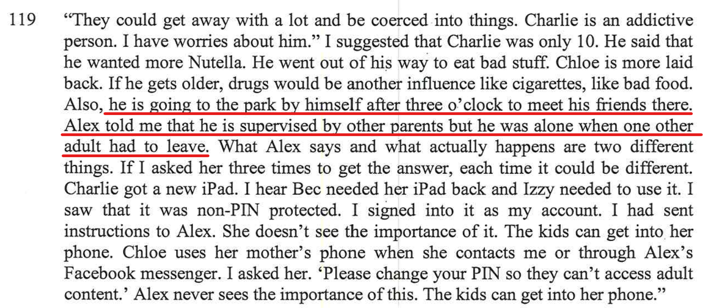

 - This is a comment that I made in the session

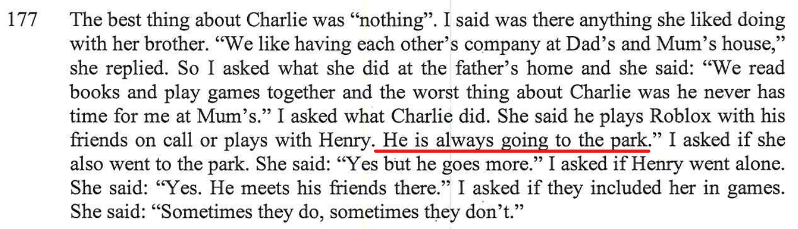

 - This is comment that my daughter Chloe made in the session

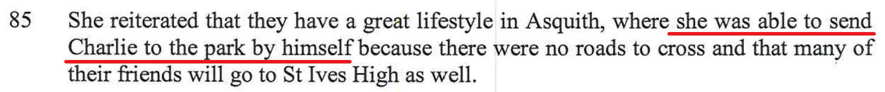

- Alex literally spells it out, **Charlie goes to the park by himself**.

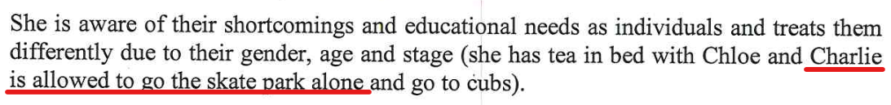

- This is from one of the **expert's comments** at the end of the report. The expert doesn't see anything wrong with Charlie going to the park, as she doesn't understand that he is un-supervised by an adult at times. 

### Email sent to Alex August 31, 2021:

> Charlie has told me that he goes to the park by himself each day and hangs out with his friends (Ted, Oscar, etc.). As I understand it, he is unsupervised both walking up to the park and whilst at the park. If this is correct, I am very concerned at the possible influences and temptations for unsupervised boys this age and from the possibility of adults with ulterior motives trying to coax Charlie (and the other boys) into inappropriate behaviour or worse – in Charlie’s case, either on the street going to or from the park or at the park. Charlie did say that on one occasion, a father of one of the other boys was present but had to go, leaving the boys on their own. I am unclear as to whether there is any other supervision by a responsible adult.
> 
> There are potential dangers for boys this age being out and about on their own. In addition to inappropriate influences and temptations from within the group (cigarettes, drugs, porn, etc.) there is also the real possibility of risks and dangers from adults trying to take advantage of boys – i.e. paedophilia.
> 
> If my understanding of the situation is correct from what Charlie has told me, then I am really concerned at Charlie’s wellbeing and development. Your comments would be appreciated and hopefully you can ease my mind.

The comment from my son Charlie below when asked from the report writer:

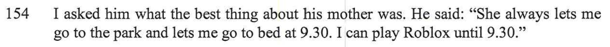

In other words, Charlie is left to his own devices to do what ever he wants. 

I sat down with both of my kids, interviewed & recorded them both (*with their knowledge*) and got a very interesting perspective on it.

Charlie is constantly going to places by himself with his scooter, e.g. to school and the park. We know that [it's super hard being a single parent](/marcseparation/my_initial_comments/#single-parent), and this is one of the only ways that Alex can seem to manage and is very much the same as how Alex's own mum brought the kids up.

While at the park, Charlie and other parents (**Jackie** (*mother of one of Charlie's friends*)) tell me that sometimes at the park no parents/adults are there to supervise, and what's more if there is a parent, it's not biological parent of Charlie. One of the stories I heard was that while Charlie was at the park with his friends, one of the parents left to go and get a coffee then came back, but was gone for about 20 minutes.

<audio src="../audio/Charlie_going_to_park_by_himself.mp3" type="audio/mpeg" controls>
  I'm sorry. You're browser doesn't support HTML5 <code>audio</code>.
</audio>

This same parent (**Jackie** (*mother of one of Charlie's friends*)) also went on to tell me that there was a time that she got a phone call from Charlie one afternoon at the park. Charlie called Jackie as he was tying to get hold of Mummy (Alex) using his mobile phone, however, Alex wasn't at home and wasn't picking up her phone. So not only was Charlie at the park himself, but Alex wasn't even at home and not contactable on her phone.

## Alex's parenting style

Alex parents the kids just like her own mother parented her. The mother (Maree) was very hands-off or Laissez-faire style of parenting. [Laissez-faire](https://www.encyclopedia.com/children/applied-and-social-sciences-magazines/laissez-faire-parents) is a French term meaning "***to let people do as they please***." Applied to parenting, the term refers to a permissive style in which parents avoid providing guidance and discipline, make no demands for maturity, and impose few controls on their child's behaviour.

> Note, **Laissez-faire** parenting is also referred to [Permissive parenting](https://www.verywellmind.com/what-is-permissive-parenting-2794957).

We just need to look at the evidence in front of us - Alex's sister [Julia](/marcseparation/julia_spence_mental_health/) moved out of the Mum's home when she was only 14 years old.  Now look how **Julia** turned out, she's DEAD! 

This is pretty serious!

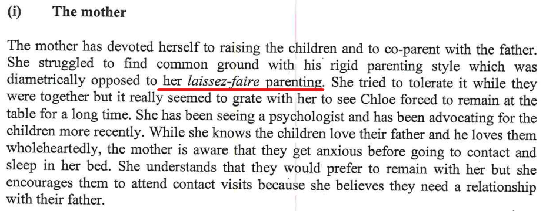

- The expert even confirms Alex's parenting style in the report being **Laissez-faire**, but curiously ignores the topic altogether, additionally choses to completely ignore the connection between Alex's parenting style, Alex's mother (Maree's) parenting style and Julia committing suicide. Rather, the report writer was quick to make a connection between my parents and my parenting style:

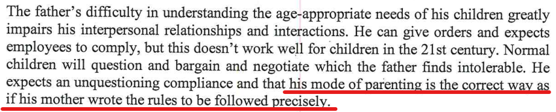

- Numerous places throughout the report, the report writer has real issues with the way that I parent, and a connection to my own parents parenting style, the report is littered with this, but no where is there a connection to Alex's parenting style copied from her mother, then Julia committing suicide is there? This is a direct cover up, influence and totally one-sided - whereas the report writer needs to remain neutral. It's clear the report writer didn't seem to like me in the session, but regardless of her own opinions of me in the session, she needs to overlook this, look at the bigger picture here.

> Also note, as [documented here](https://www.gottman.com/blog/the-four-parenting-styles/), the effects of the Laissez-faire parenting style on children: They don’t learn to regulate their emotions. They have trouble concentrating, forming friendships, and getting along with other children.

Yes, no matter which way you look at it, **Julia** now dead as a direct result of her Laissez-faire up-bringing and mental issues. If we look at all the literature on the topic of **shared parenting** which I have collated on this site, then having the kids more time with me - more balanced e.g. 50/50 - would equally benefit Alex as well as the kids, give Alex more time and make it much easier for her to manage things herself by giving her some time back, furthermore, even though Alex has a Laissez-faire parenting style, it wouldn't matter so much as the kids would have a balance with my parenting style for the other half.

All the literature on the topic of shared parenting:
- [Top 10 list of the benefits of 50/50 custody](/marcseparation/5050_custody/)
- [Platform for European Fathers (PEF)](/marcseparation/platform_for_european_fathers/)
- [Scientific research for shared parenting](/marcseparation/my_initial_comments/#scientific-research-for-shared-parenting)
- [Nielsen’s Research: Divorce & Shared Parenting](/marcseparation/appendix_nielsens_research/)

## Kids performance at school

Let's have a look at my son Charlie for example. Let's compare Semester 2 from 2020, then Semester 2 from 2021. 

### Charlie's results from 2020 semester 2

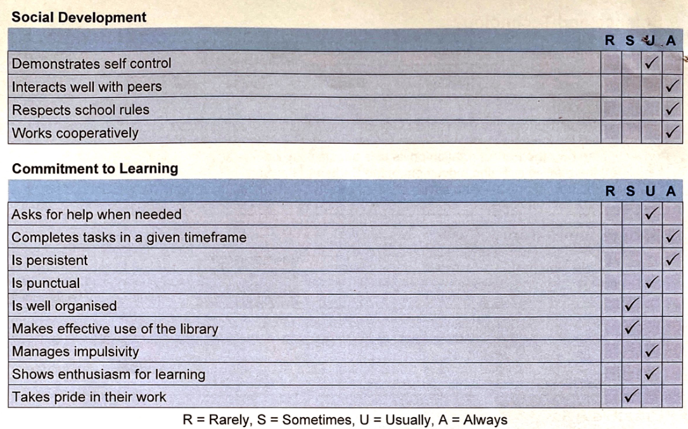

### Charlie's results from 2021 semester 2

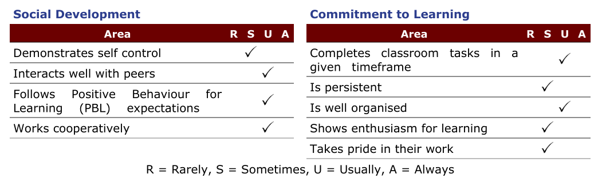

As per this [this external site](https://www.verywellmind.com/what-is-permissive-parenting-2794957), some of the effects of **Permissive Parenting** is **Display low achievement in many areas**: Because their parents have little to no expectations of them, these kids have nothing to strive toward. Studies have linked permissive parenting to lower academic achievement.

It shows in Charlie school report - 

## Dad and doesn't take kids to the park (False opinion from the report)

What Charlie is meaning by this statement below, he means like what happens at his mothers place. Currently he's with his mother 71.4% of the time, so things that happen (rightly or wrongly) with his mother would seem routine to him:

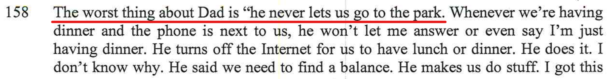

Charlie always asks me if he can go to the park (by himself) just like at his mothers place and of course I say no - for very good reasons. 

1. The park Charlie is referring to is not just around the corner like it is at the mother place, from the place I am at temporarily now, Charlie would have to cross a main road and I am a good extra kilometre away.
2. I haven't had the opportunity to meet everyone at the park, it's his Mum that organised the park thing every afternoon
3. I'm not keen on Charlie being at the park by himself, as I've already established, there's not always parents/adults there to supervise
4. Lastly, as I only have the kids 28.6% of the time, I am reluctant to let them go out as I want to try and maximise my time with then when I have them - note this is hopefully temporary and if I get more time with the kids, then things would totally change and I would let them to places, e.g. sleepovers, as I wouldn't be so eager to maximise my time with them, as I'd have more time.

Instead, I do take the kids to the park quite often, however I go with them myself on the weekends, [as you can see here](/marcseparation/kids_park/) below, going to the park with me is not the same as how he goes to the park when with his mother, that's all. 

## Alex is never around

Alex's way of parenting is from behind the scenes, she takes a step back, just like her own mother **Maree** did (and Maree was also a single mum as well). [Being a single parent is extremely difficult](/marcseparation/my_initial_comments/#single-parent) especially when you have to manage a massive two story house yourself, still working the same part time job as before separation getting paid peanuts of only $500/week and needing to go into the office with minimal working from home allowances.

Seems to me that the way things are going, Alex is adopting her own mothers permissive parenting style, and is allowing the kids to do **whatever** they choose to. Below, as per the report, Alex's sister Julia was allowed to move out of the home when she was only 14. She had no father in her life as he was distant and interstate most of the time then dead for the majority of her growing up, but also the mother was totally behind the scenes as Julia was living in a separate residence.

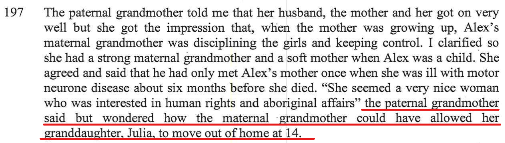

The **maternal** mother **Maree** allowed her very own daughter (**Julia Spence** (now dead)) to move out of her home when she was only 14. It's a bit worrying don't you think, if Alex is allowed to adopt the same parenting style of her mother, look how Julia turned out - she's now DEAD!

**It can't get any clearer than this**, Alex is behind the scenes and very much has a [Laissez-faire](https://www.encyclopedia.com/children/applied-and-social-sciences-magazines/laissez-faire-parents) / hands-off parenting style. My daughter Chloe interviewed alone said it herself:

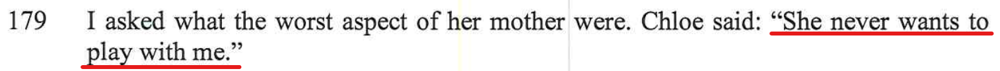

- Alex doesn't have the bandwidth and Alex exercises the same parenting style of her own mother

This could also be related, I think that based on [events I have recorded about Alex's mental health](/marcseparation/alex_mental_health/), as well the history of mental health in the family with Bipolar disorder, Alex may be suffering from [depersonalisation disorder](https://www.netdoctor.co.uk/ask-the-expert/depression-faqs/a512/i-constantly-feel-like-im-on-autopilot/) as though she’s disconnected from both her body and the world around.

It's confirmed [here](/marcseparation/report_contradictions/#alex-says-that-she-goes-to-the-park-each-afternoon-from-3pm). It may seem great (in theory) that Alex picks up the kids from school, but realistically, she doesn't spend time with the kids after school, as she's working. So the kids need to look after themselves, or in Charlie's case, left to his own devices. 

### After School care

Why doesn't Alex put the kids in after school care? Well just like I mentioned in the section [Co-Parenting not working](/marcseparation/co_parenting/), Alex has no surplus money to spend on the kids, as she's spending it all legal fees, [she's living beyond means just trying to stay afloat](/marcseparation/child_support/) in the current matrimonial home. Her part time job paying peanuts and the huge reliance on child support money, she's in the deep end just trying to stay above the water. 

### Aunty Vic - 5 star hotel pool

Just like Alex's sister Victoria. Vic also parents just like her mother, same mother as Alex - [Laissez-faire](https://www.encyclopedia.com/children/applied-and-social-sciences-magazines/laissez-faire-parents) style. 

This is what I mentioned in the report:

There were other high paying guest at the hotel, it was embarrassing and Henry was running around out of control around the 5 start hotel pool. But just like her mother, Vic was totally in the background and hand-off to it all.

### Saturday mornings

As it says in the report:

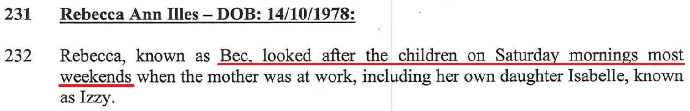

- Rebecca looks after the kids

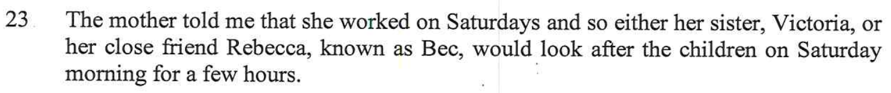

- Victoria and Rebecca looks after the kids

Alex is always at work, **she doesn't have the bandwidth to spend quality time with the kids** or look after the kids herself.

Kids are left to other people to look after them.

This is a real problem, the kids hate this especially when **Victoria** is looking after the kids. The kids, both Charlie & Chloe have told me that Victoria starves them as [I have already stated here](/marcseparation/alex_sister_victoria/#victoria-starves-my-kids), as an example, giving the kids half an egg & lettuce sandwich only and when the kids ask for seconds, or another serving of a sandwich, Victoria says "*no*". 

## No control or discipline

The children are left to their own devices. As I mentioned [here](/marcseparation/co_parenting/#different-behaviours-from-the-kids-upon-delivery), the kids ran ramped & wild around Alex, they were so out of control with her. Alex admired and relied on my back-up for parenting, Alex loved it how I was there to always step in for support.

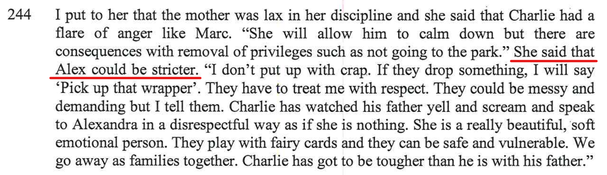

- Even Alex's best friend Bec said it herself, Alex could be stricter

### No structure

Alex came from a broken family and never had proper structure growing up.
  - Her Dad was dead when she was a teenager
  - Her Dad broke up with the Mum and moved out when Alex was six years old
  - Her Mum was very much hands-off / [Laissez-faire](https://www.encyclopedia.com/children/applied-and-social-sciences-magazines/laissez-faire-parents) parenting

My kids need structure, then need to learn routine, rules, values & authority and this is exactly what I can provide. 

### Fear & Uncomfortable

- Vic saying "*[He's such a dickhead](/marcseparation/vic_calling_me_a_dickhead/)*" about me, in front of the kids. Understandably my kids felt very uncomfortable. 
- Kids are not comfortable, [the house is constantly unlocked](/marcseparation/alex_mental_health/#the-house-is-constantly-left-unlocked).

## Counselling for my daughter

Throughout the report, Alex made it known that she's taken Chloe to counselling. 

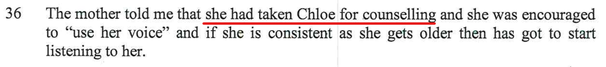

- Counselling here

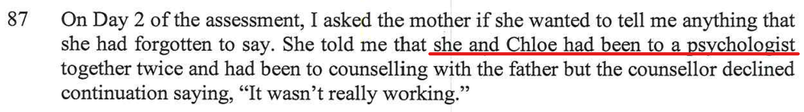

- Psychologist here

I knew nothing about these visits for my daughter Chloe. This is another example how Alex has failed to abide by [the interim parenting orders](/marcseparation/co_parenting/#not-informing-me-about-kids-medical-appointments) from the federal court. 

I think it's a bit over the top to take an 8 year old to these things. However, it's no wonder as this is exactly how Alex was parented. As mentioned above, we generally parent how we were parented. Alex's mother (when she was alive) worked for **Relationships Australia** as a counsellor. Alex grew up in the environment where counselling was normal and this would be the reason why she'd be sending Chloe without even a second thought. 

However there's more to this with Chloe which Alex doesn't get as Alex is neurotypical. The [CAST assessment I did with my daughter Chloe recently](/marcseparation/chloe/) confirmed my thoughts that Chloe - like me - has Asperger's. I could sense a long time ago. 

## Alex and my apartment

What is really weird and backed up by my theory about Alex's [Laissez-faire](https://www.encyclopedia.com/children/applied-and-social-sciences-magazines/laissez-faire-parents) parenting style, plus my other theory of [Alex using the children for financial gain](/marcseparation/child_support/) - Alex has never ever been to my place, she has never seen my place and where our/her kids sleep when they are with me. Wouldn't any mother (or parent) want to know where their kids are sleeping if it's on an on-going arrangement? This tells me that she just doesn't care for the kids that much, and this adds significant weight to my two theories. 