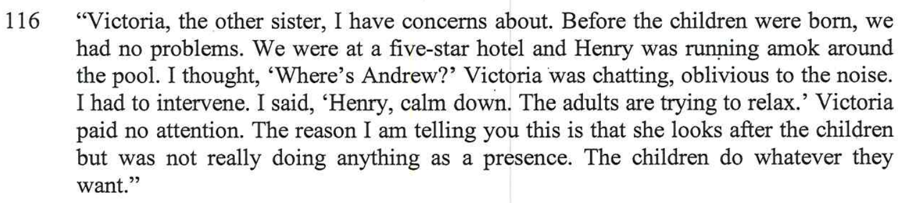

## Charlie going to places by himself

 - This is a comment that I made in the session

 - This is comment that my daughter Chloe made in the session

### Email sent to Alex August 31, 2021:

> Charlie has told me that he goes to the park by himself each day and hangs out with his friends (Ted, Oscar, etc.). As I understand it, he is unsupervised both walking up to the park and whilst at the park. If this is correct, I am very concerned at the possible influences and temptations for unsupervised boys this age and from the possibility of adults with ulterior motives trying to coax Charlie (and the other boys) into inappropriate behaviour or worse – in Charlie’s case, either on the street going to or from the park or at the park. Charlie did say that on one occasion, a father of one of the other boys was present but had to go, leaving the boys on their own. I am unclear as to whether there is any other supervision by a responsible adult.
> 
> There are potential dangers for boys this age being out and about on their own. In addition to inappropriate influences and temptations from within the group (cigarettes, drugs, porn, etc.) there is also the real possibility of risks and dangers from adults trying to take advantage of boys – i.e. paedophilia.
> 
> If my understanding of the situation is correct from what Charlie has told me, then I am really concerned at Charlie’s wellbeing and development. Your comments would be appreciated and hopefully you can ease my mind.

The comment from my son Charlie below when asked from the report writer:

In other words, Charlie is left to his own devices to do what ever he wants. 

I sat down with both of my kids, interviewed & recorded them both (*with their knowledge*) and got a very interesting perspective on it.

Charlie is constantly going to places by himself with his scooter, e.g. to school and the park. We know that [it's super hard being a single parent](/marcseparation/my_initial_comments/#single-parent), and this is one of the only ways that Alex can seem to manage and is very much the same as how Alex's own mum brought the kids up. We just need to look at Alex's sister [Julia](/marcseparation/julia_spence_mental_health/) moving out of the home when she was only 14 years old, the mother (Maree) was very hands-off. Now look how **Julia** turned out, she's DEAD! Yes, it's the worst extreme, but if we look at all the literature on the topic of **shared parenting** which I have collated on this site, then having the kids more time with me - more balanced - would greatly benefit Alex, give her more time and make it much easier for her to manage.

All the literature on the topic of shared parenting:
- [Top 10 list of the benefits of 50/50 custody](/marcseparation/5050_custody/)
- [Platform for European Fathers (PEF)](/marcseparation/platform_for_european_fathers/)
- [Scientific research for shared parenting](/marcseparation/my_initial_comments/#scientific-research-for-shared-parenting)
- [Nielsen’s Research: Divorce & Shared Parenting](/marcseparation/appendix_nielsens_research/)

While at the park, Charlie and other parents (Jackie (*mother of one of Charlie's friends*)) tell me that sometimes at the park no parents/adults are there to supervise, and what's more if there is a parent, it's not biological parent of Charlie. One of the stories I heard was that while Charlie was at the park with his friends, one of the parents left to go and get a coffee then came back, but was gone for about 20 minutes.

<audio src="../audio/Charlie_going_to_park_by_himself.mp3" type="audio/mpeg" controls>
  I'm sorry. You're browser doesn't support HTML5 <code>audio</code>.
</audio>

### Dad and doesn't take kids to the park (False opinion from the report)

What Charlie is meaning by this statement below, he means like what happens at his mothers place. Currently he's with his mother 71.4% of the time, so things that happen (rightly or wrongly) with his mother would seem routine to him:

Charlie always asks me if he can go to the park (by himself) just like at his mothers place and of course I say no - for very good reasons. 

1. The park Charlie is referring to is not just around the corner like it is at the mother place, from the place I am at temporarily now, Charlie would have to cross a main road and I am a good extra kilometre away.
2. I haven't had the opportunity to meet everyone at the park, it's his Mum that organised the park thing every afternoon
3. I'm not keen on Charlie being at the park by himself, as I've already established, there's not always parents/adults there to supervise
4. Lastly, as I only have the kids 28.6% of the time, I am reluctant to let them go out as I want to try and maximise my time with then when I have them - note this is hopefully temporary and if I get more time with the kids, then things would totally change and I would let them to places, e.g. sleepovers, as I wouldn't be so eager to maximise my time with them, as I'd have more time.

Instead, I do take the kids to the park quite often, however I go with them myself on the weekends, [as you can see here](/marcseparation/kids_park/) below, going to the park with me is not the same as how he goes to the park when with his mother, that's all. 

## Alex is never around

Alex's way of parenting is from behind the scenes, she takes a step back, just like her own mother **Maree** did (and Maree was also a single mum as well). [Being a single parent is extremely difficult](/marcseparation/my_initial_comments/#single-parent) especially when you have to manage a massive two story house yourself, still working the same part time job as before separation getting paid peanuts of only $500/week and needing to go into the office with minimal working from home allowances.

Seems to me that the way things are going, Alex is adopting her own mothers parenting style, and is allowing the kids to do **whatever** they choose to. Below, as per the report, Alex's sister Julia was allowed to move out of the home when she was only 14. She had no father in her life as he was dead at the time, but also the mother was totally behind the scenes as Julia was living in a separate residence.

This statement is slightly incorrect. It's actually the **maternal** mother **Maree** that allowed her very own daughter (**Julia Spence** (now dead)) to move out of her home when she was only 14. It's a bit worrying don't you think, if Alex is allowed to adopt the same parenting style of her mother, look how Julia turned out - she's now DEAD!

**It can't get any clearer than this**, Alex is behind the scenes and very much hands-off. My daughter Chloe interviewed alone said it herself:

- Alex never wants to spend time with Chloe - that's because Alex doesn't have the bandwidth.

This couldn't also be related to what I think, that based on [events I have recorded about Alex's mental health](/marcseparation/alex_mental_health/), Alex may be suffering from [depersonalisation disorder](https://www.netdoctor.co.uk/ask-the-expert/depression-faqs/a512/i-constantly-feel-like-im-on-autopilot/) as though she’s disconnected from both her body and the world around.

It's confirmed [here](/marcseparation/report_contradictions/#contradiction-2). It may seem great (in theory) that Alex picks up the kids from school, but realistically, she doesn't spend time with the kids after school, as she's working. So the kids need to look after themselves, or in Charlie's case, left to his own devices. 

### After School care

Why doesn't Alex put the kids in after school care? Well just like I mentioned in the section [Co-Parenting not working](/marcseparation/co_parenting/), Alex has no money to spend on the kids, as she's spending it all 

### Aunty Vic - 5 star hotel pool

Just like Alex's sister Victoria. Vic also parents just like her mother, same mother as Alex - hands-off. 

This is what I mentioned in the report:

There were other high paying guest at the hotel, it was embarrassing and Henry was running around out of control around the 5 start hotel pool. But just like her mother, Vic was totally in the background and hand-off to it all. 
### Saturday mornings

As it says in the report:

Alex is always at work, **she doesn't have the bandwidth to spend quality time with the kids** or look after the kids herself. 

## No control or discipline
- The children are left to their own devices. 

- Alex's best friend Bec said it herself, Alex could be stricter

No structure
- Alex never had proper structure growing up.
- The kids need structure, then need to learn routine

Fear & Uncomfortable
- Vic saying “He’s such a dickhead” about Marc, in front of the kids. The kids felt very uncomfortable. 

Living arrangements
- Back yard grass edges is a mess and out of control, the kids complain about always getting leeches from the back yard. 
- House is constantly unlocked, we back on to bush 

