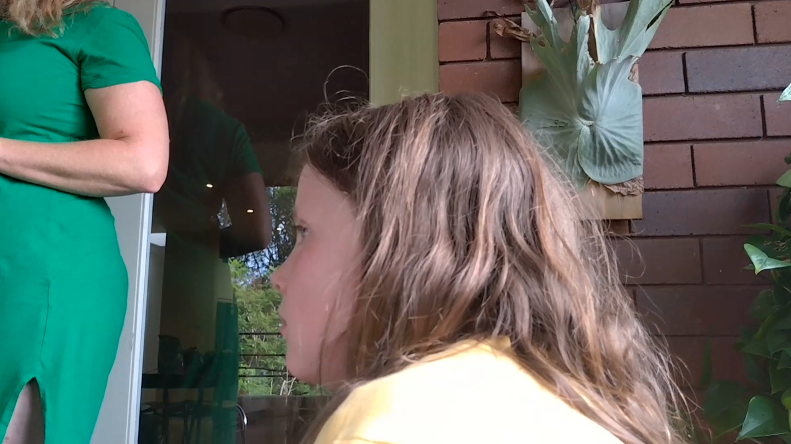

## Statements from the report

## My rebuttal

Makes me sick that Rebecca Illis thinks that she can simply step in and be a significant role model with my kids  

- By default Charlie calls Bec within an instant when he can't get hold of his Mum on the phone - as seen [here](/marcseparation/alex_mental_health/#matrimonial-home-totally-unlocked-january-16-2022), you can hear it in the background in the video
  - Seems that Bec's done a great job in building credibility with my kids
  
- No parental controls on the kids devices, as per [here](/marcseparation/report_missed_mentions/#parental-controls-on-devices)
  - Great that Bec gives iPads/devices to the kids, but they are not safe

- Bec was fully naked in front of my son Charlie as per [here](/marcseparation/dad_is_a_good_dad/#statements-from-the-report). When I had a chat to Charlie the other day about whether he's seen Bec topless before, both **Charlie & Chloe** said that it's still happening and even as recently as in a couple of weeks ago.

- Bec is a smoker, and has been a smoker ever since I first met her back in 2008. Bec even told me that she gave up smoking cigarettes at one stage, every time she got the urge to smoke, she'd masturbate instead. This is exactly what she told me.
  - To my knowledge now, via the kids, I understand that Bec still smokes and it worries me as being a significant figure in my kids lives right now, the kids are subjected to this behaviour. 

### Evidence

This video that I found on my son's Charlie's phone from December 24, 2021 (very recently). It shows Alex's friend Bec, talking about herself in the third person, but you will also notice that she's there with a packet of cigarettes to the left of Bec, and Bec is holding a cigarette in her hand, and what's more, comfortably & casually referring to herself, her daughter Izzy, Alex, Charlie & Chloe as "***Family***".

<iframe width="420" height="315"
    src="https://www.youtube.com/embed/1DrgiEB1QRE?playlist=1DrgiEB1QRE&loop=1&Version=3&autoplay=1&mute=1&showinfo=1&rel=0">
</iframe>

The exact same time, there's my daughter Chloe with Bec, Izzy, Alex & Charlie and doesn't look happy at all. Chloe looks totally uncomfortable. Of course she would hearing things like this is her new "***Family***" all the time. Of course it would confuse my kids, as me being the Dad that Chloe loves so much is not there. Bec and Izzy is NOT "***Family***", they are just best friends of Alex, this DOES NOT class them as "***Family***". 

