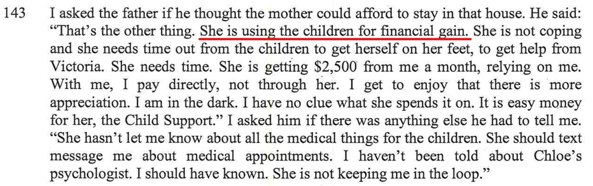

## Statements from the report

- I say in the report that Alex is using the Children for financial gain

- Then Alex practically spells it out, she's not willing to allow me more time with the kids as then she gets less money from child support and screws up her plans for a mortgage

## Statement from Alex, a text message to a third party

- Below, recently, February 27, 2022, Alex mentions something similar to another person of whom she trusts, but this other person shared me the screenshot of what Alex said to her. The context here, Alex believes that as the 3 houses sold from the trust during the last financial year and as she declared this as income, than it's effecting this current financial year and she's now only getting $200/week from **child support**, however as I had already told this other person what is really happening, this other person told Alex that it doesn't effect this financial year and that **child support** is more than $200/week. Alex says, if it's true she's be happy to have **child support** payments to reflect me having the kids 5 nights a fortnight:

It's all money for Alex! She cares abut money more then the kids themselves. 
## My rebuttal

Ever since separation, Alex hasn't managed to get a full-time job and move on with her life. Even though Alex and I have separated, she is still heavily dependant on me for finances. 

### Alex wages

Alex earns $32K~ / year, Vs me who earns $168K~ year. Alex clears about $500~ / week after tax and has chosen to remain in a part time job ever since separation (Nov 2019) and relies on the Child Support Money that she gets from me in order to remain in the matrimonial home.

### Mortgage repayments for the matrimonial home as of Jan 2022

| Mortgage Account Number | Repayments |
| ----------- | ----------- |
| 461921769 | $493.00 per month |
| 779844644 | $1,777.00 per month |

### Child Support Alex is receiving from me

Alex gets $2.2K Child Support per month from me. Alex pays me nothing to me in return.

 

As we've already [demonstrated and established](/marcseparation/alex_parenting/), Alex's way of parenting is just like how her own mother parented her, very much hands-off. Alex doesn't care about the kids so much, as mush as she cares about how much money that she can get by having the kids for most of the time. 

Think about it, there's no way that if the matrimonial home is sold that Alex would be able to get a loan, no bank would loan her any money with a part time job earning peanuts. As per above, Alex has admitted it herself, the child support money she receives from me right now, based on the current time that she has the kids, is what she so heavily relies on in order to pay the mortgage. She **needs the kids** for the period of time the kids are with her now, just so she can get enough money to pay the mortgage. **Alex is using the children for financial gain** plain and simple, and outside of this doesn't really care about the kids, as [Alex's parenting style is very much Laissez-faire / hands-off](/marcseparation/alex_parenting/#alexs-parenting-style).

Alex is milking the system to her own personal advantage - not in the kids best interest.

Why else did she and her friend Bec go to so much trouble and tell the report writer so much about me being a bad Dad. The report writer, also female, listened to both Alex & Bec and was sold on what they both had to say.

The contradictions as [mentioned here](/marcseparation/report_contradictions/#kids-and-their-voices), it's so clear that Alex is tripping up and over playing the fact that both kids would be more intimidated with 50/50 and that both kids are restricted from being themselves, This is conflicting information, which is clear to me that Alex is using this information just so she keeps the kids more often. In Alex's eyes, more kids means more money, plain and simple. 

Remember that I separated with Alex, not the kids. I love my kids to bits, why else would I go to so much trouble in putting this site together. I don't have an issue spending money on the kids, but I do have an issue spending money for the kids from behind the scenes via Alex, [I don't even get the pleasure of seeing my children benefit from the spending](/appendix_5050_custody/#7-financial-resources-are-shared-naturally).

#### Evidence of using the children for financial gain

This is a message I sent to Alex last Saturday January 22, 2022. It’s in an attempt to catch her out, hoping she’d agree to the idea: 

If she does agree to it, then it proves that she’s **using the children for financial gain**, kids are not the priority for her, it’s purely money.

Realistically, I wouldn’t go ahead with it, however this adds more evidence that Alex sees **money primary** and **children secondary** - should be the other way around. 

At the time of writing, Alex hasn’t yet responded to me directly on this message, she hasn’t said no straight away to (whereas she normally does), which sort of indicates that my hunch is correct.

TO BE UPDATED....

### Matrimonial home valuation, Alex blocking real valuations

End of 2021, we all knew that house prices in Sydney went through the roof. This includes the matrimonial home at 5 Stratford close, Asquith. 

#### June 28, 2021

Valuation of the home as per [http://realestate.com.au](http://realestate.com.au)

#### October 4, 2021

Valuation of the home as per [http://realestate.com.au](http://realestate.com.au)

We know that [http://realestate.com.au](http://realestate.com.au) is fairly reputable and trusted with house valuations. and As per previous **official** valuations on the home, we wanted to do another valuation in September 2021.

Below is the history of all the **official** valuations on the home:

| Date | Name | Vendor | Valuation |
| ----------- | ----------- | ----------- | ----------- |
| September 12, 2020 | Boris Vondros | Metroval Valuations | $1,290,000 |
| May 24, 2021 | Boris Vondros | Metroval Valuations | $1,350,000 |
| September 16, 2021 | Peter Craig | Cityside Valuers | $1,700,000 |

However the last one, as you can see dated September 2021, in comparison with the house values from [http://realestate.com.au](http://realestate.com.au), you can see that its a little off, due to the fact that the home valuer **Peter Craig** couldn't gain access to the house. 

As Alex arranged **Boris Vondros** from **Metroval Valuations** to do the first two valuations, we tried to arrange a valuer ourselves. Alex refused to let our valuer gain access to the property, and for very good reason.

Alex knew full well that the house had gone up in value in recent months, and by how much. It is also in Alex's best interest to have the lowest house valuation as possible, as it's always been Alex's plan to buy me out. The lower the valuation, the lower amount that she needs to pay me. Alex wanted the lowest possible valuation figure for the house. 

Alex also mentioned to me on the phone very recently (January 15, 2022) that she'd go ahead and organise another valuation for the home and get them to value the house at $1.5 million. 

#### Why is Alex so desperate to buy me out?

We know that as Alex is already in the house, even though it's temporary with no guarantee of her remaining in the house, she doesn't want to move out, it's hard to move out as for her, so much is attached to that house both emotionally and physically. I didn't to move out either back in January 2020, I had no choice and [I reluctantly needed to move into rental apartments](/marcseparation/my_initial_comments/#unfairly-judged-based-on-current-time-with-the-kids) and suffered so much with cabin fever and having to work & live from the same little space each and every day. Alex hasn't yet come to terms and accepted that she needs to move on with her life and this most likely would mean a new home. She's living in this fake dreamland right now.

Alex is in this [holding pattern](/marcseparation/co_parenting/) clutching at straws in this temporary phase of her life and living in the matrimonial home until a final settlement happens. There's no guarantee that Alex can keep the house, Alex knows this. Alex is trying to do everything she can to sabotage, disrupt and delay the legal proceedings so she can stay in the house much longer and to try and get the best possible result for her. 