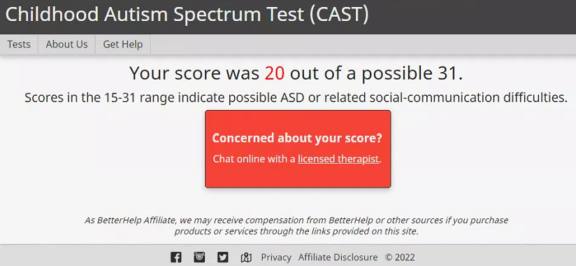

[//]: # (margin:top right bottom left)

## CAST (Childhood Autism Spectrum Test)

I sat with Chloe and we did a [CAST](https://psychology-tools.com/test/cast) together. Formerly the “**Childhood Asperger’s Syndrome Test**”, this is a 39-item, yes or no evaluation aimed at parents. The questionnaire was developed by ARC (the Autism Research Centre) at the University of Cambridge, for assessing the severity of autism spectrum symptoms in children. [As we know](/marcseparation/my_initial_comments/#no-official-aspergers-diagnosis), there is no blood test or medical imaging scan to diagnose the Asperger’s syndrome condition, so questionnaires are the more common way measuring it.

Chloe's test result below:

I know my daughter fairly well, and like I assumed, it looks like she's like me, has my genes and has Asperger's syndrome. 

## Chloe's cough

As I have already mentioned, [Chloe has had a niggling cough for 4+ months](/marcseparation/co_parenting/), Alex hasn’t done anything about it. She need to take Chloe to an ENT specialist. Below are the recordings from when I had the kids Sunday January 30, 2022. I took the kids to Luna Park, it was a hot day, wasn't cold. We were standing in line and everyone kept looking at us, not liking Chloe coughing and thinking it was COVID-19. 

Listen to the 3 recordings of Chloe constantly coughing:

<audio src="../audio/Chloe coughing Lina Park, 1 20220130.mp3" type="audio/mpeg" controls>
  I'm sorry. You're browser doesn't support HTML5 <code>audio</code>.
</audio>

<audio src="../audio/Chloe coughing Lina Park, 2 20220130.mp3" type="audio/mpeg" controls>
  I'm sorry. You're browser doesn't support HTML5 <code>audio</code>.
</audio>

<audio src="../audio/Chloe coughing Lina Park, 3 20220130.mp3" type="audio/mpeg" controls>
  I'm sorry. You're browser doesn't support HTML5 <code>audio</code>.
</audio>

## Chloe Covid test

On December 13, 2021 Chloe had a a cough, the school told us that she needed to get a Covid test, so we did and then she had to self isolate until a negative result, however Alex (and the Police) seemed to have a blatant disregard for the rules [this led to Alex calling the Police](/marcseparation/chloe_covid_test/) with a whole bunch of other dramas. 