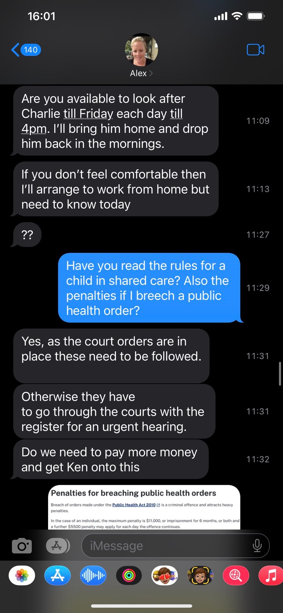
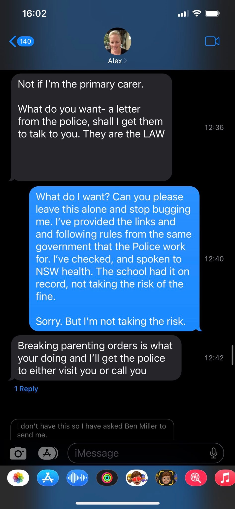

[//]: # (margin:top right bottom left)

## Charlie & Covid19

On Monday August 8, 2022, Charlie was diagnosed with Covid19. 

I emailed the school to let them know:

The school replied:

Knowing Alex like I know Alex, especially when very recently when [Chloe had a Covid19 test and had to isolate, this led to Alex calling the Police](/marcseparation/chloe_covid_test/). I knew this would lead to something totally crazy. So I quickly did my homework and called **NSW Health** to find out the latest rules and regulations for a positive case.

When I asked **NSW Health** the two questions, about the latest rules for a young 11y/0 in a shared card arrangement and who is a positive case for Covid19 and also the penalties for breaching a public health order, they pointed me int he direction of the information on their website:

I took screenshots and then let Alex know about Charlie with Covid19, his test results, he was being well looked after and the latest rules of self isolation. Something so simple, but it wasn't. 

I anticipated that Alex wouldn't go down without a fight, so I also called my lawyer **Brendan** to give him the heads up that I didn't want to pay for his time with this trivial matter, and if he gets a call from Alex's lawyer **Ken**, to just ignore it and don't act on my behalf. 

What happened next was a constant stream of abuse from Alex...

I sent this to Alex:

Messages continue:

Again, I sent these:

Messages continue:

In this time, my lawyer **Brendan** calls me and tells me that Alex's lawyer **Ken** has called him and told him that they wanted to set an urgent hearing and I may need to pay for both Alex's and my legal costs. Brendan told me that if I drop Charlie back, I wouldn't need to pay anything, however I told my Brendan Im still in risk of getting a $5000 fine from NSW Health. Brendan told me as he's not acting on my behalf for this to get Alex to ask Ken for a **indemnification order** to from the federal court, to indemnify the $5000 fine, as the federal government overrules the state government.

I left this.

Also in the meantime, I spoke with Alex on the phone, told her that organising an urgent court hearing will take weeks and not days and that Charlie would be out of isolation by then. I also said I was not prepared to take the risk of getting a $5000 fine from **NSW Health**.

She then said she'd pay me and transfer the $5000 to my account if she could pick him up. Beyond my belief, she paid thr $5000 to my bank account.

Has Alex seriously lost the plot? The money did actually come through to my account:

I was happy to let Charlie go, if I get fined, I have the money to cover it:

