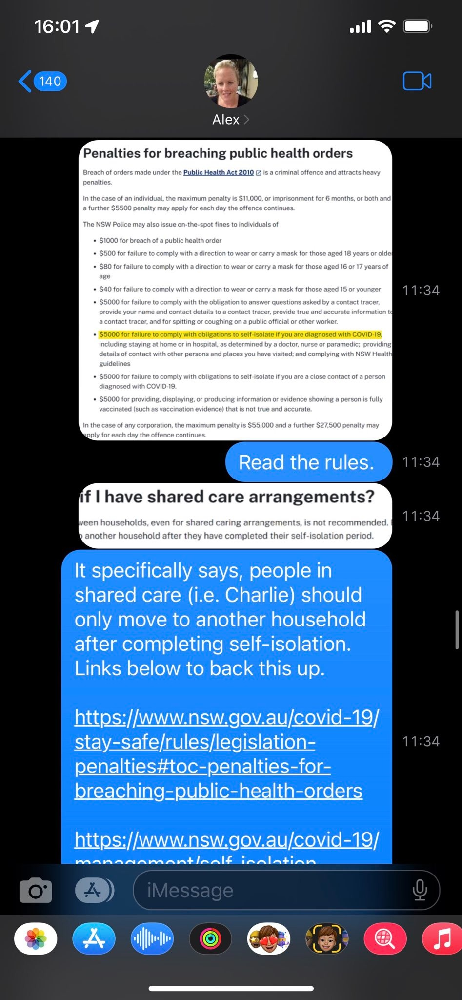

[//]: # (margin:top right bottom left)

## Charlie & Covid19

On Monday August 8, 2022, Charlie was diagnosed with Covid19. 

I emailed the school to let them know:

The school replied:

Knowing Alex like I know Alex, especially when very recently when [Chloe had a Covid19 test and had to isolate, this led to Alex calling the Police](/marcseparation/chloe_covid_test/). I knew this would lead to something totally crazy. So I quickly did my homework and called **NSW Health** to find out the latest rules and regulations for a positive case.

When I asked **NSW Health** the two questions, about the latest rules for a young 11y/0 in a shared card arrangement and who is a positive case for Covid19 and also the penalties for breaching a public health order, they pointed me int he direction of the information on their website:

I took screenshots and then let Alex know about Charlie with Covid19, his test results, he was being well looked after and the latest rules of self isolation. Something so simple, but it wasn't. 

I anticipated that Alex wouldn't go down without a fight, so I also called my lawyer **Brendan** to give him the heads up that I didn't want to pay for his time with this trivial matter, and if he gets a call from Alex's lawyer **Ken**, to just ignore it and don't act on my behalf. 

What happened next was a constant stream of abuse from Alex. Time stamps on the right side of the messages:

In this time Alex calls me from her mobile, she is calling from a Police station with my on speaker phone with a Police officer in the background. She tells me that I am doing the wrong thing and to drop Charlie back, the Police officer then said I shouldn't get a fine. But when I mentioned to the Police officer about the **NSW Health** section on shared parenting, this was new to the Police officer and then he came back and told me that I was doing the right thing. In the background Alex then started to say a few things, she got annoyed and sort of lost it as she didn't want to accept she was wrong and that I was right and her attempt to get the Police to help her failed dismally. The Police officer and Alex said they'd check the links to the **NSW Health** site to read the information and call me back, they never called me back.

Later in text (below) she even tells me that the Police officer said I wouldn't be fined, which is bullshit.

In this time, my lawyer **Brendan** calls me and tells me that Alex's lawyer **Ken** has called him and told him that they wanted to set an urgent hearing and I may need to pay for both Alex's and my legal costs. Brendan told me that if I drop Charlie back, I wouldn't need to pay anything, however I told my Brendan Im still in risk of getting a $5000 fine from NSW Health. Brendan told me as he's not acting on my behalf for this to get Alex to ask Ken for a **indemnification order** to from the federal court, to indemnify the $5000 fine, as the federal government overrules the state government.

I left this.

Also in the meantime, Alex sends me a text to say that she's be at my place at 4.45pm to pick up Charlie:

...and she sends a message to Charlie about the same time to let him know that she would come at 4.30pm to say hello to Charlie:

Charlie hasn't seen his mother for 5 nights and wanted to see his Mum. However, I knew that if Alex came, there'd be an altercation/scene where Alex would try and take Charlie, and I wasn't prepared to let that happen. Charlie understood what was at stake with the $5000 fine, also [based on history when Chloe had to isolate](/marcseparation/chloe_covid_test/) December last year where Charlie witnessed his Mum call the Police on his own Dad, but he was very upset. It got ugly between Alex and I at Storey Park when Chloe had to isolate, where my personal trainer witnessed it all and said - in his words - that Alex was a 'bully'. I didn't want the same thing to happen again this time around my neighbours.

Then shortly after at about 4.10pm, I spoke with Alex on the phone, I told her that organising an urgent court hearing will take weeks and not days and that Charlie would be out of isolation by then, that urgent for the federal court is weeks, not days. I also told Alex about her sending me an SMS to say she'd collect Charlie at 4.45pm, then she sent another SMS to Charlie in parallel to come and see him and I told her that I wouldn't let her in, as she would try and take Charlie and that I didn't want to create a scene this time in front of the neighbours, like last time in December 2021. I went on to say, I was not prepared to take the risk of getting a $5000 fine from **NSW Health** and that Charlie would stay in isolation as per public health orders for 7 days.

She then said she'd pay me and transfer the $5000 to my account if she could pick him up. Beyond my belief, minutes later she paid the $5000 to my bank account.

Has Alex seriously lost the plot? The money did actually come through to my account:

I was happy to let Charlie go, if I get fined, I have the money to cover it:

