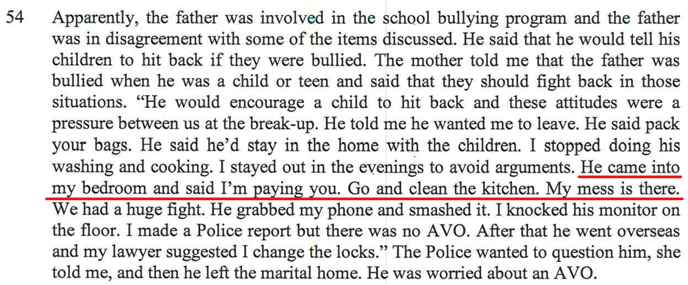
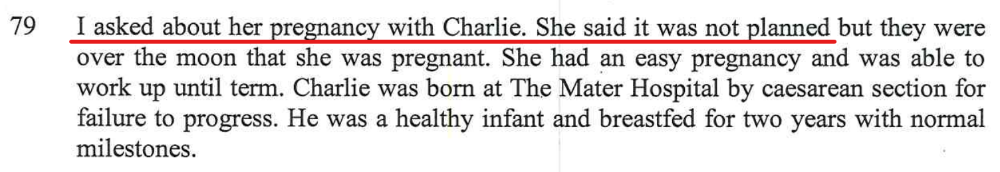
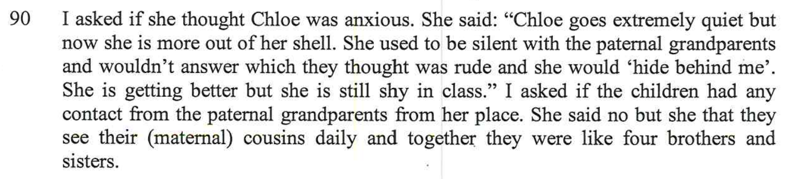
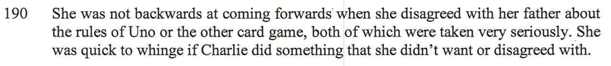

[//]: # (margin:top right bottom left)

The below are all comments from my Mum, the paternal grandmother in this situation. All comments are directed towards me. 

There are the snippets from the report (a mix of Alex's (the mother's) responses, Chloe's (my daughter's) responses and my (the father's) responses from the sessions with the report writer) with my Mum's comments under each one.

## The mother's session with the report writer

- Chloe would speak with us, but when it suited her she would just ignore us.   She wasn’t ‘mute’ but chose not to speak to us when she had something better to do.    She was ‘mute’ with other external people, e.g. Alex’s employers and others…Alex clearly told me this….   She discussed with me whether there was a medical condition which covered this.  E.g. ‘selective mutism’.

- Marc has a different parenting style – Alex is very casual – how will she maintain control when they are teenagers.

- This doesn’t make sense - does she mean that Chloe doesn’t speak up – that’s rubbish – she's not frightened of saying what she thinks.

- Alex agreed with you, and she admitted to me it was ‘more peaceful’ when she was not close to Victoria…….. remember that episode at westfield when Victoria tailed you and Ian, then sat down next to us – Alex was very embarrassed and uncomfortable…. Unsettling for Charlie and Henry – they didn’t’ know what was going on.

- She is saying ‘*the children now have their own voices*’, so what is the concern about your having them half time?   They now speak up!!!

- you told me you had cleaned up your mess, it was hers that was everywhere, and that was what you asked her to clean up. 

- the police could have easily called you – you were in Aust some of the time.

57.    she says there was financial abuse – this is wrong – that was after the split up, not before.

- Alex also told Marc she wished Ian and I were dead – she wanted to claim some of Marc’s intended inheritance. 	I tried to remain neutral in their relationship issues, but after those 2 comments, Alex has lost any respect I may have had for her…… 	She thought I was on her side, but failed to acknowledge that Marc is my son, and even though I don’t agree with the way he has handled parts of his relationship, I will always give he and the children my support.

- That’s rubbish.  You had a normal social childhood…..   you had Enver and Michael as friends close by.   You were in a cricket team, you went to a church youth group, you went to tae-kwan-do.  You went to cubs.  You learned Tennis, went to swimming squad at the school.

1.    What about all the carpentry work Ian did – the shelving downstairs etc… I made all the curtains in the house……heaps of sewing and knitting.   Think about 30+ items knitted. Alex was clearly aware you had Asperger’s before you got into a more settled relationship.

1.    Alex has come from a broken home – you would have thought it would be important to her to have her children brought up in a stable environment.

- I can’t honestly believe there was no animosity between Alex’s parents.  The parents separated when Julia was 2 – are you telling me there was no animosity???     She basically didn’t see her father after that – they never went to Sydney to see him, and he only visited in ‘the hospital?’.    You can’t have harmony, then next day they separate????

- that is not correct – when Alex told us about the pregnancy. She said that you had decided to have a child.

- as far as Chloe – Alex clearly told you ‘that she would let nature take it’s course…….

- Charlie would clearly not struggle.   Not sure what renovating their rooms affects how they feel about seeing you.

	Charlie told me quite clearly whilst up here last week, he wanted to live 50/50 with his father.    It appeared to us that Alex favoured Chloe and tended to give her more attention than Charlie.

- Alex discussed with me Chloe’s ‘silent’ episodes…..   she did it with people e.g. the staff at the Real Estate Agency where Alex works.  Chloe would not speak with them…..   she at times, would choose not to speak with us – Chloe is quite challenging and has her own way of getting what she wants……  She and Charlie are very close – Charlie always defends her

- Chloe says whatever to suit the environment.

## The father's session with the report writer

- you and Alex have different opinions on how to handle them….   Alex is happy for them to be on their computers or watch TV (when we were there, that’s what she did).

- you’re trying to encourage other interests.   Alex just lets them go on their computers – when we were there I didn’t see her read with them or encourage them to read.

## My daughter Chloe's session with the report writer

