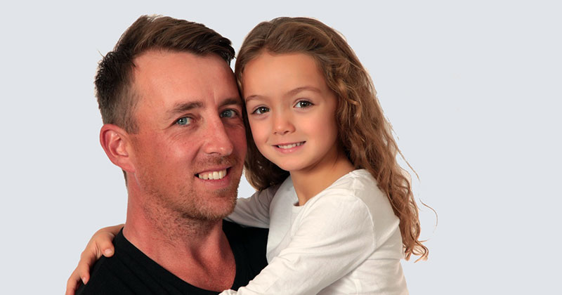
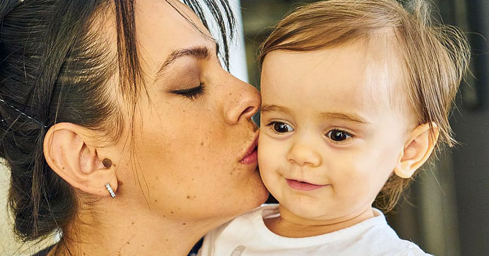

Top 10 list of the benefits of 50/50 custody – source [https://timtab.com/50-50-custody-benefits-why-shared-parenting-important/](https://timtab.com/50-50-custody-benefits-why-shared-parenting-important/) 

<iframe width="420" height="315"
    src="https://www.youtube.com/embed/uW9gvJU-XK8?playlist=uW9gvJU-XK8&loop=1&Version=3&autoplay=1&mute=1&showinfo=1&rel=0">
</iframe>
 

## 1 Two parents are better than one

The number 1 benefit of 50/50 custody is to take advantage of a child having two parents. Neither parent is marginalized and both are able to make a large contribution.

To understand why two parents are better than one, think about the African proverb "It takes a village to raise a child." What this means is that a child is more protected and has a richer experience by interacting with many people who care about him or her.

Having the close involvement of two parents in children's lives offers many benefits.
- A better balanced upbringing is likely. For example, one parent might enjoy reading to their daughter, while the other coaches her in sport
- Children gain access to the extended families and friendship groups of both parents. That means more connections to grandparents, family friends, etc.
- Each parent is able to bring their own individual strengths to help develop their child, such as humour or teaching ability.
- An individual parent's errors and weaknesses are less likely to cause problems. For example, a child can make up for one parent having little money by also spending time with the other parent.
- Children have two major role models and have two different households that they grow up in, allowing them to choose which behaviours to copy and which to avoid.

I believe every parent comes to realise that you can't raise a child properly on your own. You need other people involved so that you don't screw your kid up in some way. A great way to involve others is to share parenting duties evenly.

## 2 Children are happier being close to both parents

50:50 custody has the benefit of allowing a child to know both parents very well. Children have a deep need to connect to their mother AND father.

The ill-effects of father absence have been well documented. According to **Dr Edward Kruk**, father absence is associated with:
- Insecurity and diminished self-confidence
- Behavioural problems
- Truancy and poor academic results
- Delinquency, youth crime and teenage pregnancy
- Drug and alcohol abuse.

Just not knowing a biological parent seems to cause problems for children, creating an inner void that is not easily filled by others. And the quality of the relationship matters too. 

> *Children who feel a closeness and warmth with their father are twice as likely to enter college, 75 percent less likely to have a child in their teen years, 80 percent less likely to be incarcerated and half as likely to show various signs of depression*.… Furstenberg and Harris

Frequent, lengthy contact with both parents gives a child the opportunity to form two essential relationships. For children whose parents live apart, a high level of contact is best achieved by 50:50 custody and shared parenting.

## 3 50:50 Custody Puts the "Quality" into Quality Time

A further benefit of 50:50 custody is to boost the quality of time that children spend with parents. When you're only with each other half the time, moments together become more precious. 

When parents and children catch up after a break, they might: share some hugs, talk about what has been happening in each other's lives, do an activity they all like or enjoy a meal together.

> *50 50 custody is the ultimate form of shared parenting. The two parents are treated as equals and fully share responsibilities for raising children*.… Adam Singleton

Co-parenting can improve the quality of parent-child relationships. You tend to avoid bad habits and routines, such as slumping in front of a TV after work or school and not communicating.

- Parents feel refreshed and are keener to see their kids.
- Children feel wanted and, hopefully, loved by both parents.
- Children may appreciate time with each parent more.

A good joint custody schedule has visits and breaks that are regular and neither too short nor too long. Each period apart is a chance for the parent to refresh and prepare for the next visit.

## 4 Children Get to Have Two Homes

Shared parenting means a child effectively has two homes at the same time. That provides for a richer experience while growing up.

With two homes, a child has access to more spaces and features. For example, they could play computer games in the gaming room at one home. When staying with the other parent, the child might instead spend time at a local park or hang out with a neighbour they know from school.

Two homes also means children get to experience living with more people. Quite often, a child may be living across homes with a combined four adults and multiple half and step siblings.

People are sometimes concerned that having two homes makes kids feel unstable. However, 50% of your time living in a place is enough to feel very much "at home". So kids in joint custody usually feel secure in both households.

## 5 Children Benefit from Competitive Parenting

An important though seldom discussed benefit of co-parenting is the healthy competition it stirs up. No separated or divorced parent wants to feel like their child prefers staying with their ex. That works to keep parents on their game to provide good experiences.

For example, a parent might strongly value discipline, hard work and academic achievement. But they still want their child to enjoy coming to stay with them. So they will soften their approach. Shared care encourages parents to pay attention to and satisfy the needs of their children.

Unlike sole custody with visitation, 50/50 custody encourages healthy competition. Both parents need to take care of routine, mundane aspects of parenting. You don't get the unhealthy situation where one parent has so little time with their child that they end up spending much of it indulging in outings, junk food, travel, etc.

## 6 Shared Parenting Improves Living Standards

Children who live in a shared care arrangement, especially 50:50 joint custody, enjoy higher living standards because of it. Poverty risks are lessened since children live across two households. If living standards are low in one home, at least a child might make up for it in the other.

For example, in the poorer household, a child might spend their time reading, watching TV and doing other low-cost activities. When staying with the better-off parent, they might instead play computer games, go shopping and eat out at restaurants. Overall, the child enjoys a good standard of living.

Shared parenting also improves living standards by allowing a child to spend more time with the higher-earning parent. Income statistics for Australia show that recipients of child support earn only about half of what payers do. And payers usually have less than 14% physical custody. Where kids see paying parents more, the children are materially better off.

> *The majority (65 per cent) of child support payers have below 14 per cent care of their children. The median income of payers was $47,985. The median income of child support payees at June 2019 was $23,953*.… Department of Social Services submission to Australia's Family Law Inquiry

One reason why child support recipients have low incomes is the amount of time they spend looking after children. In contrast, 50/50 custody allows both parents to participate in the workforce and earn a good income.

## 7 Financial Resources are Shared Naturally

50:50 custody and shared parenting avoid many of the financial problems of raising children post-separation. Without even trying, shared care gets both parents financially contributing.

When both parents are looking after kids, they routinely pay for stuff without a second thought. They pay rent or mortgage on a bigger home, cover food and energy costs, pay for outings, vacations, etc. Each parent ends up contributing what they can reasonably afford.

Contrast this way of managing costs with sole custody, where child support is relied on. One parent has to hand over money for things he or she may not want to purchase. The non-custodial parent doesn't even get the pleasure of seeing their child benefit from the spending.

> *The child support system weakens the child/father bond by separating the act of love from the act of providing*… Kathryn Edin

Child support is an unsatisfactory way of handling spending. Payers are often resentful. Recipients are encouraged to stay dependent on their ex. Parents who may want little to do with one another are forced into an unhealthy financial relationship.

It is no wonder that children have better overall living standards with 50:50 custody. They naturally benefit from the financial resources of both parents. And you are less likely to have one parent failing to contribute properly.

## 8 Fathers are Happier

For the many divorced and separated Dads who want to be with their children often, co-parenting is a blessing. You are able to maintain close relationships with the little person or people you love most in the world. And you are able to fulfill a role that gives life meaning and purpose: being an involved father with your child or children.

> *Fathers who lose custody were consistently found to be at greater risk for chronic health conditions, psychological impairment, and death. Of particular concern is the suicide risk of divorced men who become legally disenfranchised from their children*… Edward E Bartlett

Fathers do not enjoy handing over child support for the raising of their children. What they usually want is to be with their sons and daughters. The best way for that to happen when parents live apart is 50:50 custody or another form of shared parenting.

And a happy father makes for a happy child. Contented fathers who are in good shape physically and mentally are better positioned to help their children thrive.

Fathers who lose custody were consistently found to be at greater risk for chronic health conditions, psychological impairment, and death. Of particular concern is the suicide risk of divorced men who become legally disenfranchised from their children.

## 9 Mothers are Happier

Thanks to personal bloggers, we know that mothers appreciate the advantages of shared parenting. That appears to be true even among mothers who initially wanted sole custody.

Mothers who co-parent get more time to themselves. That means they are more refreshed, eager and prepared each time their parenting duties begin again. They should be happier and are better able to provide quality parenting.

> *Those hours are a precious commodity I fully utilize to nurture friendships, date, work, exercise and relax. When the kids come home Sunday evening, we are all so happy to see each other and I can feel in my whole body how much more energy I have for them*.… Emma Johnson

> *Before you ask the court to review your case one more time (in the hopes of winning sole custody), consider the unexpected benefits you can expect to enjoy once you all get used to the joint custody arrangement*.… Jennifer Wolf

Co-parenting mothers can invest time in themselves for the benefit of their children. They are able to work on their physical and mental health, do online courses, work more hours to advance their career, and do things like date and build friendships. By sharing care of their children, mothers can become stronger parents and better role models.

## 10 The Next Generation Wins Too

Shared parenting has positive benefits for children into their adult lives. Because children are able to form strong bonds with both parents, they likely have a much stronger support base as they enter into adulthood.

When a child becomes an adult and child support payments stop, who helps with expenses such as higher education or a deposit for a first home? A young man or woman who is close to both parents is better positioned than one raised in sole custody.

Growing up in a shared parenting arrangement also better equips a person to raise their own family. They have had more role models in their life. And they probably have a large extended family to draw on.

Separating parents who choose to share their parenting duties equally are, in a way, also moving towards sharing their grandparent duties. When a mother and father cooperate to keep each other as an involved co-parent, that must surely be good for all those who follow.