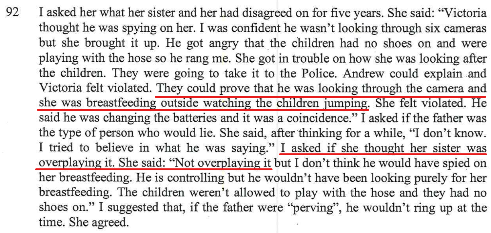
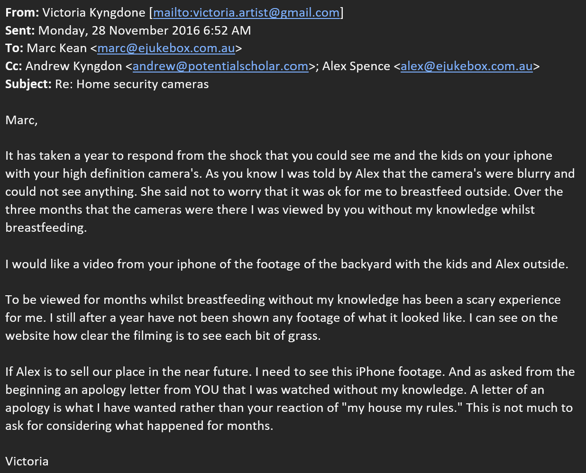
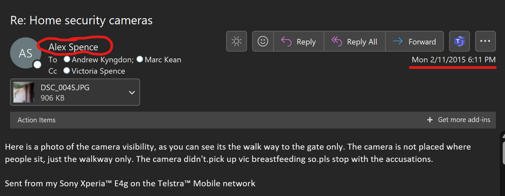
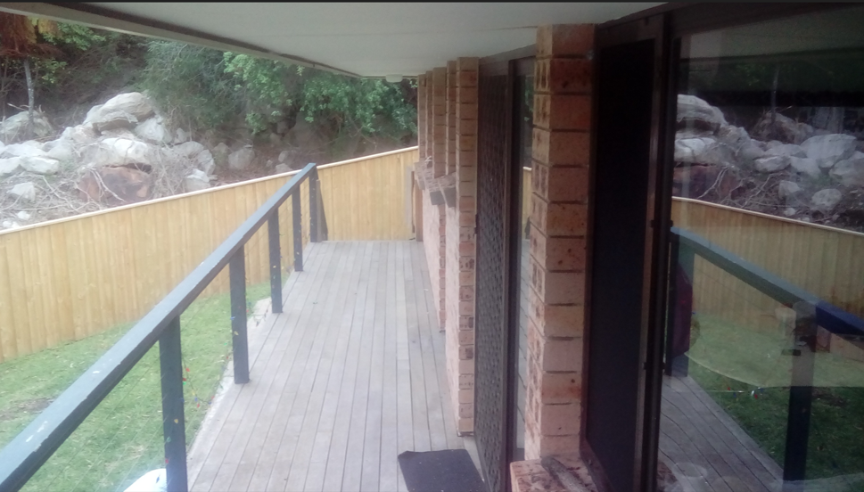
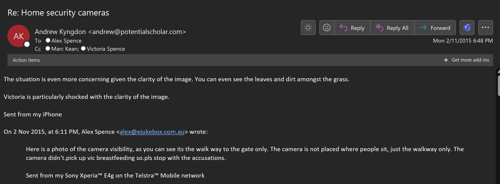
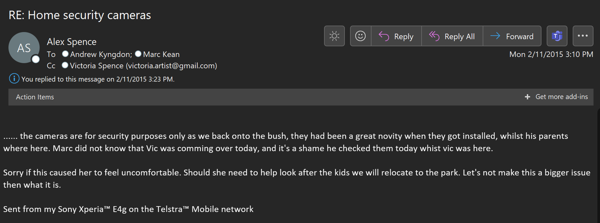

## Statements from the report

## My rebuttal
### Monday, November 2, 2015

Both Victoria and her husband have seriously warped view of the world, accusing me of spying on Victoria breastfeeding in our backyard.

This is the same day that Aunty Vic (Alex's sister) was at our house (Stratford close, Asquith) looking after our kids Charlie & Chloe. 

### Background

I had Netgear Arlo (version 1) security cameras that I installed to overlook the outside of each door into the home, [as the house backs onto bush and there had been break-ins to the Tennis club behind our house](/marcseparation/serious_risks/#the-matrimonial-home-is-constantly-left-unlocked). The cameras came with stickers to position at each doorway on the outside of the house to let people know of Arlo Security Camera's on site and in action. Both Vic & Andrew previously commented on the cameras just after I installed them as they learnt from the stickers, and they were OK with it at the time, security. These security cameras were setup to detect movement. When they see movement, they record video for 10 seconds. While this may seem great, they run on batteries and it means you need to keep logging into the system every now and then and check how much battery is left on the cameras to ensure that they don't run flat. Then to order a replacement set of batteries is needed, or to change the batteries.

### Story

So on this day at work, I did exactly that and remembered to logon to the web portal and check the batteries for the cameras. However, while checking on the camera’s, I happened to notice some pre-recorded 10 second videos siting there that showed my kids were miss-behaving. So I called Alex and told her. Alex then calls her sister Vic to inform her about the kids not behaving, but straight away Vic asks how Alex knew. Alex tells Vic that I saw it on the cameras and within an instant Vic snaps and accuses me of spying on her breastfeeding in the backyard. Vic calls her husband Andrew, then within minutes I start to get abused by both Vic and her husband Andrew. Andrew calls me while I'm still at work and accuses me thinking that I spied on Vic breastfeeding and wouldn't listen at all to my explanation. Later that night, a flurry of email of total accusation nonsense between Alex and I on one side, then Vic and Andrew on the other side. 

Victoria even went on to assume and accuse me that over the past 3 months I was viewing her breastfeeding, it's complete and utter nonsense that something so simple of me checking the batteries of the cameras has turned into this absurd allegation.

It was absurd and this ruined the relationships of Vic, Andrew and (Charlie's cousin) Henry. Alex supported me on this (email below) and we didn't see or talk to them at all since this happened until after Alex and I separated. Once I had moved out, then all of a sudden Vic, Andrew, Henry & Chelsea were all back in Alex's life as Alex had no other choice, Alex needed help from her sister to help look after the kids while she worked. 

#### Email from Alex
Alex was telling Vic & Andrew to stop with the accusations and that the camera didn't pick up Vic breastfeeding in the backyard:

A view from the camera:

#### Reply back from Andrew

#### Alex's reply to Andrew
