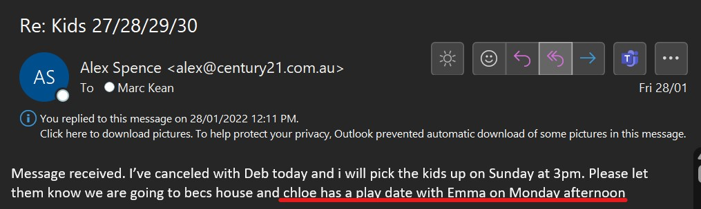
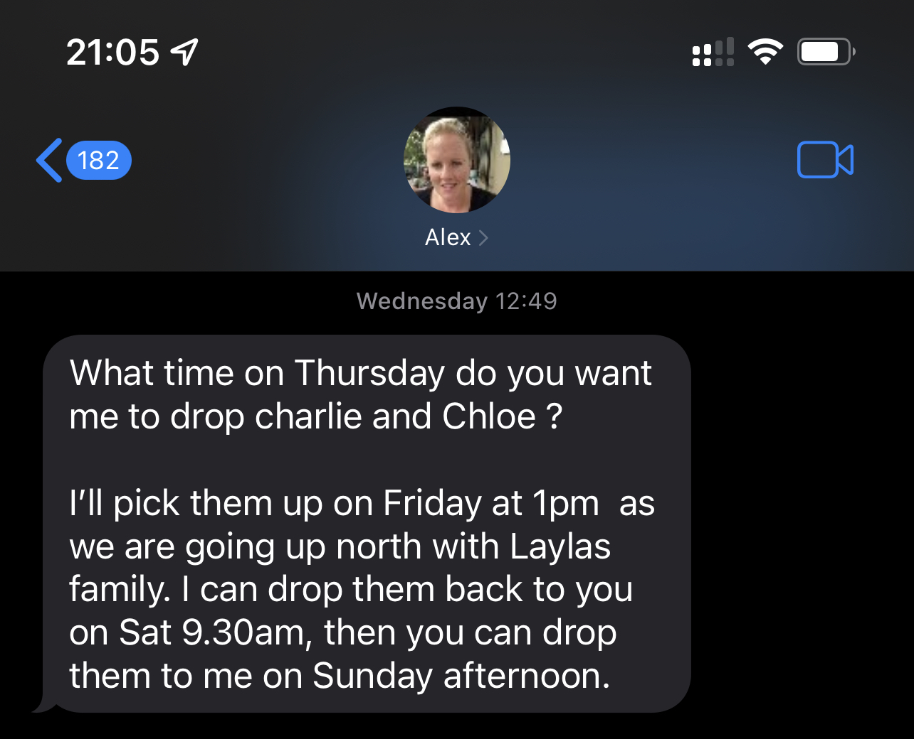
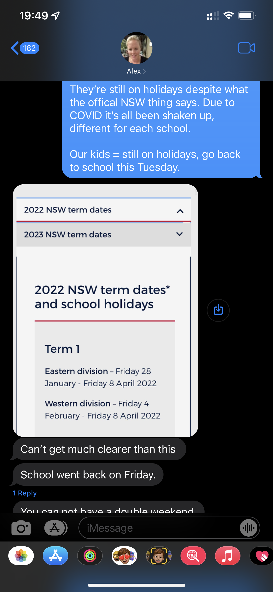
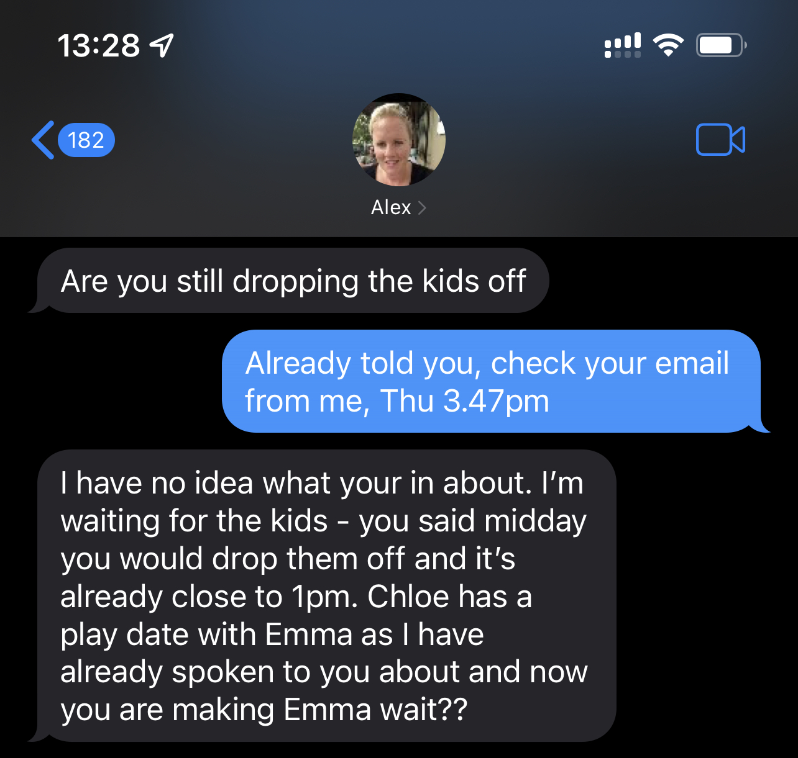
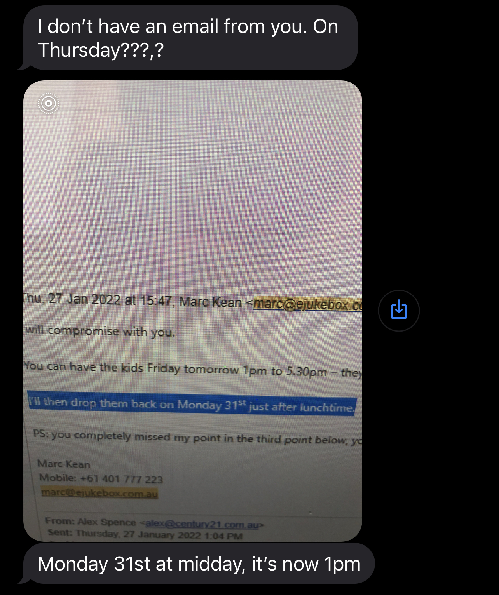
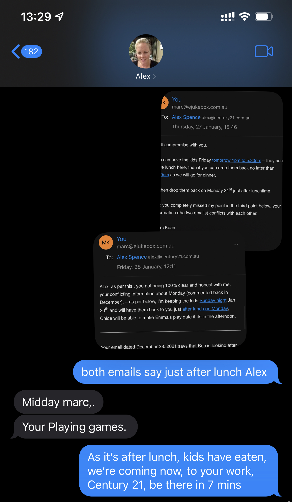

## Last weekend of school holidays 2022

> Tuesday, December 28, 2021

Alex and I had an agreement that I have the kids, 27, 28, 29 January 2022 (last weekend of school holidays).

Alex's email to me, dated December 28, 2021 says that her BFF **Bec** is looking after the kids on Monday Jan 31:

> Thursday, December 30, 2021

However, this contradicts Alex's other email she sent to me dated December 30, 2021 (two days later) where she said school goes back on the Friday January 28, 2022. 

So, back then when the emails were sent, in Alex's head, if she believed that school went back on the Friday January 28, 2022, then **Bec** can’t have possibly had plans to look after the kids on the Monday, as the kids would have been in school.

Now (Thursday, January 26, 2022) we know that school goes back on Tuesday February 1st, 2022.

Alex's email ***above*** clearly states that I can have the kids (27th 28th 29th), additionally, last month Alex was obviously bullshitting about Bec looking after the kids on Monday.

> Friday, January 28, 2022

Alex sends me a text message to let me know that Chloe has a play date organised with Chloe's friend Emma on Monday afternoon. So ok, Monday afternoon would mean Monday after lunch. 

> Wednesday, January 26, 2022

Also, with only a day’s notice she sends me a text that she wants to go away with the kids tomorrow night with Layla and making demands that I just need to comply. 

Alex is making plans with the kids when she already knows that I have the kids, seriously?????

> Thursday, January 27, 2022

Alex only gave me a day’s notice about this Layla thing and conflicting information about Sunday night/Monday with **Bec**. 

Based on this, I emailed Alex and told her that I’ll feed the kids lunch, then drop the kids back to her **after lunch** on Monday, January 31st, 2022. 
 
I told her that in future, please be a little more respectful in the tone of her messaging, she's not better than me, she don’t demand our kids agenda, they are our kids, and we both need to plan and agree on things rather than her simply making plans for the kids even when she know's that I was meant to have the kids as per a prior agreement. Alex didn’t discuss the Layla thing with me, she just dumped it on me last minute and expected me to comply.

## School holidays ending

An official letter from the school principal (dated: Tuesday, 25th January 2022) says for both Charlie & Chloe, they are to return to school in 2020 on Tuesday, February 1 2022.

Most schools also due to go back with the first day back at school Tuesday, February 1 2022.

Although from [the NSW government website](https://www.nsw.gov.au/living-in-nsw/school-holidays), it says school holidays end Friday, January 28, 2022.

> Friday, January 28, 2022

I get a text from Alex demanding the kids come back - this is even after our original agreement with the kids that they spend the [last weekend of the school holidays with me](/marcseparation/general_events_2022/#last-weekend-of-school-holidays-2022). 

> Saturday, January 29, 2022

## Dropping the kids off

As per [above](/marcseparation/general_events_2022/#last-weekend-of-school-holidays-2022) I already sent two emails to Alex where I mention clearly that I'll drop the kids back to her **after lunch** on Monday, January 31st, 2022. However, Alex doesn't seem to be able to understand what **after lunc**h means. We all know that lunchtime is from 12-1pm, so after lunch would naturally mean after 1pm. 

But on Monday itself, I get a text message from Alex.

> Monday, January 31, 2022

Text message from Alex at 12:16pm:

Text message from Alex at 12:55pm, :

Text message to Alex at 12:56pm:

I didn't mention the word '**midday**' anywhere, I was consistent all along and said "***after lunch***" on Monday.

## Kids with me on my allocated weekend

