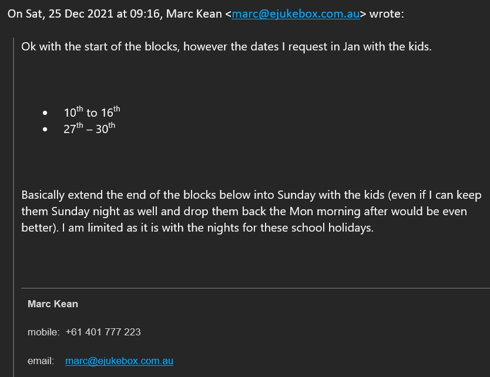
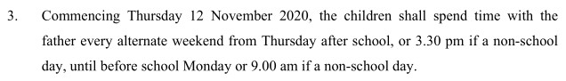
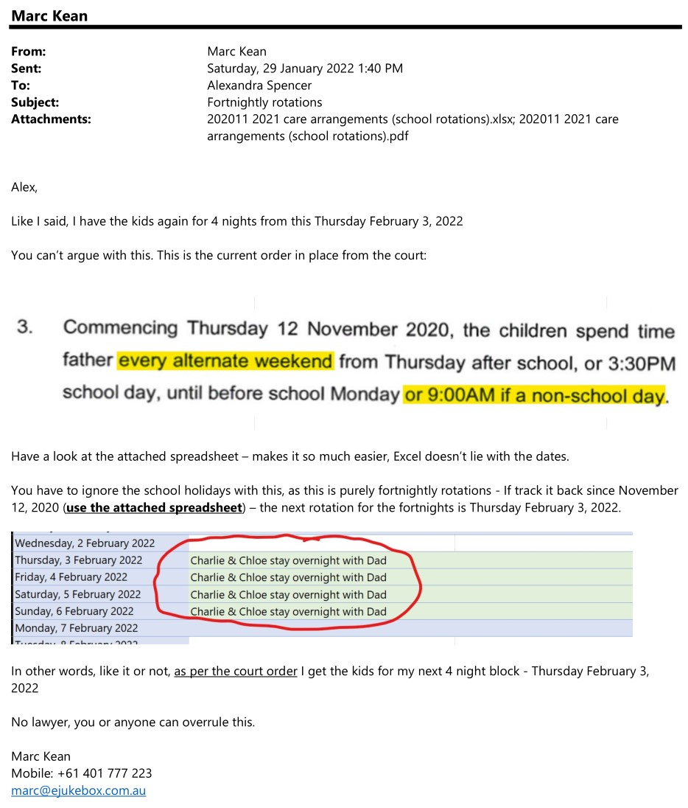
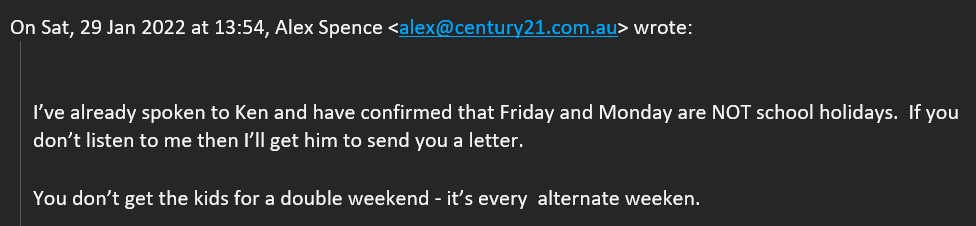
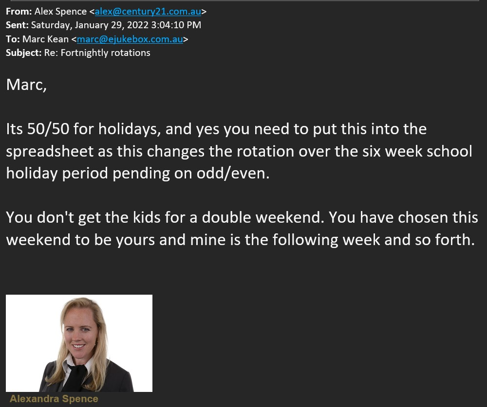
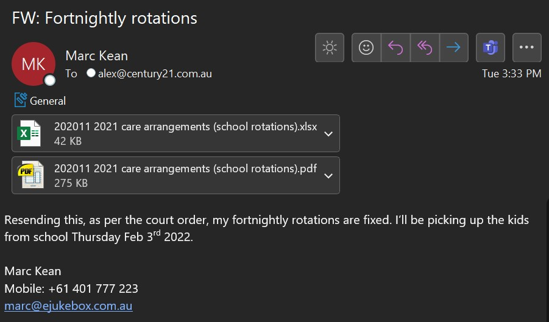
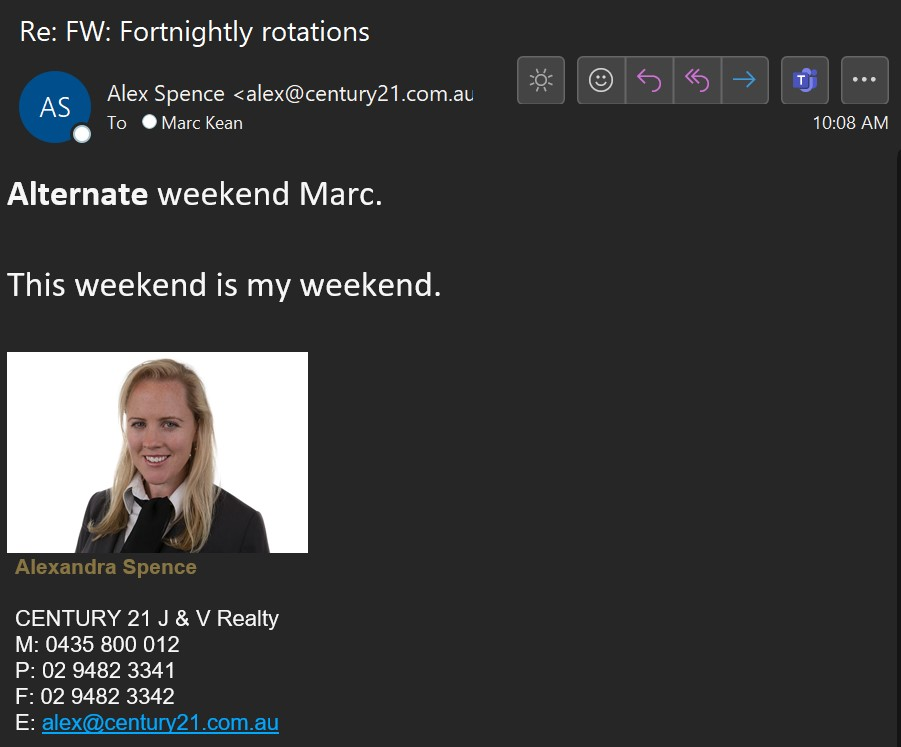
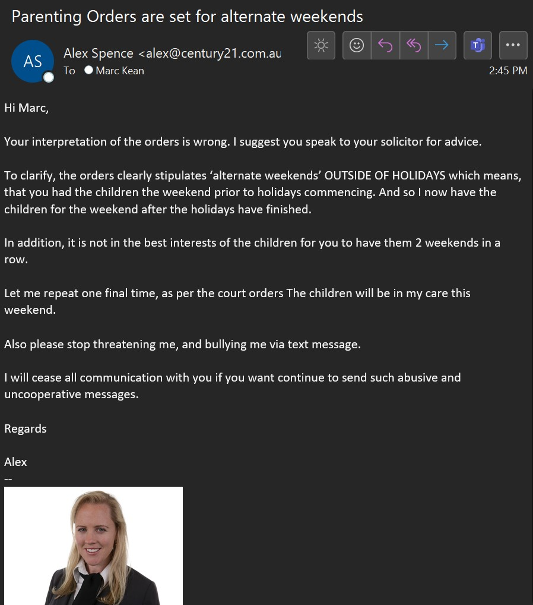

Whatever [mental issue Alex has](/marcseparation/alex_mental_health/) going on in her head, it's much worse than before.

She seriously needs to be checked by a doctor or something, because this stuff is beyond belief. 

## Last weekend of school holidays 2022

> Saturday, December 25, 2021

Alex and I had an agreement that I have the kids, 27, 28, 29 January 2022 (last weekend of school holidays), as per this email...

I asked for 27th - 30th January:

> Tuesday, December 28, 2021

Then Alex confirmed the dates were ok:

On this same day (December 28, 2021), another email from Alex says that her BFF **Bec** is looking after the kids on Monday Jan 31:

> Thursday, December 30, 2021

However, this email about Bec contradicts Alex's other email she sent to me dated December 30, 2021 (two days later) where she said school goes back on the Friday January 28, 2022:

So, back then when the emails were sent, in Alex's head, **if she believed** that school went back on the Friday January 28, 2022, then **Bec** can’t have possibly had plans to look after the kids on the following Monday, as the kids would have been in school.

Now (Thursday, January 26, 2022), as new **return to school** information has come through since then, we know that [school goes back](/marcseparation/general_events_2022/#school-holidays-ending) on Tuesday February 1st, 2022, and not the previous Friday *as the original messaging from the school*.

Alex's email ***above*** clearly states that I can have the kids (January 27th, 28th, 29th, 2022), additionally, last month Alex was obviously bullshitting about Bec looking after the kids on Monday.

> Friday, January 28, 2022

Alex sends me an email to let me know that Chloe has a play date organised with Chloe's friend Emma on **Monday afternoon** (January 31, 2022):

 So ok, **Monday afternoon** for Emma's play date would mean **Monday after lunch**. See [below](/marcseparation/general_events_2022/#dropping-the-kids-off).

> Wednesday, January 26, 2022

Also, with only a day’s notice Alex sends me a text saying that she wants to go away with the kids tomorrow night with Layla and making demands that I just need to comply. 

Alex is making plans with the kids when she already knows that I have the kids, seriously?????

> Thursday, January 27, 2022

Alex only gave me a day’s notice about this Layla thing in my time with the kids, also she gave me conflicting information about Sunday night/Monday with **Bec**. 

Based on this, I emailed Alex and told her that I’ll feed the kids lunch, then drop the kids back to her **after lunch** on Monday, January 31st, 2022. This is also to accommodate Alex, so that Chloe can have a play date with Emma. 
 
I told her that in future, please be a little more respectful in the tone of her messaging, she's not better than me, she's not in control of our kids agenda, they are our kids, and we both need to plan and agree on things rather than her simply making plans for the kids even when she know's that I was meant to have the kids as per a prior agreement. Alex didn’t discuss the Layla thing with me, she just dumped it on me last minute and expected me to comply.

## School holidays ending

An official letter from the school principal (dated: Tuesday, 25th January 2022) says that for both Charlie & Chloe, they are to return to school in 2022 on Tuesday, February 1, 2022.

Most other schools are also due to go back with the first day back at school Tuesday, February 1, 2022.

Although from [the NSW government website](https://www.nsw.gov.au/living-in-nsw/school-holidays), it says school holidays end Friday, January 28, 2022.

> Friday, January 28, 2022

I get a text from Alex demanding the kids come back - this is even after our original agreement with the kids where they are to spend this [last weekend of the school holidays with me](/marcseparation/general_events_2022/#last-weekend-of-school-holidays-2022). 

She expects me to drop the kids back on the Friday, January 28, 2022 (I ignore this first text):

> Saturday, January 29, 2022

A day later, Alex sends another text about ths school holidays that have ended. So I send a copy of the letter from the school that says school goes back Tuesday, February 1, 2022.

- Alex says "***School went back on Friday***" WTF? The official letter from the school clearly states that school goes back Tuesday, February 1, 2022. Is she completely dumb?

Then she starts to talk about a double weekend (which comes to light [further below](/marcseparation/general_events_2022/#kids-with-me-on-my-allocated-weekend)): 

## Dropping the kids off

As per [above](/marcseparation/general_events_2022/#last-weekend-of-school-holidays-2022) I already sent two emails to Alex where I mention clearly that I'll drop the kids back to her **after lunch** on Monday, January 31st, 2022. However, Alex doesn't seem to be able to understand what **after lunch** means. We all know that lunchtime is from 12-1pm, so after lunch would naturally mean after 1pm. 

But on Monday itself, I get a text message from Alex.

> Monday, January 31, 2022 - 12:16pm

Text message from Alex:

- Wait a second, the messages Alex [sent above](/marcseparation/general_events_2022/#last-weekend-of-school-holidays-2022) clearly say that Chloe has a play date with Emma on Monday afternoon, and at 12:16pm Emma is waiting? This is not Monday afternoon for a play date at all, it sounds like a lunchtime play date.  
- Also, where did I say the word **midday**? No where. I was very clear and precise all along, I always said I'd drop the kids back to her Monday after lunch. 

Text message from Alex at 12:55pm, there's an actual photo of my email that she's finally found, she's even highlighted the bit where I said after lunchtime, but again, she says **midday**! WTF - has Alex gone completely fucked in the head:

Text message to Alex at 12:56pm. I text Alex two copies of my emails which clearly mention I'd drop the kids back Monday after lunch:

- Then for a third time, she says **midday** again!!!

I didn't mention the word '**midday**' anywhere, I was consistent all along and said "***after lunch***" on Monday.

Alex is mentally screwed in the head.

## Kids with me on my allocated weekend

As per a very simple court order, it says:

> Commencing Thursday 12 November 2020, the  children shall spend time with the father every alternate weekend from Thursday after school, or 3.30 pm if a non-school day, until before school Monday or 9.00 am if a non-school day

You'd think it would be so simple, to just track this back to this date **Thursday 12 November 2020** and then every fortnight from there is my allocated weekends with my kids. 

So I did exactly that, I tracked it back and I'm due to have the kids this coming Thursday 3 February, 2022. 

As I knew this wold be another issue Alex would have a problem with, I emailed her very clearly explaining this:

> Saturday, January 29, 2022

The attachment that I sent to Alex in this email listed all the weekends in order from **Thursday 12 November 2020** onwards. I made it so clear and I highlighted all the alternating weekends from this date. [Download this attachment from here](../blobs/generalevents/202011%202021%20care%20arrangements%20(school%20rotations).pdf).

You'd think it would be so simple, but like I anticipated, she had issues with it.

This is Alex's reply:

Another reply from Alex:

I send a reply to Alex:

> The holidays don’t affect the fortnightly rotation. Never has, never will. This is exactly how we’ve been operating since November 12, 2020
>
>It's a court order - I'm not discussing this with you any further, if you don't get this, not my problem. I explained it very clearly below. Or read the court order.

> Wednesday, February 2, 2022

After no more correspondence and as my time with the kids again was fast approaching, I send a follow up to Alex:

Alex replies:

Then she replies again:

