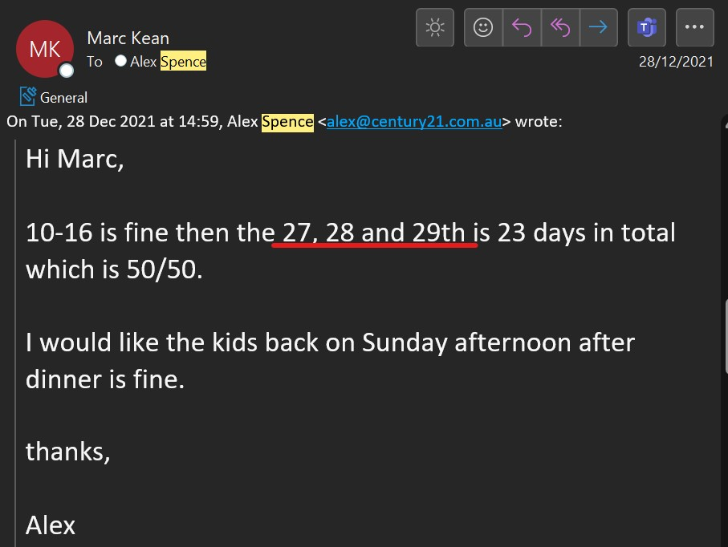
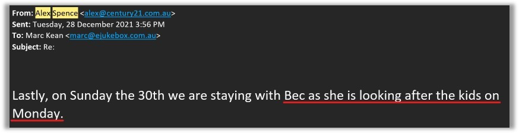
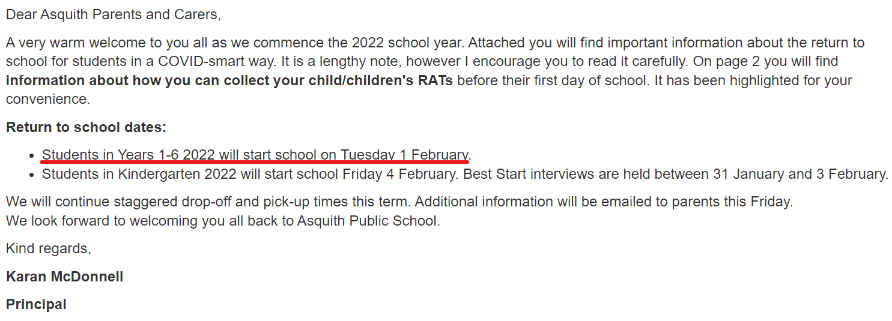
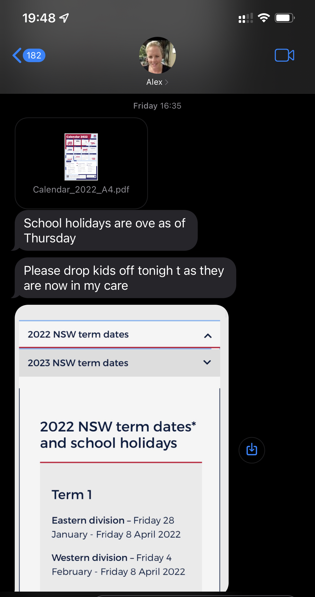
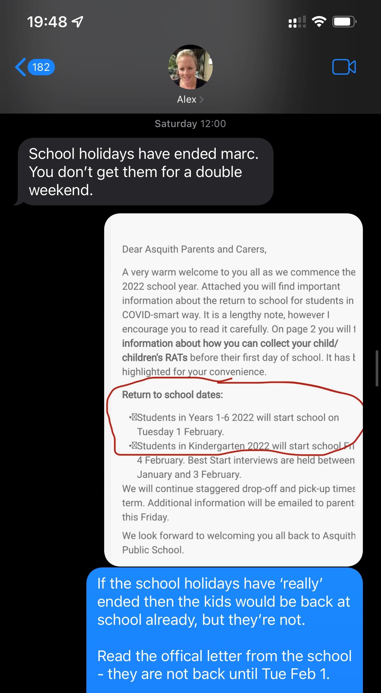

## Last weekend of school holidays 2022

> Tuesday, December 28, 2021

Alex and I had an agreement that I have the kids, 27, 28, 29 January 2022 (last weekend of school holidays).

Alex's email to me, dated December 28, 2021 says that her BFF **Bec** is looking after the kids on Monday Jan 31:

> Thursday, December 30, 2021

However, this contradicts Alex's other email she sent to me dated December 30, 2021 (two days later) where she said school goes back on the Friday January 28, 2022. 

So, back then when the emails were sent, in Alex's head, if she believed that school went back on the Friday January 28, 2022, then **Bec** can’t have possibly had plans to look after the kids on the Monday, as the kids would have been in school.

Now (Thursday, January 26, 2022) we know that school goes back on Tuesday February 1st, 2022.

Alex's email ***above*** clearly states that I can have the kids (27th 28th 29th), additionally, last month Alex was obviously bullshitting about Bec looking after the kids on Monday. Also, with only a day’s notice she tell me that you want to go away with the kids tomorrow night and making demands that I just need to comply. 

> Wednesday, January 29, 2022

Also, as per above, Alex is making plans with the kids when she already knows that I have the kids, seriously?????

Alex only gave me a day’s notice about this Layla thing and conflicting information about Sunday night/Monday with Bec, so I said to Alex that I’ll drop the kids back to her Monday January 31st 2022. 
 
I told her that in future, please be a little more respectful in the tone of her messaging, she's not better than me, she don’t demand our kids agenda, they are our kids, and we both need to plan and agree on things rather than her simply making plans for the kids even when she know's that I was meant to have the kids as per a prior agreement. Alex didn’t discuss the Layla thing with me, she just dumped it on me last minute and expected me to comply.
## School holidays ending

An official letter from the school principal (dated: Tuesday, 25th January 2022) says for both Charlie & Chloe, they are to return to school in 2020 on Tuesday, February 1 2022.

Although from [the NSW government website](https://www.nsw.gov.au/living-in-nsw/school-holidays), 

> Friday, January 28, 2022

I get a text from Alex demanding the kids come back - note even after our original agreement with the kids 

> Saturday, January 29, 2022

## Dropping the kids off

> Monday, January 31, 2022

Text message from Alex at 12:16pm:

Text message from Alex at 12:55pm:

Text message to Alex at 12:56pm:

I didn't mention the word '**midday**' anywhere, I was consistent all along and said "***after lunch***" on Monday.

## Kids with me on my allocated weekend

