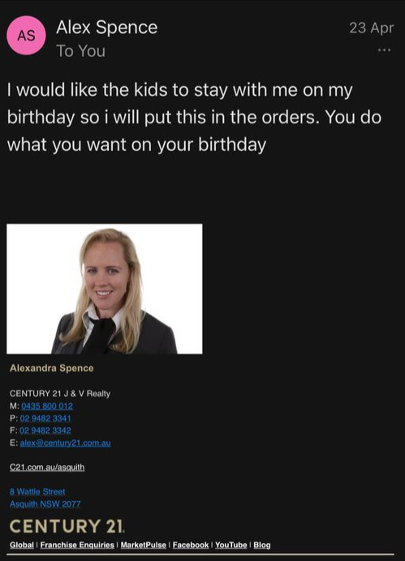
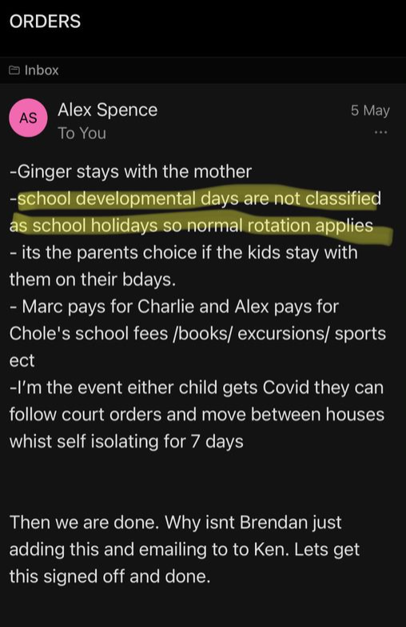

## Alex has been constantly holding up the parenting order to be finalised.

On July 26, 12pm we had a court directions hearing, to see where we were at with the parenting order. Both lawyers didn't know anything about the latest developments, but basically, Alex and I had already spent the last several months and come up with our very own agreement and I accommodated most of her requirements to help get this over the line. The lawyers weren't aware of this. However I explained this to the registrar in this directions hearing and that the only difference was that (just like before) Alex wanted something **more** added last minute, that she would have the kids for the first Friday night or term 1/2/3 school holidays (even though I was meant to have the kids for the first half of term 1/2/3 school holidays. Alex's methodology was that so she would have the kids minimum 5 nights in a row at anytime. The registrar asked me what was the problem of just accepting it, I told her, nothing, but that Alex could come come back later with other requirements or demands that she wants. I also told the registrar that if I did accept this extra 3 Friday nights a year, that that was it, and no further changes where Alex can't come back and make further requirements or demands. 

From there, the registrar said to Alex's lawyer Ken, that he was to take Alex and I's current agreement **as is**, then just simply add in the 3 Friday nights a year and that was it. Ken hinted to the registrar that it shouldn't take too long, just a few days. Something so simple.

Well just yesterday (about a month later), Monday August 22, 2022 Alex dropped to me a physical copy of a **draft** parenting order that her lawyer Ken wrote up as per instructions from the registrar.

It seems that Ken hasn't listened or even read Alex and I's parenting agreement at all, and got things totally wrong. This first one about the parents birthday nights.

Alex email:

Draft parenting order from Ken:

Again, Alex's lawyer Ken has totally wasted her time, this next one about school development days or pupil free days.

Alex email:

Draft parenting order from Ken:

What is happening here, Ken is no longer being paid for this, he doesn't care at all and obviously has taken a default parenting order and not even bothered to change anything.

I will add that this also dates back to the beginning of the year, when [even Ken was telling Alex that school development days or pupil free days were not school holidays](/marcseparation/general_events_2022/#school-holidays-ending)

