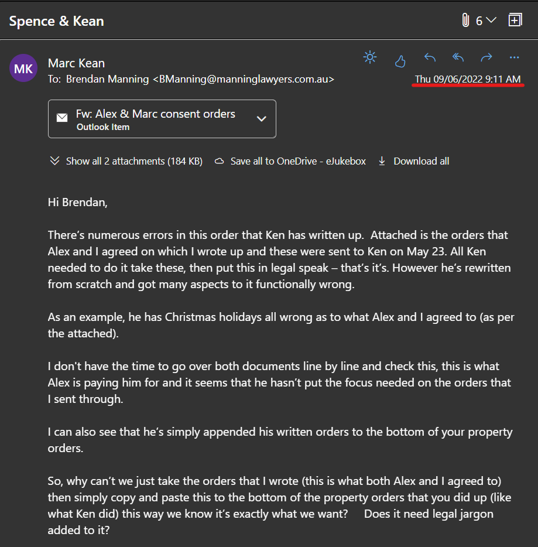

## Alex has been constantly holding up the parenting order to be finalised

On July 26, 12pm we had a court directions hearing, to see where we were at with the parenting order. Both lawyers didn't know anything about the latest developments, but basically, Alex and I had already spent the last several months and come up with our very own agreement and I accommodated most of her requirements to help get this over the line. The lawyers weren't aware of this as there were so many ad-hoc changes that Alex kept throwing at me. However I explained this to the registrar in this directions hearing and that the only difference was that (just like before) Alex wanted something **more** added tot the agreement last minute, that she would have the kids for the first Friday night or term 1/2/3 school holidays (even though I was meant to have the kids for the first half of term 1/2/3 school holidays).

Alex's methodology is that she would have the kids minimum 5 nights in a row at anytime. Imagine if I had the kids the weekend just before the school holidays and dropped the kids at school on the Monday prior to the school holidays, then Alex would have the kids for Mon/Tue/Wed/Thu night and I would have the kids the Friday as it would be the start of the school holidays, but no, Alex demanded minimum 5 nights in a row. 

The registrar asked me what was the problem of just accepting this new demand, I told her, nothing, but that Alex could come come back later with other requirements or demands that she wants. I also told the registrar that if I did accept this extra 3 Friday nights a year, then that was it, I wanted to finalise it and didn't want any further changes where Alex could come back and make further requirements or demands.

From there, the registrar said to Alex's lawyer Ken, that he was to take Alex and I's current agreement **as is**, then just simply add in the 3 Friday nights a year and that was it. Then it would be final and a sealed court order. Ken hinted to the registrar that it shouldn't take too long, just a few days. This way it would form a sealed parenting agreement and no further changes. Something so simple.

Well just yesterday (about a month later), Monday August 22, 2022 Alex dropped to me a physical copy of a **draft** parenting order that her lawyer Ken wrote up as per instructions from the registrar.

It seems that Ken hasn't listened or even read Alex and I's parenting agreement at all, and got things totally wrong. This is the second time Ken has failed with this simple task, [history](/marcseparation/alex_holding_up_parental_order/#history) below discusses the first time this happened.

This first one about the parents birthday nights.

Alex email:

Draft parenting order from Ken:

Again, Alex's lawyer Ken has totally wasted her time, this next one about school development days or pupil free days.

Alex email:

Draft parenting order from Ken:

**Note:** school development days are the same as pupil free days, they are the same thing.

Ken no longer cares and is no longer being paid for this (Alex told this to me herself, she's not paying him to write this parenting order), and obviously has taken a default parenting order and not even bothered to change anything to adhere to Alex and I's agreement.

### History

This is not the first time Alex's lawyer Ken has failed in the task of writing parenting orders. Back in May 2022, a task so simple, Ken was to take Alex and I's agreement, then put this in legal speak. Alex sent our agreement to Ken in May 2022.

A couple of weeks later, the authored parenting order from Ken came back with a comedy of errors throughout:

Also as far as history goes, I will also add that in relation to **development days / pupil free days be classed as school holidays** this also dates back to the beginning of the year, when [Alex changed plans last minute and this school development day/pupil free day was related to it](/marcseparation/general_events_2022/#last-weekend-of-school-holidays-2022). 

This time there were 2 school development days (Alex calls them **staff days**), where Alex goes back on her original agreement and for me to drop the kids back before a weekend which I was previously promised by Alex to spend time with my kids. 

Text from Alex - Saturday, January 29, 2022:

Ken was in the background instructing Alex the complete opposite about school development days / pupil free days, in this instance that school development days / pupil free days are **not** part of the school holidays, but as you can see directly above in Ken's DRAFT order, school development days / pupil free days **are** classed as school holidays.

### Circumventing NSW state public health orders

You might remember [this](/marcseparation/charlie/#charlie--covid19) when Charlie was diagnosed positive with Covid19, where Alex didn't seem to want to accept the NSW public health orders and accept that Charlie was isolating with me. See [the link immediately above](/marcseparation/charlie/#charlie--covid19) for the details, however Alex now wanted to have a clause written in the federal court parenting order where if the kids get Covid19 again, then they are allowed to move from one home to another which directly contradicts the NSW public health orders. My lawyer says that this will never be able to written into a parenting order. 

### Physical punishment

Also in these orders that Ken has written up, he's explicitly said that each parent is restrained from physically punishing the kids.

However reading the actual legislation, it's ok to use physical punishment to a certain point which is reasonable, as long as it's not physical abuse. If you read the official [Physical punishment legislation](https://aifs.gov.au/resources/resource-sheets/physical-punishment-legislation) it clearly defines what is **physical punishment**:

Then if we dive deeper into the legislation, in all states and territories we can see that it's **ok** to use **reasonable** physical punishment to discipline children.

Then on page 3 of the document, it list the current Australian law regarding the use of physical punishment by parents broken down by state and territory. I quote, NSW:

*The Crimes Amendment (Child Protection – Physical Mistreatment) Act 2001 (NSW) introduced an amendment to the Crimes Act 1900 (NSW) to limit the use of excessive physical force to punish children.*

*This amendment did not explicitly ban the use of physical force towards children but it did introduce clearer guidelines on what is acceptable, including that physical punishment by **a parent should not harm a child more than briefly** and listing parts of a child’s body that cannot be subject to force (s 61AA).*

### Update, August 29, 2022

One day before the hearing, and by this time Ken has failed twice in preparing the parenting orders. An email from my lawyer Brendan today, the third attempt from Ken with the parenting orders. This time, there's been **no** change from the second attempt, however Ken has added a **notation** at the bottom:

In other words, saying it's ok to go against public health orders. I have already mentioned [here and listed the exact public health orders for NSW](/marcseparation/charlie/), it says, no matter if shared care or now, isolation is isolation. 

