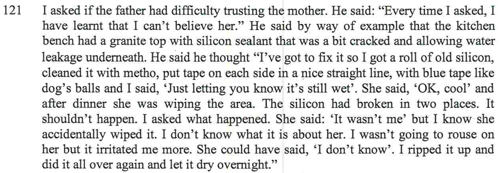
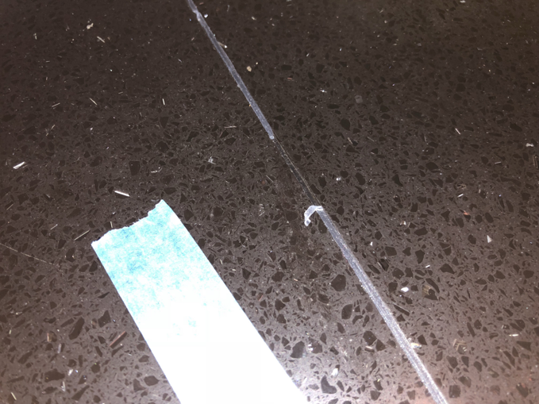
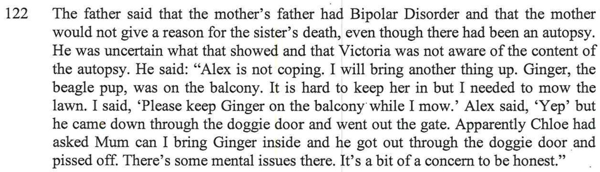

Alex is not coping and/or has mental issues or a mix of both. We know that there has definitely been a history of mental health in both Alex's father and sister, with both experiencing Bipolar disorder. There was a number of idiotic things that Alex did while we were living together and as for the cause, part of it I put it down to that she's not happy in our relationship, she wasn't coping (one reason why we separated) as she wasn't happy at all.

However since separation and even with me removed from the picture, in theory Alex should be much happier now and in turn, cope better. However, this is not the case and Alex is still doing idiotic things, making stupid mistakes and mishaps over and over again. Further below are examples of these idiotic things which she did both **before** and **after** we separated. 

However we know that the [report writer told me that she would be putting in the report that Julia committed suicide.](/marcseparation/julia_spence_mental_health/#what-the-report-writer-told-me-in-person), but even this wasn't mentioned in the report. 

As mentioned in the report, I told the report writer that it's as if Alex is running on autopilot and lot living in the present moment.

Doing extensive research online, knowing Alex from **before** and **after** we separated, it seems that she may be suffing from [depersonalisation disorder](https://www.netdoctor.co.uk/ask-the-expert/depression-faqs/a512/i-constantly-feel-like-im-on-autopilot/) as though she's disconnected from both her body and the world around. These feelings of detachment are the mind’s way of coping in situations of extreme stress. And stress is exactly what Alex was going through before our separation, and now it may seem that this hasn't changed.

### What we know of the current situation:

- Alex is a single Mum in a large home, much bigger than she needs with her and two kids, [the matimonial home is run down](/marcseparation/living_conditions/)
- [In the report](/marcseparation/report_contradictions/#contradiction-2), Alex says that she goes to the park each afternoon from 3pm, but my daughter Chloe says the opposite
- It's true that when the kids are with their Mum, they are left alone to play with their friends and/or be looked after by Aunty's or friends as Alex needs to work. It's also true that Charlie goes to the park by himself. 
- 

Alex has mental issues - the below is a summary of real events, which have been documented at the time of the events happening
	· Alex runs on auto-pilot, her brain is not engaged on things that she's doing
	· Alex runs on subconscious and is not conscious most of the time 
	· The house just about burns down
	· The house is constantly left unlocked

### Alex's crap carpark

On December 16, 2020 look how far out from the gutter that she parked on an already narrow street in the middle of school pickup:

### Chloe dropped face first onto a tiled floor

When our daughter was a little baby and still in nappies. Alex was changing her nappy in the laundry, Alex put Chloe on the bench face up. Alex turns her back for a second, then Chloe roles off the bench and goes splat onto the tiled floor face down. Chloe would have fallen about 1+ meters.

Saying stuff which is in-correct, doesn't give me the correct answer

### The grass that was for sale

I ask Alex "Do we have the money for the grass?"    She says, "Yes"
I ask where is it, she says "In the office"
I ask where abouts is it in the office, she says "it'll be dropped off to the office"

### Private Health Insurance

Half way through November I asked Alex to cancel the health cover (under her name) cover for her and the kids. Alex paid this using money out of the joint account $1.9K (after separation) she took our money to pay for her health cover, this included cover for both Alex and the kids (I’m not paying for Alex's cover), I asked this same night if she had reversed the health cover and she said YES! She said the money would be back in my account in a couple of days. Just now (2 weeks later) the money is still not back in the account, however the money has been transferred to a completely separate account in her name - which I don't have access to. 

### Sealant in the kitchen

#### My statement from the report

#### More detail

Before Alex and I separated, I noticed water leaking through the kitchen bench through the joins of the granite bench top. So I removed the old sealant, cleaned it, then laid new sealant. After this I also put bright blue tape either side of the wet sealant like a road works warning, that would be easily noticed from the cornet of the eye, so that one would stay well clear of the sealant while it dries. This happened at about 4pm one afternoon. Just after I laid the sealant, I showed Alex how much of a great job it was, a perfect line of sealant, told her not to touch it as it needed to dry, and she acknowledged it.

Later that same day at about 6.30pm (2.5 hours later) after dinner, I noticed the sealant line had been broken in 3 different sections – Alex was washing the dishes at the time right next to the sealant and I was on the other side of the bench and could easily see the sealant broken.

The kids were not around and I was in the office the whole 2.5 hour window between me laying the sealant and when I noticed it had been broken. Alex however was in the kitchen getting dinner ready.

When I noticed the damage, I brought it up with Alex and she denied anything to do with it. At the time of me bringing it up while Alex was doing the dishes, Alex had a tea towel in her hand and actually wiped over the sealant right then and there thinking I was talking about a spec of dust on the line of sealant and she thought she could wipe off the spec of dust.
 
What happened??? 

- Either **A**: Alex have wiped across the sealant and didn’t say anything due to the fear of being yelled at or me getting angry
- or **B**: Alex wiped over it and forgotten she had done it or not aware of wiping over it. If this is the case, this is a mental issue and seriously concerning. Assume it’s option A, then I wouldn’t care as much, fine, she owns up that she fucked up, she made a mistake, everyone makes mistakes, I would be fine if you did this (I can move on with this). But instead she is adamant she didn’t wipe over it - hence the reason I was seriously angry just after. I’m both angry and concerned because if it was option B, mental illness runs in her family, she had all along thought I would physically hit her and she has always thought I attack her (which is total bullshit, I have never hit her), if she has genuinely forgotten she has wiped over it - which we have had similar issues in the past of random shit happening beyond comprehension and her not remembering having any recollection or owning up to it e.g.
  - forgetting to lock the house regularly
  - the dish drainer ended up in the bin and you didn’t know how and no recollection

…. she might need to get tested for her mental wellbeing. 

Either or, we need to sort this ASAP, if this doesn’t get sorted it and if I move out and Alex does have a mental problem, her looking after our kids by herself is not healthy. 

As evidence, the below are the photos I took, the photos of the sealant being broken, the blue tape there as a warning sign to keep away while it dries.

|  |  |
| ----------- | ----------- |
|  |  |
|  |  |

### Tree loppers

After Alex and I separated, and would be about 20 months afterwards. On 03/10/2021, tree loppers came to chop down next-door neighbours' trees alongside fence line pf the matrimonial home on the neighbour's side of the fence.

This happened on a Sunday, I wasn’t aware. I did ask the neighbour (who I have a decent relationship with) to let me now, however he assumed he would let Alex know and she would let me know.

I had the kids that weekend, I came to the house with the kids or another reason on that same day and while I was there I happened to notice the tree loppers that were there at the time. The side fence was wide open, Alex was not home and the dog was there. The dog **Ginger** is a cross between a Beagle & King Charles Cavalier and they like to wander off. Being a scent hound dog, the Beagle has been bred for centuries to follow his nose, this instinct is extremely strong. Most often, [a Beagle will run away to follow a scent](http://www.beaglepro.com/beagle-running-escaping).

The tree loppers didn’t know anything about the dog in the house – and it was super lucky that I managed to be there on that same day to inform the tree loppers about he dog and to keep the fence shut. 

The next door neighbour **Rolly** send me a screenshot of his correspondence with Alex, As you can see below there was a week's notice.

Alex chose to ignore it. 

### Chloe dropped face first onto a tiled floor

When our daughter was a little baby and still in nappies. Alex was changing her nappy in the laundry, Alex put Chloe on the bench face up. Alex turns her back for a second, then Chloe roles off the bench and goes splat onto the tiled floor face down. Chloe would have fallen about 1+ meters.

### Ginger the dog on the back balcony

#### My statement from the report

#### More detail

Mum and Dad were here at the time.

I needed to mow the lawn, so I had the back gate open in the back yard, I put Ginger the dog on the balcony with the balcony gate closed so she was contained. I did this so that I could mow the lawn. 

I informed Alex not to let Ginger off the balcony as I was mowing the lawn with the back gate open. As Ginger is a cross between a Beagle & King Charles Cavalier, she liked to wander off quite a lot. Being a scent hound dog, the Beagle has been bred for centuries to follow his nose, this instinct is extremely strong. Most often, [a Beagle will run away to follow a scent](http://www.beaglepro.com/beagle-running-escaping). Plus I would have only been no longer than an hour mowing the back lawn. 

Then minutes later while the petrol lawn mower was still going (loud noise), Chloe asks Mummy if she can let Ginger inside, Alex says to Chloe it’s OK to let Ginger into the house. 

Then Ginger runs downstairs and out through the doggy door and into the backyard and nearly escapes through the open gate in the back yard. 

I ask the question to Alex and Chloe, who opened the door, both told me they didn’t. 

It wasn't until later when I threatened to get Chloe into trouble for lying, Alex told me it was her that it was her that said it was OK for Chloe to let Ginger in the house.

**Witness:** My mum was here at the the time and she too witnessed this. 
