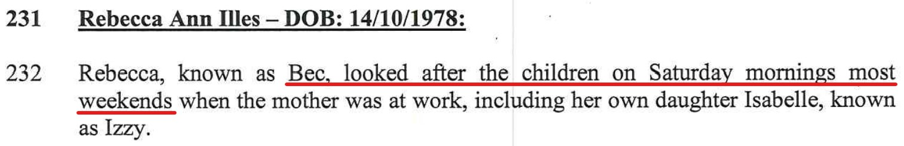

## Charlie going to the park by himself

Charlie has told me that he goes to the park by himself each day and hangs out with his friends (Ted, Oscar, etc.). As I understand it, he is unsupervised both walking up to the park and whilst at the park. If this is correct, I am very concerned at the possible influences and temptations for unsupervised boys this age and from the possibility of adults with ulterior motives trying to coax Charlie (and the other boys) into inappropriate behaviour or worse – in Charlie’s case, either on the street going to or from the park or at the park. Charlie did say that on one occasion, a father of one of the other boys was present but had to go, leaving the boys on their own. I am unclear as to whether there is any other supervision by a responsible adult.
 
There are potential dangers for boys this age being out and about on their own. In addition to inappropriate influences and temptations from within the group (cigarettes, drugs, porn, etc.) there is also the real possibility of risks and dangers from adults trying to take advantage of boys – i.e. paedophilia.
 
If my understanding of the situation is correct from what Charlie has told me, then I am really concerned at Charlie’s wellbeing and development. Your comments would be appreciated and hopefully you can ease my mind.

The comment from my son Charlie below, he is constantly at the park, because it's

## Alex is never around

As it says in the report

No control or discipline
- The children are left to their own devices. 

- When I get the kids before they adjust, they don’t do what they’re told
- Charlie tells me ‘No’
- Kids run amuck around the shops touching everything, I tell them look but not touch and to not run around as there’s elderly people that they need to look out for and respect
- Aunty Vic - 5 star hotel pool. 

No structure
- Alex never had proper structure growing up.
- The kids need structure, then need to learn routine

Fear & Uncomfortable
- Vic saying “He’s such a dickhead” about Marc, in front of the kids. The kids felt very uncomfortable. 

Living arrangements
- Back yard grass edges is a mess and out of control, the kids complain about always getting leeches from the back yard. 
- House is constantly unlocked, we back on to bush 

Chloe sick
- Constantly has a sore tummy, for the past 2 years, something is causing it and Alex has done nothing to look into it
- Chloe had a niggling cough for 4 months, never went away. Alex didn’t do anything about it, I bought cough medicine which got rid of it. 
- Chloe constantly had issues with her mouth and Alex does nothing about fixing it 
