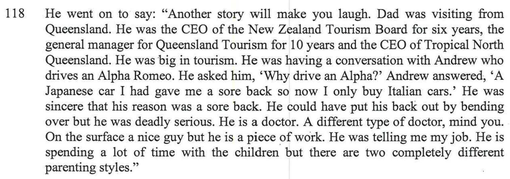
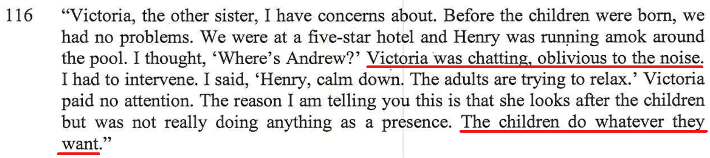

Victoria Kyngdon married to Andrew Kyngdon, two kids Henry & Chelsea. 

Both individuals are very strange

- [Breast feeding spy allegation](/marcseparation/breast_feeding_spy_allegation/)
  - Turned something so simple into total nonsense
- Victoria at a 5 star hotel swimming pool, Henry out of control
- Andrew's warped views of Japanese cars

## Andrew and Japanese cars

In the report, I said:

Just because he got a sore back by driving one particular Japanese car, now Andrew doesn't like all Japanese cars.

## Victoria oblivious to kids

One day on a Saturday when Alex was working and Vic was meant to me looking after the kids at the home, Chloe called me saying that she was bored, Vic wasn't not playing with Chloe at all, Vic was on her phone in the kitchen, she was left to occupy herself. 

Another episode I mentioned in the report, Vic is totally oblivious to the kids. 

When the kids are around Vic and Vic is meant to be looking after them, kids can do whatever they like, Vic is not paying any attention at all. 

## Victoria starves my kids

Every time I get my kids, they constantly complain about how Vic looks after them. Charlie constantly complains that he never gets fed enough food and is alway hungry.
- He only gets one Sushi roll, Vs the 5 rolls that he eats when he's with me
- Both Charlie & Chloe shared one egg & lettuce sandwich, half a sandwich each for lunch
- At McDonalds, Vic gives the kids a cheese burger with no cheese and no pickles, as it's cheaper than a hand burger, but this is all the kids get and Charlie always complains that he hungry. 