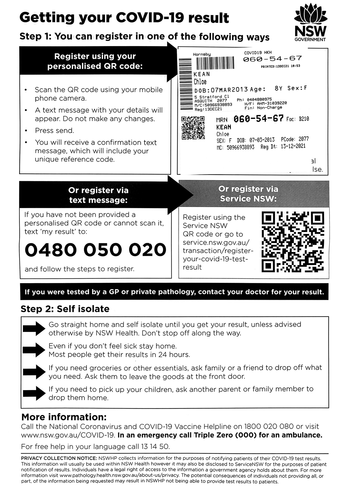
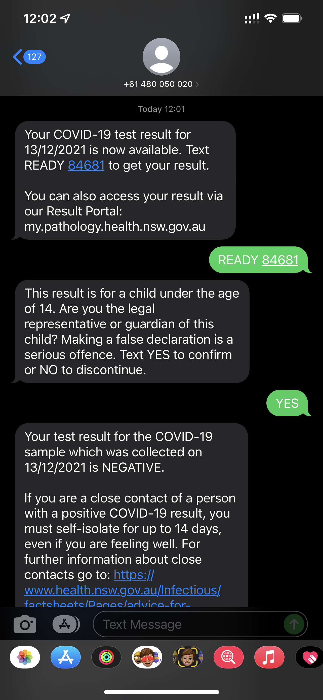

I had the kids over the weekend of **Sat/Sun Dec 11/12 2021**. Chloe had a niggling dry tickling cough, Chloe said that she had it for the past 3-4 months.
 
### Sun Dec 12, 2021

I bought Chloe cough medicine to help knock the cough on its head. The instructions say to take it 4 times a day.
 
### Mon Dec 13, 2021

The morning of school, Chloe mentioned that I, as an adult can take the cough medicine to school and the school administer doses on my behalf during the school day. 
 
I went to the school with Chloe in the morning, however as soon as I gave them cough medicine, they assumed Covid and I was required to see a doctor. 
 
Chloe and I went to the doctor ASAP, appointment at 10am. The Doctor did some quick tests, then told us that we need to get a Covid test. 
 
Chloe and I went straight to get a Covid test, Chloe was tested only, not me. Chloe needed to self-isolate and as per normal, the rule is not to associate with anyone else. So I took her back home. 
 
A little later around lunchtime, Alex complains to the Police that I had Chloe and there were court orders for me to drop her back, however the court order says at the end of school for that day 2.55pm is when Alex picks the kids up. Also, in relation to the Covid test, the law states that Chloe (like anyone else) needs to remain isolated after a Covid test and until a negative result comes back. The Police (a woman officer) phoned me and I told the Police this and it was accepted. I also said, as soon as a result came back, I would drop Chloe back. 
 
Later that night I had my PT session at 7pm. It was normal that I take the kids with me, and sometimes they wait in the car, e.g. if it’s raining or freezing cold in winter. On this occasion I left Chloe in the car to remain isolated. The sun roof was open for ventilation, and Chloe was not in any emotional distress, she had her phone and my 5G internet. Chloe was happy being in the car by herself. I could see the car from where I was. 
 
Just after 7pm and while at my PT session, Alex then calls the Police again, and so I then get a another call from the Police, this time Constable Hudson, where I mention the same thing as I mentioned to the first officer earlier in the day, they I was not comfortable dropping Chloe back while she’s meant to be isolated, and I would drop Chloe back as soon a negative result came back. He was OK with this. 

### Coming to the park
 
Alex then calls Chloe on her mobile phone while isolating in the car, Alex finds out that I am at my PT session and then comes to the park (Storey Park, Hornsby) to see me physically standing there beside the car with Chloe in the car. Alex is in her car with Charlie in the front passenger seat, and she is holding her phone up in front of her, as she’s either talking to her friends and/or filming the situation. Alex says a few heated words and I remain as calm as possible and simply keep telling her to go. 

**If Alex did video, this video should be on her phone as evidence**.

### Leaving the park

Alex leaves shortly after (Chloe remains with me) then Alex phones the Police again, to tell them that Chloe is *locked in a car*. I then end my PT session early and leave to go back home at approximately 7.30pm. When I get home Constable Hudson calls me again, this time he is disgruntled and asks what it really going on, as he has learnt that Chloe is *locked in a car* while I am at my PT session. He goes on to tell me that this is against the law (Chloe wasn’t in any emotional distress through), and tell me that I need to drop Chloe back. I tell him that Police can’t enforce federal court orders, and then he threatens me, he says that he will create an event and send a car to collect Chloe. I tell him not to as I need to call my lawyer. He says to me that he will send a car regardless and I tell him not to until I call my lawyer - this goes around in circles for a short time until I said that I needed to go and hung up. 

I call my Lawyer straight away and tell him of the situation, he instructs me to drop Chloe back. So I did, However, on my way dropping Chloe back to the house, Alex was waiting with Charlie outside in her car my apartment obviously waiting for the cops to show (Charlie would have been witness cops coming to Dad). 

But when I got to the house, mins later Alex showed up, I left Chloe there and went home, I never heard from the cops again.

### Tue Dec 14, 2021

I called Charlie about the events that happened the day earlier. I confirmed that he was exposed to all Alex’s conversation with her friends about the situation, and all the conversations with the Police. Charlie told me on the phone *it made him feel uncomfortable*.

### Recording of how Charlie felt

Here is a recording of Charlie, about exactly how he felt being in the front car passenger seat while Mummy was calling the Police on Daddy and also waiting for the Police to show up:

<audio src="../audio/20211217_Charlie_not_comfortable_Mummy_contacting_the_Police.mp3" type="audio/mpeg" controls>
  I'm sorry. You're browser doesn't support HTML5 <code>audio</code>.
</audio>

### Witness at Storey Park

Phil Baird is my PT and I asked him to come up, he witnessed the majority of the event His comment to me was *that is bullying from Alex* and Phil went onto mention how impressed he was how I handled the situation. Phil is available upon request to provide this statement if required.

### Covid result, Tue, Dec 14 2021

