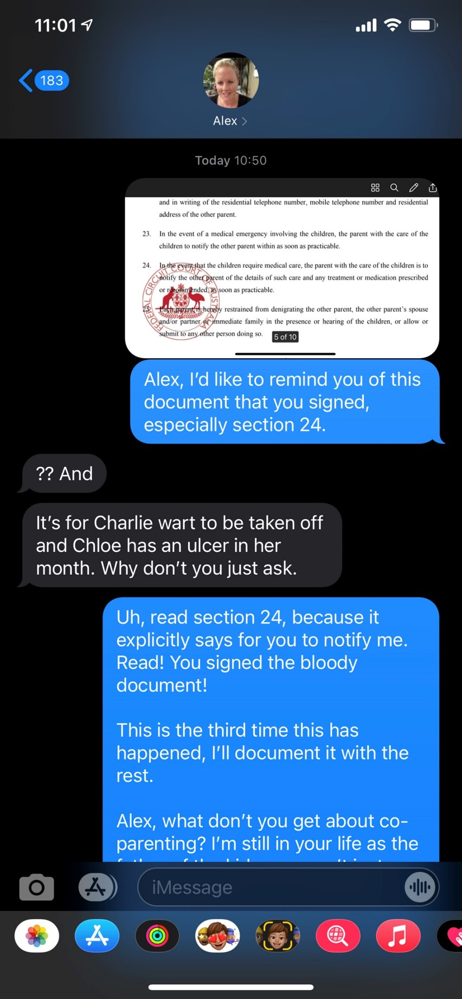
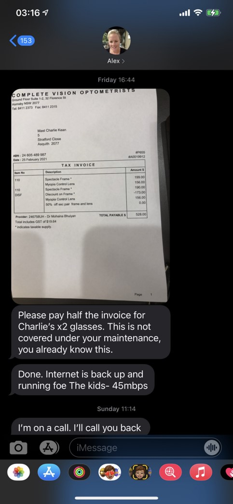

## Statements from the report

Current Parenting is not working

## General events

### March 9, 2021
- I go to the house to drop off kids sports uniforms
- Alex greets me at the door with a fowl look on her face, abuses me, tells me - I forgot the kids sneakers and doesn’t even say thank you
- She doesn’t even say thank you
- Charlie calls me later on Wednesday night and asks me about his shoes, I tell him to speak to Mummy to sort it out and then all of a sudden he hangs up on me which is totally out of character for him
- Straight after, Alex calls me and abuses me, what did I do, Charlie is in tears and I just hung up on her
- I find out later on Thursday from Charlie that Alex was with him at the time when he called and it was Alex that hung up on me

## Not informing me about kids medical appointments

| February 1, 2021 | March 12, 2021 | November 18, 2020 |
| ----------- | ----------- | ----------- |
|  |  |  |