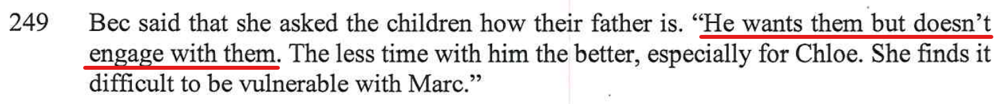

[//]: # (margin:top right bottom left)

## Statements from the report

The report contained the following:

- This is crap, the kids love being with me. The below videos, you can see, th kids are more than happy spending time with me. 

- This didn't happen, I remember this night very clearly as I saw Bec's boobs, it's etched in the back of my mind forever. Yes, I remember walking into the kitchen of the hotel room that we had near the Vivid light show, and there was Bec sitting on the ground in the kitchen with my son Charlie, Bec was totally topless with her boobs hanging out. I quickly walked back out again. But got me wondering afterwards, why is Bec totally topless and my son Charlie was right there at the same time? Why didn't Bec get changed in the bathroom? 

    Plus, the hotel that we were in was right at the Vivid light show, so we didn't drive to it, we simply walked to it as we were right on circular quay in the middle fo Sydney. 

- Utter bullshit, as per this site 

## My rebuttal

### I am not a bad Dad

Photos and videos speak for themselves. 

### The below some videos of the kids at my place

Kids to excited at my place...

<iframe width="420" height="315"
    src="https://www.youtube.com/embed/HBVIzwhJitw?playlist=HBVIzwhJitw&loop=1&Version=3&autoplay=1&mute=1&showinfo=1&rel=0">
</iframe>

Kids are faking this, but having so much fun together!

<iframe width="420" height="315"
    src="https://www.youtube.com/embed/Zqry3yZ9eJg?playlist=Zqry3yZ9eJg&loop=1&Version=3&autoplay=1&mute=1&showinfo=1&rel=0">
</iframe>

### Australia Zoo

<iframe width="420" height="315"
    src="https://www.youtube.com/embed/O8NhnRvIjVM?playlist=O8NhnRvIjVM&loop=1&Version=3&autoplay=1&mute=1&showinfo=1&rel=0">
</iframe>

### Big Boing, Birtinya, QLD

<iframe width="420" height="315"
    src="https://www.youtube.com/embed/R1dAO4jOdlk?playlist=R1dAO4jOdlk&loop=1&Version=3&autoplay=1&mute=1&showinfo=1&rel=0">
</iframe>

### Rubik’s Cube Challenge

Rubik’s Cube Challenge - I messed it up and Charlie Kean solved it! Hats off to Charlie, the little genius!

What else is there to do in lockdown, other than make the most of the time to yourself. 

See what you can do when you focus and apply yourself, you can do anything…

<iframe width="420" height="315"
    src="https://www.youtube.com/embed/4BIsmeyN9wI?playlist=4BIsmeyN9wI&loop=1&Version=3&autoplay=1&mute=1&showinfo=1&rel=0">
</iframe>

### Clip & Climb | Gosford, NSW, Jan 2021

Kids and I experienced this awesome place, we all had so much fun. 

<iframe width="420" height="315"
    src="https://www.youtube.com/embed/_58f7he47qc?playlist=_58f7he47qc&loop=1&Version=3&autoplay=1&mute=1&showinfo=1&rel=0">
</iframe>

## Home activities

### Charlie & Chole helped to build their brand new loft bed from IKEA

Great activity for the kids to really get involved in something that we can all contribute to as a family, learn some new skills and really enjoy the finished result. 

<iframe width="420" height="315"
    src="https://www.youtube.com/embed/qWYC70au4ts?playlist=qWYC70au4ts&loop=1&Version=3&autoplay=1&mute=1&showinfo=1&rel=0">
</iframe>
 
<iframe width="420" height="315"
    src="https://www.youtube.com/embed/I_OHOYEqIY0?playlist=I_OHOYEqIY0&loop=1&Version=3&autoplay=1&mute=1&showinfo=1&rel=0">
</iframe>

### Gingerbread house

A fun activity and challenge as a family, to build a gingerbread house. We all too part in this group activity, was fun and kept us all occupied for quite some time. 

<iframe width="420" height="315"
    src="https://www.youtube.com/embed/6jcYpYPdIfQ?playlist=6jcYpYPdIfQ&loop=1&Version=3&autoplay=1&mute=1&showinfo=1&rel=0">
</iframe>
 
<iframe width="420" height="315"
    src="https://www.youtube.com/embed/bplzhkNkYdA?playlist=bplzhkNkYdA&loop=1&Version=3&autoplay=1&mute=1&showinfo=1&rel=0">
</iframe>

### Boss Day

Similar to the movie of the same name. I gave the kids points for doing jobs at my place. Chloe managed to get enough points to have her very own **boss day** - she was the boss for this very one day. So it was off to the shops, as this is what she wanted to do.

<iframe width="420" height="315"
    src="https://www.youtube.com/embed/weHhTMzBIls?playlist=weHhTMzBIls&loop=1&Version=3&autoplay=1&mute=1&showinfo=1&rel=0">
</iframe>
 
<iframe width="420" height="315"
    src="https://www.youtube.com/embed/wZXi-_c4o4E?playlist=wZXi-_c4o4E&loop=1&Version=3&autoplay=1&mute=1&showinfo=1&rel=0">
</iframe>

### Halloween 2020 / 2021

Spent 2020 Halloween with the kids:

<iframe width="420" height="315"
    src="https://www.youtube.com/embed/7QFUTMtBnoY?playlist=7QFUTMtBnoY&loop=1&Version=3&autoplay=1&mute=1&showinfo=1&rel=0">
</iframe>
 
<iframe width="420" height="315"
    src="https://www.youtube.com/embed/V97XWdcX4Dc?playlist=V97XWdcX4Dc&loop=1&Version=3&autoplay=1&mute=1&showinfo=1&rel=0">
</iframe>

Spent 2021 Halloween with the kids:

<iframe width="420" height="315"
    src="https://www.youtube.com/embed/KqFBTrD8H7w?playlist=KqFBTrD8H7w&loop=1&Version=3&autoplay=1&mute=1&showinfo=1&rel=0">
</iframe>