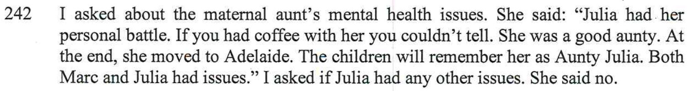

Julia Spence has always had issues with her mental health. Julia was known to have a problem handling Alcohol, and after only a couple of glasses of wines, she’d be out of control drunk. In the report Alex says that her sister Julia passed away in March 2021, two days after being discharged from **hospital** in Adelaide. No mention of the type of hospital, but we know it was a **mental hospital**.

### What the report writer told me in person

Ruth the report writer told me that she had been given powers from the court, that the court gave her power to subpoena information from places. So I did ask Ruth to find out how Julia died and what the family mental health history was. As you can see here:

The report writer ignored my request totally.

When I was in the session sitting with the the report writer, Ruth explicitly told me that she would be putting in the report that Julia **committed suicide**. The fact that Julia recently got out of a **mental hospital**, off drugs and back home, people can't cope, Ruth said she's seen this before and it's fairly common. 

But nowhere in the report does it mention the specific terms:
- "*Mental Hospital*" - it only mentions **hospital** (the word mental is missing)
- "*Committed suicide*" - just that she had been started on a new medication and died in her sleep

So basically, the report writer is trying to downplay and sugar coat the mental history of the sister Julia, to deflect this mental attention away from Alex. 

Alex's best friend **Rebecca Illes** made a verbal comment about Julia before Alex and I separated, her comment was "*She’s a bad egg*" - **Rebecca Illes** is Alex's best friend and spoke to Ruth Selig in the Family Report and even she downplayed and sugar coated Julia. Here's what Bec said: 

Purely for the fact to not attract any attention to the mental health aspect of the sisters, Julia and more specifically, Alex.

Below are some of the things that Julia did when she came to visit the matrimonial home before Alex and I separated. 

- She slammed doors in the house while we were trying to sleep
- She traced mud through the house, on brand new carpet
- She broke a coffee machine due to mistreatment, after she forcibility used it
- She’d smoke cigarettes in the backyard around the children after being told not to
- She’d leave a stash of cigarette buts in accessibility range of the kids
- She had a bottle of wine in her car while my two kids were there in the car with her

<iframe width="420" height="315"
    src="https://www.youtube.com/embed/zGeWNbt47RA?playlist=zGeWNbt47RA&loop=1&Version=3&autoplay=1&mute=1&showinfo=1&rel=0">
</iframe>

 

<iframe width="420" height="315"
    src="https://www.youtube.com/embed/0MGPuNncgLQ?playlist=0MGPuNncgLQ&loop=1&Version=3&autoplay=1&mute=1&showinfo=1&rel=0">
</iframe>

Clearly you can see that Julia is F'ed up and mentally sick in the head. 
### Julia was a joke in her family

My kids told me that themselves, cousin Henry and their Uncle (Henry's dad) make up a song about Julia being such a bad egg and with mental issues. The kids were rehearsing it over and over led by Andrew Kyngdon. My kids perform the song below:

<iframe width="420" height="315"
    src="https://www.youtube.com/embed/I_K9du6qQ-0?playlist=I_K9du6qQ-0&loop=1&Version=3&autoplay=1&mute=1&showinfo=1&rel=0">
</iframe>

This proves that even within Julia's family, they thought she had issues.