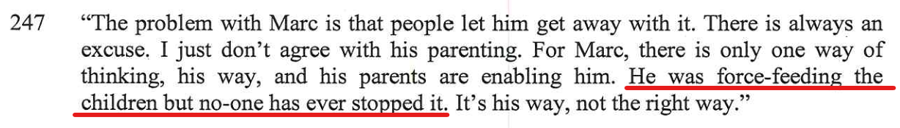
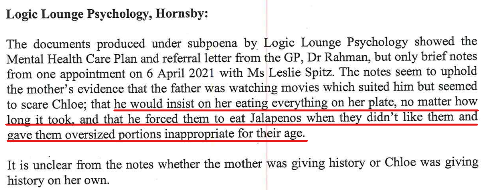
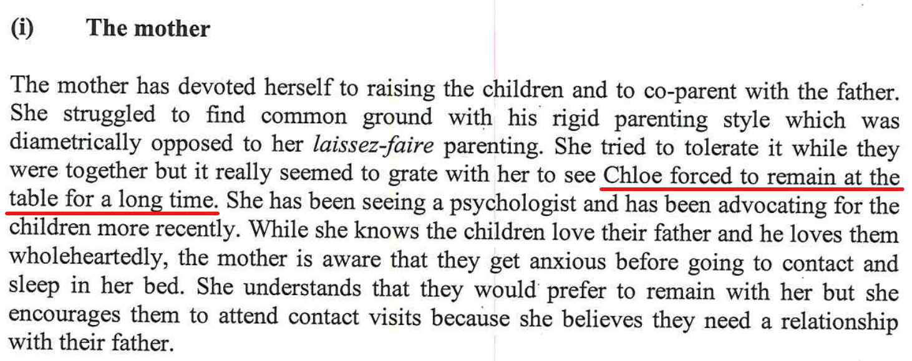
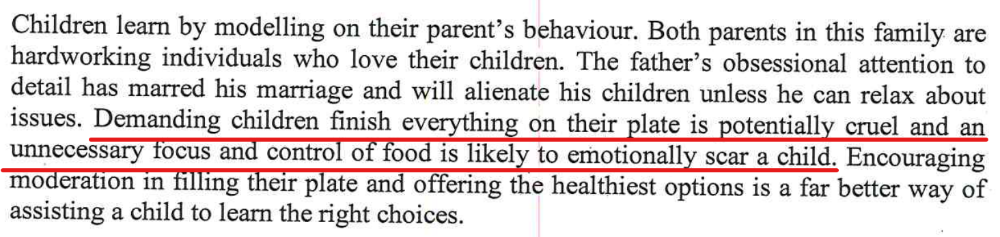

## Statements from the report

- Bec said *He was force-feeding the children but no-one has ever stopped it*

### Report writers comment

### Report writers comment

### Report writers comment

## My rebuttal

FIrstly, let's define what it really means if a kids says they're full and let's hear it from a kids mind, my son Charlie:

<audio src="../audio/Definition_of_full_from_a_kids_mind.mp3" type="audio/mpeg" controls>
  I'm sorry. You're browser doesn't support HTML5 <code>audio</code>.
</audio>

1. I am full, there's no more room in the kids stomach
2. There's always room for desert
3. Kids just don't feel like it

Example, Charlie thought he was getting hard and rocky pudding so he said he was full. But as soon as he found out it was chocolate cake all of a sudden he said he was not full. 

Charlie goes onto say that if you offer a kid something and they haven't eaten for 2-3 hours and they say that they're full, it just simply means that they don't feel like it, but if you offered them something better, then they would say that they're not full. But, if they ate 20 mins ago, then they really are full (what adults call full, not what kids call full). 

### Charlie eating four (4) sushi rolls in one siting

In February of 2019, my son was aged 8 and he ate 4 Sushi Rolls (not forced) on his own accord (remember that I myself am 2 meters tall, so technically speaking my kids have catch up and would most likely grow more than their peers, so makes sense that they would consume more food than others in their age group, as they are growing more than other in their age group.):

<iframe width="420" height="315"
    src="https://www.youtube.com/embed/gmMTAULqgzc?playlist=gmMTAULqgzc&loop=1&Version=3&autoplay=1&mute=1&showinfo=1&rel=0">
</iframe>

### Charlie eating five (5) sushi rolls in one siting

Then very recently, we can see that Charlie can also eat 5 sushi rolls in the one sitting - without being force-fed. 

<iframe width="420" height="315"
    src="https://www.youtube.com/embed/kOzZyaFyZ20?playlist=kOzZyaFyZ20&loop=1&Version=3&autoplay=1&mute=1&showinfo=1&rel=0">
</iframe>

Seriously, my kid is my kid don't forget and he has a massive appetite as he has a **lot** of growing to do.

#### Aunty Vic starves the kids

As Aunty Vic looks after the kids very often, as Alex's way of parenting is hands off and relies on others to look after the kids. The kids (both Charlie & Chloe) constantly complain that they hardly get fed much food at all. 

I heard several times that Aunty Vic starves the kids by giving them one egg & lettuce sandwich to share between both of them, so half each for lunch. Other times Aunty Vic buys them a **McDonalds** cheese burger sometimes with no meat patty and no cheese (just the pickle) as it's cheap, around 30c. 

### Force Feeding

This is open to interpretation, it's not force feeding them, I'm not there with a stick and literally forcing them until they are crying, they are **not in any emotional distress** at all, its completely the opposite. I know my kids and the last time they ate and I also know for their sizes how much they can eat (it's not force feeding them at all) it's understanding how much they can eat and making sure they eat everything on their plate what it served by serving the correct quantity to start with. [In the US and many other Western countries, we’re taught that it’s rude to leave food on your plate because it somehow indicates you didn’t enjoy your meal.](https://matadornetwork.com/read/7-food-etiquette-rules-around-world/) It's also an understanding on kids metabolisms, they are both growing kids and it's important they get good food with a balanced diet. You also need to look at what is on the plate, it's a mix of all the healthy food groups, correct portions of protein and veggies. 

If we compare this to me, same thing happened to my sister and I when we were young. Right now, both myself and my sister are not over weight, nor do we have a weight problem or have any health issues as a result of food. Myself, I'm tall very tall (6 foot 6) and both my kids will be also very tall and will grow much more than other kids. 

It is true that other **friends** of the kids who do get away with **picking** at things, e.g. picking everything off a ham & pineapple pizza leaving just the cheese, these kids do and will have eating problems when they get older, as they are left to decide what food they do and don't eat, which means they are not getting the correct nutrition and will effect their development at this early stage of their life.  

The **Jalapeno** episode was once, where I wanted the kids to try Jalapenos. I am a big believer of trying food at least once to decide on if you like it or not. Also, kids palates change as they get older. Kids might not like something as young kids, but once they're older they may start to develop a taste and appreciate for various foods in which they didn't particularly like before. The second **Jalapeno** time I accidentally put **Jalapenos** on Chloe's sandwich (mistaken it for mine), then I took them off straight after I realised and it was the juice remains of the **Jalapenos** which was a little hot.