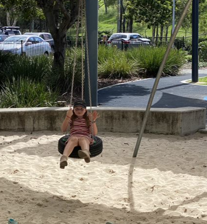

[//]: # (margin:top right bottom left)
## Statements from the report

- *The Children complained that he rarely takes them to the park*

- *The Mother has a good understanding of their physical needs and, takes them frequently to the park, encourages them to play sports and is engaging them with the extended family*

## My rebuttal

Since separation, the kids and Dad have done many fun things together.

The comment from the expert above about how the mother is ***engaging them with the extended family*** - I do as well. I forgot to mention this in the session, however Charlie and Chloe have paternal cousins from Sydney. Below is the photo which shows the 3 first cousins from the father, each cousin with their own young kids. They are spread across in Sydney and on the central coast NSW.

As for the other comments about how I don't take the kids to the park, this is absurd. Below, a mix of videos and photos of the kids at the park. We go frequently.

|  |  |
| ----------- | ----------- |
|  |  |
|  |  |
|  |  |
|  |  |
|  |  |
|  |  |
|  |  |