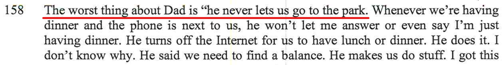

[//]: # (margin:top right bottom left)
## Statements from the report

- *The Children complained that he rarely takes them to the park*

- *The Mother has a good understanding of their physical needs and, takes them frequently to the park, encourages them to play sports and is engaging them with the extended family*

### Dad and doesn't take kids to the park

What Charlie is meaning by this statement below, he means like what happens at his mothers place. Currently he's with his mother 71.4% of the time, so things that happen (rightly or wrongly) with his mother would seem routine to him:

Charlie always asks me if he can go to the park (by himself) just like at his mothers place and of course I say no - for very good reasons. 

1. The park Charlie is referring to is not just around the corner like it is at the mother place, from the place I am at temporarily now, Charlie would have to cross a main road and I am a good extra kilometre away.
2. I haven't had the opportunity to meet everyone at the park, it's his Mum that organised the park thing every afternoon
3. I'm not keen on Charlie being at the park by himself, as I've already established, there's not always parents/adults there to supervise
4. Lastly, as I only have the kids 28.6% of the time, I am reluctant to let them go out as I want to try and maximise my time with then when I have them - note this is hopefully temporary and if I get more time with the kids, then things would totally change and I would let them to places, e.g. sleepovers, as I wouldn't be so eager to maximise my time with them, as I'd have more time.

Instead, I do take the kids to the park quite often, however I go with them myself on the weekends, [as you can see here](/marcseparation/kids_park/#my-rebuttal) below, going to the park with me is not the same as how he goes to the park when with his mother, that's all. 

## My rebuttal

Since separation, the kids and Dad have done many fun things together.

The comment from the expert above about how the mother is ***engaging them with the extended family*** - I do as well. I forgot to mention this in the session, however Charlie and Chloe have paternal cousins from Sydney. Below is the photo which shows the 3 first cousins from the father, each cousin with their own young kids. They are spread across in Sydney and on the central coast NSW.

As for the other comments about how I don't take the kids to the park, this is absurd. Below, a mix of videos and photos of the kids at the park. We go frequently.

|  |  |
| ----------- | ----------- |
|  |  |
|  |  |
|  |  |
|  |  |
|  |  |
|  |  |
|  |  |