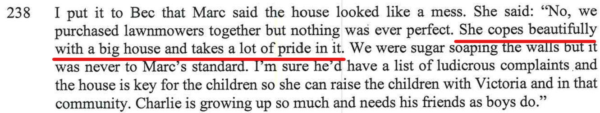

- "He had very firm views about how they should behave and how they should complete their chores to his own standards of cleanliness."

- "She copes beautifully with a big house and takes a lot of pride in it."

The current living conditions for the home are totally the opposite to that of the report. 

- Just like Alex’s mother, there’s crap left all over the place
- The house is filthy and disgusting 

The below are real walk through videos of the home since separation.

<iframe width="420" height="315"
    src="https://www.youtube.com/embed/gDr0XIgdk7A?Version=3&autoplay=1&mute=1&loop=1&showinfo=1&rel=0">
</iframe>

 

<iframe width="420" height="315"
    src="https://www.youtube.com/embed/hixvOH7lxVo?Version=3&autoplay=1&mute=1&loop=1&showinfo=1&rel=0">
</iframe>

