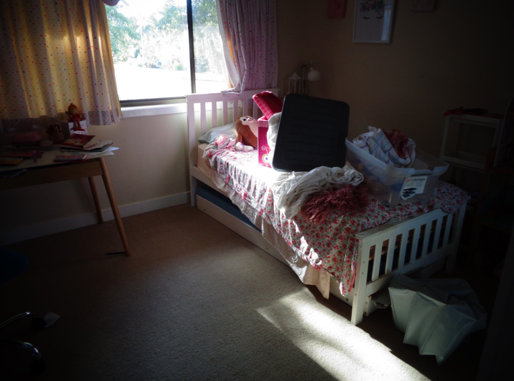

## Statements from the report

- "He had very firm views about how they should behave and how they should complete their chores to his own standards of cleanliness."

- "She copes beautifully with a big house and takes a lot of pride in it."

## My rebuttal

### Children's bedrooms
#### Charlie's bedroom at house

#### Chloe's bedroom at house

### Kitchen

<iframe width="420" height="315"
    src="https://www.youtube.com/embed/hixvOH7lxVo?playlist=hixvOH7lxVo&loop=1&start=31&end=41&Version=3&autoplay=1&mute=1&showinfo=1&rel=0">
</iframe>

### General living

The below is a video when I went to the house at one stage since separation and I mowed the lawn and did the edges. I did a comparison video on the before and after, you will see a massive difference. 

<iframe width="420" height="315"
    src="https://www.youtube.com/embed/B61ABb9LGg0?Version=3&autoplay=1&mute=1&loop=1&showinfo=1&rel=0">
</iframe>

I take pride on keeping places clean to a good standard. As it was my job to mostly keep the outside of the home clean e.g. the lawn, I extended this and even looked after my next door neighbours lawn while they were away. The following video will show you the before, mid-point and after view of the lawn after I did the edges and mowed the lawn for him (John). 

<iframe width="420" height="315"
    src="https://www.youtube.com/embed/fEc_OpXdne8?Version=3&autoplay=1&mute=1&loop=1&showinfo=1&rel=0">
</iframe>

