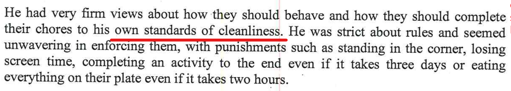

## Statements from the report

- "He had very firm views about how they should behave and how they should complete their chores to his own standards of cleanliness."

- "She copes beautifully with a big house and takes a lot of pride in it."

## My rebuttal

<iframe width="420" height="315"
    src="https://www.youtube.com/embed/gDr0XIgdk7A?playlist=gDr0XIgdk7A&loop=1&Version=3&autoplay=1&mute=1&showinfo=1&rel=0">
</iframe>

Not safe

<iframe width="420" height="315"
    src="https://www.youtube.com/embed/1oJeG2IlXPQ?playlist=1oJeG2IlXPQ&loop=1&start=81&end=89&Version=3&autoplay=1&mute=1&showinfo=1&rel=0">
</iframe>

The current living conditions for the home are totally the opposite to that of the report. 

- Just like Alex’s mother, there’s crap left all over the place
- The house is filthy and disgusting 

These videos are real walk through videos of the state of the home since separation. It's a dump, the the living conditions are far from optimal in anyone's standards.

<iframe width="420" height="315"
    src="https://www.youtube.com/embed/hixvOH7lxVo?playlist=hixvOH7lxVo&loop=1&Version=3&autoplay=1&mute=1&showinfo=1&rel=0">
</iframe>

This video below, you will notice that about half way through that there's a completely loose cable on the back balcony which is totally dangerous, as kids can fall straight through about 5+ meters to the ground. 

<iframe width="420" height="315"
    src="https://www.youtube.com/embed/1oJeG2IlXPQ?playlist=1oJeG2IlXPQ&loop=1&Version=3&autoplay=1&mute=1&showinfo=1&rel=0">
</iframe>

