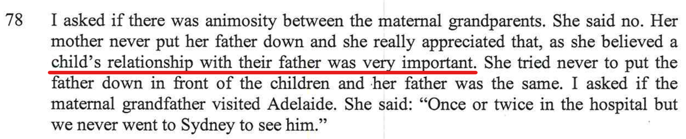
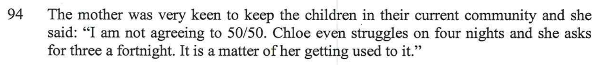
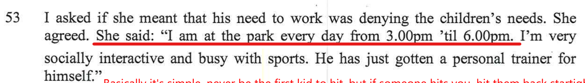
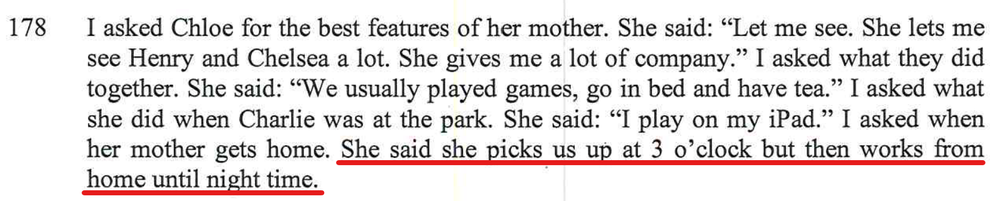

### Contradiction 1

Alex was brought up with the belief that she thinks fathers play a very important role for kids

 

### Contradiction 2

Alex says that she goes to the park each afternoon from 3pm.

Chloe says the opposite. 

It's true that when the kids are with their Mum, they are left alone to play with their friends and/or be looked after by Aunty's or friends as Alex needs to work. It's also true that Charlie goes to the park by himself. 