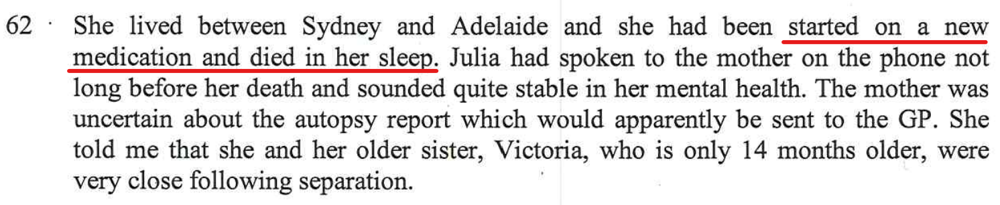

Whilst in the session with Dr Ruth Selig, there were several things that I mentioned that were missed in the report.

## Teaching the kids life skills

- I mentioned that one of the things I was most proud of was that I taught the kids table manners whilst I was still living in the house. My father who was a CEO at large companies throughout his life, **wined and dined** with his other business people and it was imperative that he spoke correctly and acted correctly as he was representing his company. People judge others by the way they speak and act which includes things like table manners. Even today, the kids tell me that now they are proud that even tell other peers (their friends) the correct table manners.

## Julia dying

- Ruth told me that *I’ll be putting in the report that Julia Spence committed suicide*. But she didn't. 

I wasn’t an easy person to live with, I just wanted to understand why she’d be doing these things

Alex constantly leave the house unlocked. As the house backs on to bush, this is a security risk to the kids if someone gains access to the house

In the last few months before separation, when going to bed, Alex never said goodnight to me

Asked me if I had another partner, this wasn’t mentioned anywhere

I am very instrumental in teaching the kids moral and values. I used the example of my father who worked in high profile jobs all his life as CEO of large companies where he had to represent the company with other business people, he understood correct manners. I also mentioned that having good manners is a good reflection on the kids themselves, also the parents and that other people take notice of this. I said that before separation one of the things I did which I was very proud of, from an early age I taught the kids table manners. To this day, the kids still exhibit good table manners and even teach some of their peers. 

