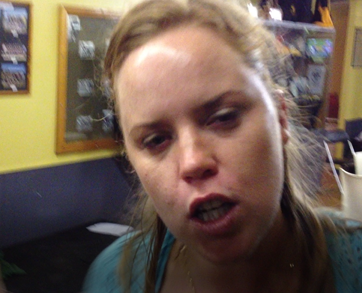

## Back balcony

This is on the top balcony at the back of the house, kids can fall down through this, land on the ground and could seriously injure themselves of whats worse, kill themselves. 

<iframe width="420" height="315"
    src="https://www.youtube.com/embed/Pb2Wtx18Zj8?playlist=Pb2Wtx18Zj8&loop=1&start=81&end=89&Version=3&autoplay=1&mute=1&showinfo=1&rel=0">
</iframe>

## Alex is hands off parenting

As per [this section](/marcseparation/alex_parenting/#alex-is-never-around). There's a great chance the Alex will follow the same parenting style as her own mother. We can see how this turned out for Alex's sister Julia, she killed herself.

Julia had a real drinking problem and was a chain smoker amongst having bipolar disorder, not being able to hold down a job and as Bec said, she's a "*bad egg*". 

Leaving the home at 14, no father in her life (as he was dead at the time), the mother was behind the scenes as Julia lived in share accommodation with Alex and Alex's gay friend Kristan. Julia lacked the support and guidance needed to develop into a decent woman to have somewhat of a chance of a normal life, but this is a classic case of where 

